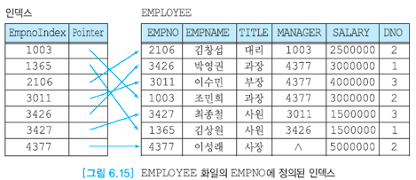
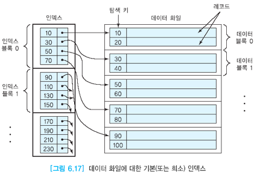
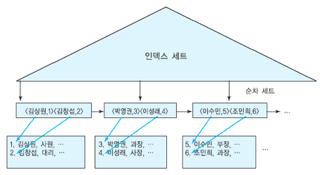

# 01. 인덱스

## 01. 인덱스

### 인덱스란?

인덱스의 사전적인 의미를 찾아봅시다.

인덱스는 색인이라는 뜻으로 일상 생활에서 자주 접해왔습니다.

바로 책을 읽을 때 목차가 이와 같은 역할을 하죠.

책에 목차가 없다고 생각을 해봅시다. 그렇다면 원하는 내용을 찾기 위해서 앞에서 부터 모든 내용을 봐야합니다.

하지만 목차가 있다면 어떨까요? 

앞에서 부터 모든 내용을 볼 필요없이 빠르게 원하는 내용을 찾을 수 있습니다.


데이터베이스에서도 마찬가지입니다. 

인덱스를 통해서  빠르게 데이터를 찾을 수 있죠.


### 단일단계 인덱스

단일 단계 인덱스는 `<키, 레코드의 주소>` 로 이루어져 있으며 오름차순으로 정렬되어 있습니다.

따라서 이진 탐색을 통해 데이터를 빠르게 검색할 수 있습니다.

또한 인덱스는 원래의 데이터와 별도로 저장되며 약 10%~20%의 크기를 가집니다.




#### 기본 인덱스

단일단계 인덱스의 한 종류로, 인덱스가 걸려있는 필드가 기본키인 경우 **기본 인덱스**라 합니다.




#### 클러스트링 인덱스

인덱스가 걸려있는 필드의 값에 따라 정렬된 경우, **클러스트링 인덱스**라 합니다.

해당 값으로 본래의 데이터가 정렬되어야 하므로 테이블 당 하나의 클러스트링 인덱스만 존재할 수 있습니다.

클러스트링 인덱스의 경우, 범위 질의에 특화되어 있습니다.

인접한 데이터끼리 인접해 있으므로 시작 범위로 찾고 끝 범위가 나올 때까지 하나씩 찾아가면 최소한으로 검색을 할 수 있습니다.




#### 보조 인덱스

인덱스가 걸려있는 필드의 값이 정렬되어 있지 않은 경우, **보조 인덱스**라 합니다.


#### 희소 인덱스

일부 키 값에 대해서만 인덱스의 엔트리를 유지하는 인덱스를 **희소 인덱스**라고 합니다.

기본인덱스의 그림 역시 희소 인덱스인데, 10,30,50,70,90은 인덱스의 엔트리를 유지하지만 20,40,60,80,100은 인덱스의 엔트리를 유지하지 않습니다.


#### 밀집 인덱스

모든 키 값에 대해서 인덱스 엔트리를 유지하는 인덱스를 **밀집 인덱스**라고 합니다.


#### 희소 인덱스 VS 밀집 인덱스

일반적으로 레코드의 길이가 데이터블록보다 훨씬 작기 때문에 희소 인덱스가 엔트리수가 훨씬 적습니다.

또한 희소 인덱스가 디스크 접근 수가 1정도 적습니다. 따라서 모든 갱신과 대부분의 질의에 대해서 희소 인덱스가 유리합니다.

하지만 COUNT와 같이 인덱스가 정의된 필드만 검색하는 경우, 밀집 인덱스는 원래의 데이터를 접근할 필요가 없어 더 유리합니다.


### 다단계 인덱스

단일단계 인덱스를 통해 데이터에 빠르게 접근이 가능하다는 사실을 알았습니다.

하지만 데이터가 굉장히 많다면 인덱스도 데이터가 많아지는 문제가 발생합니다.

이 경우, 인덱스 데이터들에 대해서 다시 인덱스를 걸어줄 수 있는데 이를 **다단계 인덱스**라고 합니다.

가장 상위 단계의 인덱스를 마스터 인덱스라고 부르며, 보통 4단계 이내로 끝납니다.


다단계 인덱스는 각 단계의 인덱스들이 오름차순을 유지해야 하기 때문에 단일단계 인덱스보다 갱신이 오래 걸립니다.

하지만 일반적으로 갱신의 비율보다 검색의 비율이 높아 다단계 인덱스를 많이 사용합니다.


## 02. SQL에서의 인덱스

### 인덱스 생성

인덱스 생성 시 `CREATE INDEX` 를 합니다.

이는 SQL 표준은 아니지만 대부분의 DBMS가 지원합니다.

``` sql
CREATE INDEX {인덱스 이름} ON {테이블 이름}({필드 이름});
```


### 인덱스 삭제

```sql
DROP INDEX {테이블 이름}.{인덱스 이름}
```


### 복합 필드에 인덱스

한 테이블에 여러 필드에 하나의 인덱스를 정의할 수 있습니다.

이 때 필드의 수가 늘어날수록 인덱스를 활용하는 탐색 조건이 복잡해지고 인덱스 엔트리의 길이가 늘어나기 때문에 탐색 성능이 저하됩니다.

따라서 3개 이하의 필드를 사용하기를 권장합니다.


복합 필드에 인덱스는 다음과 같이 정의합니다.

```sql
CREATE INDEX {인덱스 이름} ON {테이블 이름}({필드 이름}, {필드이름});
```


이 경우, 필드의 순서가 중요합니다.

첫 번째 필드와 두 번째 필드에 대한 조건을 사용할 때는 인덱스가 사용되지만, 두 번째 필드만을 사용할 때는 의미가 없어집니다.


## 레퍼런스

데이터베이스 배움터(책)

## 질문할 사항
## 추가 공부할 키워드

* B+ 트리