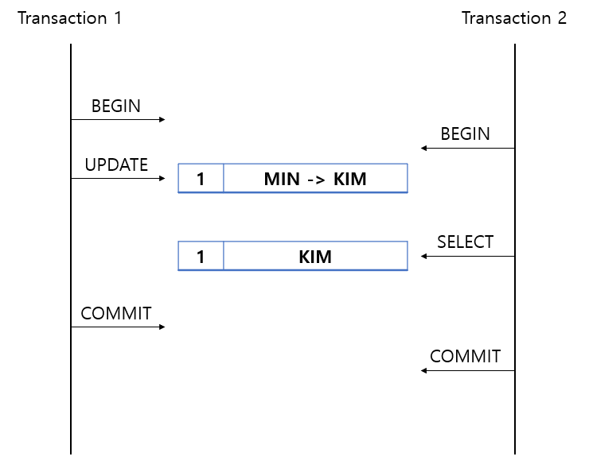
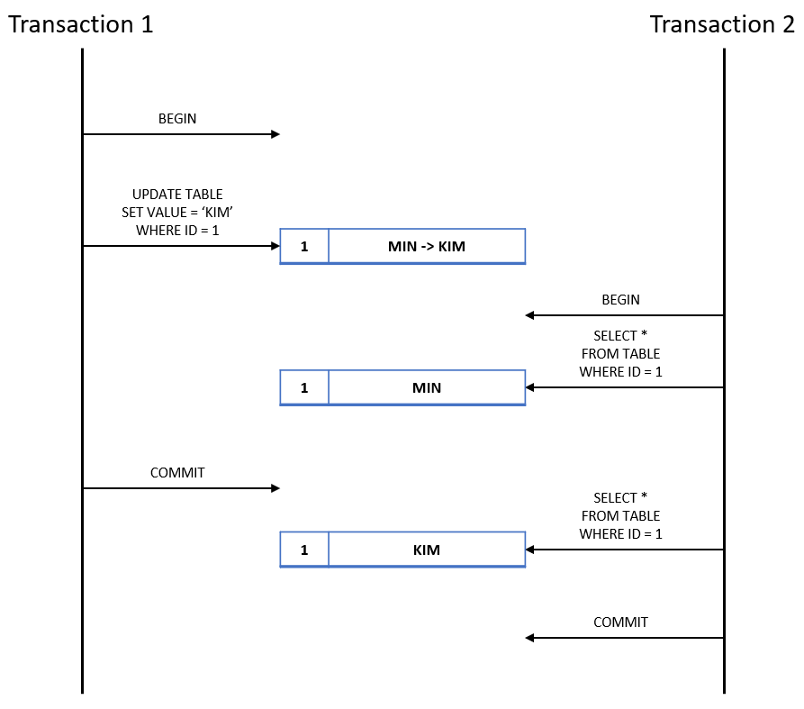
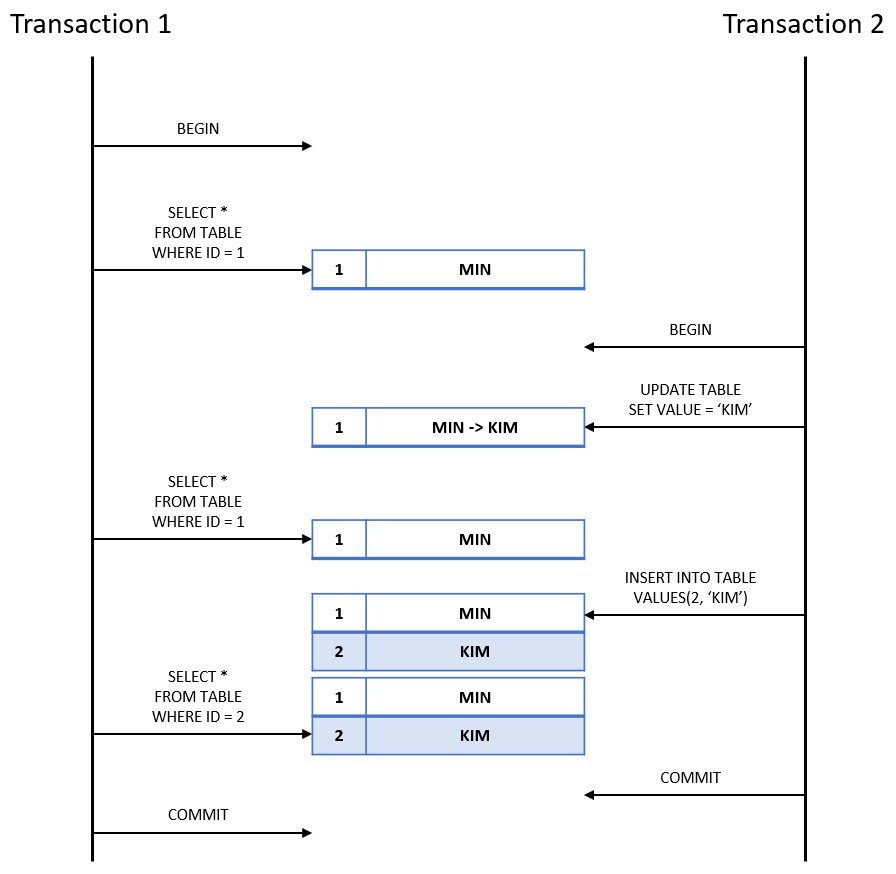

# [DB] 트랜잭션 격리 수준

## 트랜잭션 격리 수준이란

`트랜잭션 격리 수준` 이란 여러 트랜잭션이 동시에 처리될 때 트랜잭션끼리 얼마나 고립되어 있는지를 나타내는 것입니다.

고립 정도가 높아질수록 성능은 감소하고, 고립 정도가 낮을수록 여러 문제가 발생할 가능성이 있습니다.

격리수준은 아래 4가지가 있으며 각각에 대해서 알아봅시다.

* READ UNCOMMITTED

* READ COMMITTED

* REPEATABLE READ
* SERIALIZABLE

## READ UNCOMMITTED

하나의 트랜잭션의 변경이 commit, rollback에 상관없이 다른 트랜잭션에 영향을 미칩니다.

트랜잭션 1이 update 후 commit 하지 않았지만 트랜잭션 2는 update 이후의 데이터를 조회하게 됩니다.

이 경우 `Dirty Read` 문제가 발생할 수 있습니다.

`Dirty Read` 란 다른 트랜잭션에 의해 삽입, 변경된 데이터를 commit하기 전에 읽는 것을 말합니다.

만약 다른 트랜잭션이 rollback 된다면 다시 읽었을 때 데이터의 값이 달라집니다.

해당 문제 때문에 대부분의 RDBMS에서 사용하지 않습니다.

## READ COMMITTED

하나의 트랜잭션의 변경이 commit된 후에만 변경사항이 다른 트랜잭션에 반영됩니다.

트랜잭션 1이 값을 바꾼 후, 트랜잭션 2가 읽을 때 commit 전에는 변경 전 값을 commit 후에는 변경 후 값을 조회합니다.

이 경우 `Non-Repeatable Read` 문제가 발생할 수 있습니다.

 `Non-Repeatable Read` 은 하나의 트랜잭션이 같은 값을 조회할 때 다른 값이 조회되는 현상입니다.

해당 수준은 Oracle을 포함하여 많이 선택되는 격리 수준입니다.

## REPEATABLE READ

트랜잭션이 시작되고 종료되기 전까지 한 번 조회한 값은 계속 같은 값이 조회됩니다.

update에 대해서는 데이터의 정합성이 보장되지만 insert/delete에 대해서는 보장되지 않습니다.

`Phantom Read` 문제가 발생합니다.

`Phantom Read` 은 환상을 보는 것과 같이 데이터가 사라지거나 없던 데이터 생기는 현상을 말합니다.

위 예시에서 트랜잭션 1이 ID가 2인 값을 조회 시 성공했지만 트랜잭션 2가 rollback할 경우 해당 데이터는 없어집니다.

다시 트랜잭션 2가 ID 2로 조회하면 아무 데이터가 없습니다.

## SERIALIZABLE

가장 엄격한 격리수준으로 한 트랜잭션이 테이블을 읽으면 다른 트랜잭션은 그 테이블에 대해 추가/변경/삭제를 할 수 없습니다.

위에서 언급한 세 개의 정합성 문제는 발생하지 않지만 동시 처리 성능이 가장 떨어집니다.

## 레퍼런스

https://private-space.tistory.com/97

https://velog.io/@sa1341/%ED%8A%B8%EB%9E%9C%EC%9E%AD%EC%85%98-%EA%B2%A9%EB%A6%AC-%EC%88%98%EC%A4%80Isolation-Level%EC%9D%B4%EB%9E%80

## 질문할 사항
## 추가 공부할 키워드

