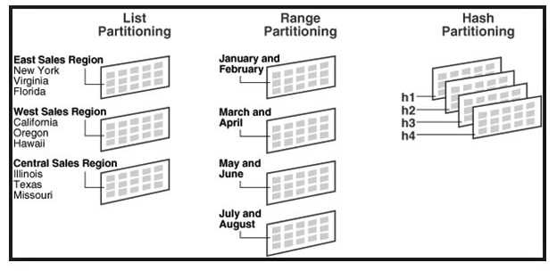

# [DB] Partitioning이란

## Partitioning이란

`Partitioning`은 데이터베이스를 물리적으로  분할하는 것을 말합니다.

멀쩡한 데이터베이스를 왜 분할하는 걸까요?

서비스의 크기가 커짐에 따라 DB에 저장되는 데이터도 대용량이 되었습니다.

이는 용량의 한계와 성능 저하로 이루어졌고, 이를 해결하기 위해 `Partitioning`이라는 개념이 등장하였습니다.


 

## Partitioning 장단점

### 장점

#### 성능 향상

`Partitioning`을 통해 성능 향상을 기대할 수 있습니다.

테이블이 크기가 줄었기 때문에 Full Scan에서 데이터의 Access 범위가 줄어듭니다.

또한 많은 Insert 연산이 발생하는 환경에서 하나의 테이블이 아닌 각각 테이블로 분산시켜 효율을 높일 수 있습니다.


#### 관리 용이 

`Partitioning` 별로 관리함으로서 오는 장점들이 존재합니다.

백업 및 복구도 부분적으로 이루어질 수 있으며 여러모로 관리하기 편리해집니다.


### 단점

#### join 비용 증가

`Partitioning`을 통해 무조건적인 쿼리 성능 향상이 이루어지지는 않습니다.

기존에는 하나의 테이블과 join을 했다면 `Partitioning` 을 하게 된다면 여러 테이블과 join을 하게 됨으로서 성능이 저하될 수 있습니다.


#### 테이블과 index를 함께 Partitioning

테이블과 index를 독립적으로 `Partitioning` 할 수 없습니다.


## Horizontal Partitioning

수평 파티셔닝은 하나의 테이블을 수평으로 나눠, 각 행을 다른 테이블에 분산시키는 방법입니다.

이를 **sharding** 이라고도 합니다.

Partition에 데이터가 적절하게 분배됨에 따라서 위에서 말한대로 성능이 향상됩니다.

이 때 어느 Partition에 데이터를 저장해야 할지에 대해 적절한 키가 필요하고 여러 방법이 존재합니다.




### List Partitioning

특정 값들을 `Partition`에 매핑시켜서 저장하는 방법입니다.

위 이미지에서는 지역의 도시들을 묶어서 매핑해주었습니다.


### Range Partitioning

특정 키의 범위에 따라 분할하여 저장하는 방법입니다.

위 이미지에서는 2달씩 묶어서 저장하는 방법을 택했습니다.

그 외에도 연도를 기준으로 10년씩 묶을수도 있고, 금액을 기준으로 일정 범위에 따라 묶을 수 있습니다.


### Hash Partitioning

해시 함수를 통해 분할하여 저장하는 방법입니다.

테이블에  `Partition`의 개수를 지정한다면 그에 맞춰 해시 함수가 동작합니다.

```sql
CREATE TABLE table_name ( id INT, field_name INT ) 
PARTITION BY HASH(id)
PARTITIONS 4;
```


### Composite Partitioning

위에서 언급한 분할 방식을 2개 이상 사용하는 방법입니다.


## Vertical Partitioning

수직 파티셔닝은 하나의 테이블을 수직으로 나눠, 각 열을 다른 테이블에 분산시키는 방법입니다.

자주 사용하는 칼럼 등을 분리하여 테이블의 크기를 줄이고 성능을 향상시킬 수 있습니다.


## 레퍼런스

https://gmlwjd9405.github.io/2018/09/24/db-partitioning.html

https://soye0n.tistory.com/267

## 질문할 사항

* Vertical Partitioning은 그냥 테이블을 새로 만들어야 하는건가

## 추가 공부할 키워드

* 레플리카
* 샤딩은 다시 봐야할까?