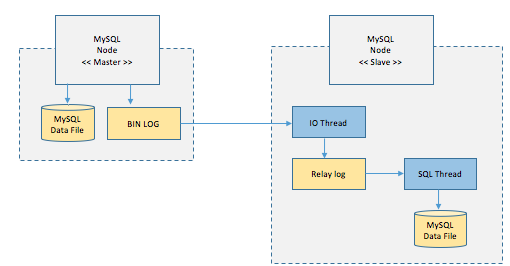

# [DB] 리플리케이션, Replication

## Replication이란

`Replication` 이란 여러 DB를 수직적인 구조, Master-Slave로 구축하는 방식입니다.

Master 역할을 하는 DB는 insert, delete, update 등의 쓰기 작업을 처리하게 되며 Slave 역할을 하는 DB는 select에 해당하는 읽기 작업을 처리하게 됩니다.

여러 개의 Slave DB를 구성하여 읽기 작업을 분산하게 됩니다.

## Replication의 동작과정

MySQL에서 `Replication`이 어떤 원리로 동작하는지 알아봅시다.

* Master Node에 쓰기 트랜잭션 수행
* Master Node에 트랜잭션 commit 후 이에 대한 결과를 BIN LOG 파일에 저장
* Slave Node의 I/O Thread가 BIN LOG 파일을 Replay log 파일로 복사
* Slave Node의 SQL Thread는 Replay log를 한 줄씩 읽으며 데이터를 Slave Node에 저장

## Replication의 장단점

### 장점

* 대부분의 서비스에서는 읽기 요청이 60~80% 정도를 차지합니다. 그렇기 때문에  `Replication`으로 읽기 요청만을 분산해도 성능을 높일 수 있습니다.
* Master에서 Slave로 데이터를 복사하는 과정이 비동기 방식으로 처리되어 지연 되지 않습니다.

### 단점

* Master와 Slave, 그리고 여러 Slave들 간에 데이터 동기화가 보장되지 않습니다. 따라서 정합성이 깨질 수 있습니다.
* Master에 장애가 발생하면 Slave로 failover되지 않습니다. 개발자가 직접 하나의 Slave를 Master로 대체하는 등의 방안이 필요합니다.
* Master의 BIN LOG는 무분별한 데이터 적재를 막기위해 데이터 보관 주기를 설정할 수 있습니다. 하지만 이 보관주기가 Slave까지 확산되지 않습니다.

## 레퍼런스

https://mariadb.com/kb/en/replication-overview/

## 질문할 사항

## 추가 공부할 키워드

* 클러스트링