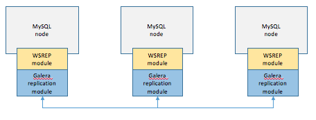

# [DB] 클러스트링, Clustering

## Clustering이란

`Clustering`이란 여러 DB를 수평적인 구조로 구축하는 방식입니다.

## Clustering의 동작과정

`Clustering`도 다양한 방법이 있지만 그 중 MySQL의 Galera 방식에 동작과정에 대해 알아봅시다.

* 한 개의 노드에 트랜잭션 수행
* 다른 노드들에 데이터 복제를 요청
* 다른 노드들이 복제 요청을 받아들여 디스크에 작성하고 복제 요청을 받아들였다고 알림
* 다른 노드들로부터 복제 요청 확인이 돌아오면 디스크에 저장

## Clustering의 장단점

### 장점

* 노드들 간에 동기화 과정이 일어나기 때문에 데이터의 일관성 보장
* 1개의 노드가 죽어도 다른 노드가 살아 있기 때문에 시스템을 장애없이 운영 가능(Single point of failure 문제 해결)

### 단점

* 노드들 간에 동기화 과정이 일어나기 때문에 `Replication` 에 비해 성능 저하
* 장애가 다른 노드로 전파된 경우 처리가 까다로움

## Clustering의 종류

`Clustering` 은 Active-Active 방식과 Active-Standby 방식으로 나눌 수 있습니다.

Active는 실제로 가동중이라는 것을 의미하고 Standby는 대기중이라는 것을 의미합니다.

### Active-Active

모든 DB 노드가 가동중인 것을 의미합니다.

그렇기 때문에 한 개의 노드에 장애가 와도 남은 노드가 처리함으로서 시스템 전체의 장애를 피할 수 있습니다.

현재는 Oracle과 DB2에서만 해당 방식을 지원합니다.

### Active-Standby

Standby 상태의 노드는 평소에 사용되지 않고 Active 노드가 장애일 경우에 동작합니다.

이를 전환하는 시간 동안은 시스템 전체가 마비됩니다.

전환되는 시간은 길게는 몇 분까지 걸릴 수 있습니다.

`Active-Standby`는 다시 두 개의 방식으로 나눌 수 있습니다.

`Cold-Standby`와 `Hot-Standby` 입니다.

`Cold-Standby`는 평소에 Standby 노드는 준비하지 않고 있다가 Active 노드가 장애일 경우 작동하고,  `Hot-Standby` 는 작동할 준비를 미리 해놓습니다.

 `Hot-Standby` 가 그만큼 전환 시간이 빨라 장애 시간을 줄일 수 있지만 가격이 더 드는 단점이 있습니다.

## 레퍼런스

https://kgh940525.tistory.com/entry/Database-DB-%EC%84%9C%EB%B2%84%EC%9D%98-%EB%8B%A4%EC%A4%91%ED%99%94Multiplexing-%ED%81%B4%EB%9F%AC%EC%8A%A4%ED%84%B0%EB%A7%81-%EB%A6%AC%ED%94%8C%EB%A6%AC%EC%BC%80%EC%9D%B4%EC%85%98Replication

## 질문할 사항

## 추가 공부할 키워드