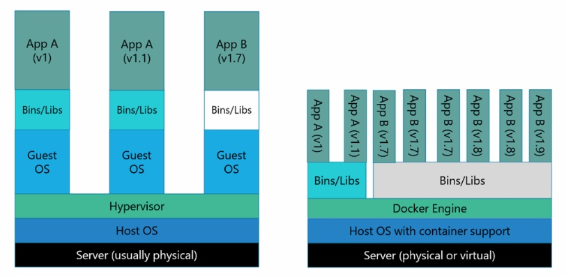
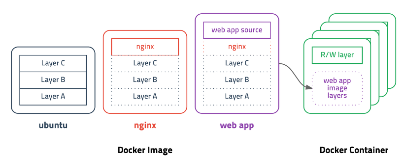

# [DevOps] Docker

## Docker란

Docker란 Go언어로 개발된 리눅스 컨테이너 기반 오픈소스 가상화 플랫폼입니다.

## 가상화

가상화는 하드웨어와 같은 물리적인 컴포넌트를 논리적인 객체로 추상화하는 것을 의미합니다.

하나의 장치를 여러 개 처럼 동작할 수도 있고, 반대로 여러 개의 장치를 하나의 장치처럼 사용할 수 도 있습니다.

서버의 CPU 사용량이 너무 낮아서 비효율적일 수 도 있고, 그렇다고 한 개의 서버에 여러 서비스를 한다면 안정성에 문제가 발생합니다.

이러한 이유로 안정성을 보장하며 리소스를 최대한 활용하기 위해 가상화가 많이 사용되고 있습니다.

### 컨테이너

컨테이너는 가상화 기술 중 하나입니다.

그 중에서도 LXC, 리눅스 컨테이너는 대표적인 방법입니다.

컨테이너는 기존 OS를 가상화 시키던 것과 달리 OS레벨의 가상화로 프로세스를 격리시켜 동작하는 방식으로 이루어집니다.

### VM 가상화 vs 컨테이너 가상화

VM 가상화는 Host OS 위에 Hypervisor 엔진, 그리고 그 위에 Guest OS를 올려 사용합니다. 

이는 Host와 Guest가 완전히 분리되어 사용됩니다. 

하지만 OS위에 OS를 올리기 때문에 무겁고 느리다는 단점이 있습니다.

하지만 높은 격리 레벨로서 보안적인 측면에서 유리합니다.

또한 linux 위에 window를 올리는 등 멀티 OS가 가능합니다.

컨테이너 기반 가상화는 Docker의 경우, Docker Engine 위에 실행에 필요한 바이너리만 올라가게 됩니다. 

이는 Host OS의 커널을 공유하기 때문에 I/O 처리를 쉽게 하고 성능의 효율을 높일 수 있습니다.

또한 이식성이 좋고 scale out에 용이합니다.

## Docker Image

`Docker Image`는 컨테이너를 실행할 수 있는 실행파일, 설정 값들을 가지고 있는 묶음입니다.

`Docker Image`를 컨테이너에 담고 실행한다면 해당 프로세스가 동작하게 됩니다.

위 그림을 봅시다.

ubuntu, nginx, web app을 순차적으로 더해 하나의 `Docker Image`를 만들고 이를 컨테이너에 담고 있습니다.

## 레퍼런스

* https://khj93.tistory.com/entry/Docker-Docker-%EA%B0%9C%EB%85%90

## 질문할 사항

* docker는 개념 공부하는 것도 좋지만 실제로 사용하면서 공부를 좀 하고 싶다.

## 추가 공부할 키워드

