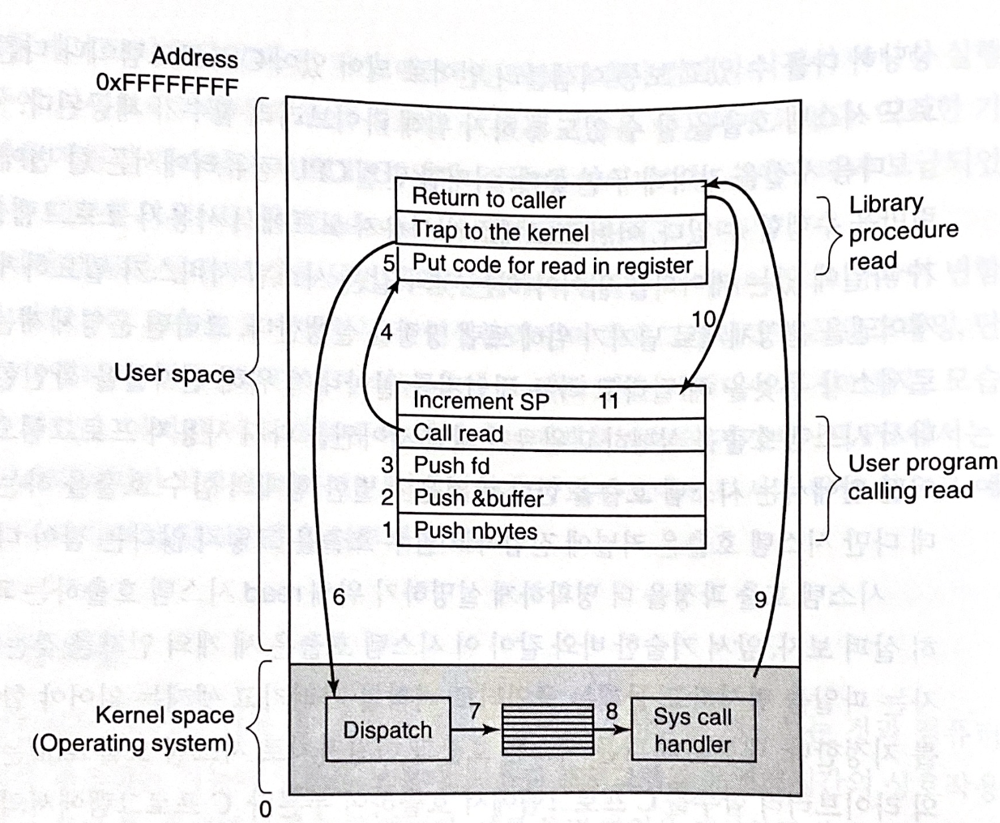

# 02. 시스템 콜

## 01. 시스템 콜이란

**시스템 콜**은 시스템 호출이라고도 하며 영문으로 system call 이라고 부릅니다.

운영체제는 커널모드와 사용자모드로 나뉘어 구동됩니다. 

이 때 사용자모드에서 프로세스를 관리하거나, 파일 입출력 등 커널모드를 사용해야 할 일이 존재합니다.

시스템 콜은 사용자모드에서 이러한 커널모드의 기능을 사용할 수 있도록 하는 인터페이스입니다.


아래서 설명하는 내용이나 예시는 POSIX에 대한 내용입니다.

> POSIX
>
> **p**ortable **o**perating **s**ystem **i**nterface의 약자로 이식 가능 운영 체제 인터페이스입니다.
> 서로 다른 UNIX OS의 공통 API를 정리하여 이식성이 높은 유닉스 응용 프로그램을 개발하기 위한 목적으로 IEEE가 책정한 애플리케이션 인터페이스 규격입니다.


## 02. 시스템 콜 과정

시스템 콜이 어떠한 과정으로 진행되는지 이해하기 위해 파일을 읽는 `read` 시스템 콜 과정을 예시로 들겠습니다.

read 시스템 콜은 세 개의 인자를 필요로 합니다.

첫 째 인자는 파일을 명시하고, 둘 째는 포인터로 버퍼를 가리키고, 셋 째는 읽어야 할 바이트 수를 지정합니다.


C언어에서 해당 시스템 콜을 하기 위한 방법은 아래와 같습니다.

``` C
count = read(fd, buffer, nbytes);
```

함수의 반환값은 실제로 읽은 바이트 수이며, 오류로 인해 실행될 수 없다면 -1를 반환합니다.


이제 read 시스템 콜 시, 일어나는 과정을 11단계로 알아봅시다.



### 1~3 단계

함수을 부르기 위한 인자들을 스택에 푸쉬합니다.

이 때 인자들은 역순으로 들어갑니다.


### 4단계

라이브러리 함수에 대한 실제 호출이 일어납니다.


### 5단계

어셀블리어로 작성되었을 가능성이 있는 라이브러리 함수는 보통 운영체제가 예상하는 위치에, 예를 들어 특정 레지스터에 시스템 콜 번호를 저장해둡니다.


### 6단계

TRAP 명령을 실행하여 사용자모드에서 커널모드로 전환합니다.


### 7단계

시스템 콜 번호를 확인하고 이에 따라 적절한 호출 핸들러를 실행합니다.

이 때는 시스템 콜 헨들러를 가르키는 포인터들을 담은 테이블을 시스템 콜 번호로 인덱스해서 결정합니다.


### 8단계

시스템 콜 핸들러가 실행됩니다.


### 9단계

시스템 콜 핸들러의 실행이 완료되면 유저모드 라이브러리 함수에서 트랩 명령 바로 뒤 명령으로 제어권이 넘어갈 수 도 있습니다.

넘어갈 수도 있다고 표현한 이유는 시스템 콜이 호출자를 블록해서 진행을 못하고 있을 수 있기 때문입니다.

예를 들어 키보드에서 값을 읽어오는데 입력이 없다면 호출자는 블록됩니다.

이 경우 운영체제는 실행가능한 프로세스를 우선적으로 실행하고 키보드 입력이 들어온 후 다시 이후 과정을 진행합니다.


### 10단계

라이브러리 함수는 보통 함수 호출이 반환되는 방식 그대로 사용자 프로그램에게 반환합니다.


### 11단계 

사용자 프로그램은 스택을 정리합니다.


## 레퍼런스

* https://ko.wikipedia.org/wiki/POSIX

* 운영체제론

## 질문할 사항
## 추가 공부할 키워드

