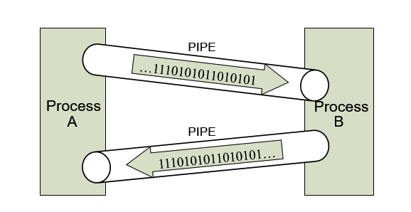
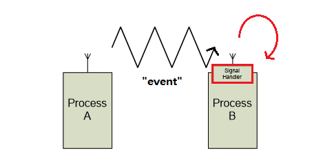
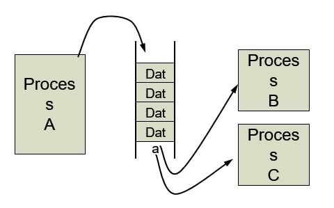
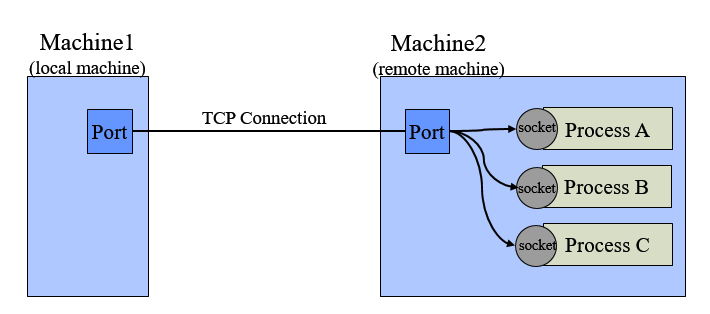

# 04. 프로세스 간 통신

## 01. 프로세스 간 통신이란?

프로세스는 다른 프로세스와 통신하여 정보를 교환해야하는 경우가 있습니다.

이를 협력적인 프로세스, cooperative process라고 하며 다른 프로세스들에게 영향을 주고 받습니다.

앞선 포스팅에서도 살펴봤지만 프로세스는 자신만의 독립적인 메모리 공간을 가지고 있기 때문에 정보를 주고 받기 위해 별도의 매커니즘이 필요합니다.

이렇게 프로세스 간에 정보를 주고 받는 것을 **IPC, InterProcess Communication** 이라고 합니다.

이를 위해 커널에서 IPC를 위한 도구를 제공하며 시스템 콜의 형태로 프로세스에게 제공합니다.

## 02. 프로세스 간 통신 방법

프로세스 간에 통신하는 방법들에 대해서 알아봅시다.

### 공유 메모리(Shared Memory)

공유메모리 방법은 프로세스들 사이에 공유되는 메모리 영역을 구축하는 방법입니다.

각 프로세스가 메모리에 직접 접근하기 때문에 속도가 빠르고 사용이 편리합니다.

하지만 여러 개의 프로세스가 동시에 메모리에 접근하는 경우에 대한 동기화가 필요하고,

하나의 프로세스가 메모리에 데이터를 전달해도 다른 프로세스들이 알 수 없다는 문제점이 존재합니다.

### 메세지 패싱(Message Passing)

메세지 패싱 방법은 커널 메모리 영역에 메세지 전달을 위한 채널을 만들어 프로세스 간의 정보 전달을 메세지를 통해 하는 방법입니다.

커널에서 데이터를 주고 받기 때문에 속도가 빠르진 않지만 커널에서 제어할 수 있기 때문에 동기화 문제가 발생하지 않습니다.

이 아래 부터 설명하는 `파이프`, `시그널`,` 메세지 큐`,` 소켓`은 모두 메세지 패싱 방법의 일종입니다.

### 파이프(Pipe)

파이프 방법은 메세지 패싱 방법의 일종으로 파일 I/O를 통해 프로세스간 데이터를 주고 받는 방법입니다.

파이프를 통해 프로세스 간 데이터를 직접 전달하게 되며 단방향성이기 때문에 양방향 통신을 위해서는 두 개의 파이프가 필요합니다.

또한 파이프를 통해 가는 정보들의 순서가 보장되며, 파이프의 용량이 가득차면 더 이상 정보를 전달할 수 없습니다.

### 시그널(Signal)

시그널 방법은 pid를 알고 있는 특정 프로세스에게 커널을 통해 이벤트를 전달하는 방법입니다.

대표적인 예로 프로세스가 돌아가고 있을 때 `ctrl+Z`, `ctrl+C` 를 눌러서 프로그램을 강제 종료시킨 경우가 바로 특정 키에 대해서 종료를 위한 시그널을 보내는 방식입니다.

시그널을 수신한 프로세스는 **시그널 핸들러**에 의해 특정 동작을 하게 됩니다. 이 때 SIGKILL과 SIGSTOP 등의 프로세스 종료, 중지 명령어는 무시할 수 없습니다.

### 메세지 큐(Message Queue)

메세지 큐 방법은 메세지를 주고 받을 때 큐 자료구조를 이용해서 프로세스 간 통신하는 방법입니다.

메세지 큐에는 여러 프로세스가 동시에 접근이 가능하지만 이에 따른 동기화가 필요합니다.

또한 메세지 큐를 사용하기 위해서는 메세지 큐 ID를 알아야 하는데 일반적으로 프로세스가 이를 알기 어렵고 번거롭습니다.

### 소켓(Socket)

소켓 방법은 메세지를 주고 받을 때 Port 번호를 통해 프로세스 간 통신하는 방법입니다.

위에서 설명했던 IPC 방법들에 비해 위치에 독립적입니다. (machine boundary가 없습니다.) 

다만 Local에서는 Port 번호만으로 프로세스를 식별 가능하며 Remote인 경우에는 IP 주소와 포트번호의 조합으로 상대 프로세스를 식별할 수 있습니다.

## 레퍼런스

* http://blog.naver.com/PostView.nhn?blogId=bycho211&logNo=220985701140

* 운영체제론

## 질문할 사항

* 프로세스 B가 자신의 주소 영역에 공유메모리를 연결한다는게 어떤 의미일까?

  공유 메모리 영역의 경우 두 프로세스가 동일한 물리적 주소를 가리키는 가상 주소를 가지고 있기 때문에 동일한 물리적 메모리 주소를 여러 프로세스에서 동시에 처리 할 수 있습니다.

  https://stackoverflow.com/questions/21325001/where-is-linux-shared-memory-actually-located

* 소켓 방식에서 포트와 프로세스가 1대1 대응이 아닌가?

  이미지에서 Port에 Process가 여러 개 대응되어 있는 것은 Port당 여러 개 Process가 있다는 의미가 아닌 추상화된 그림으로 이해하였습니다.

## 추가 공부할 키워드

