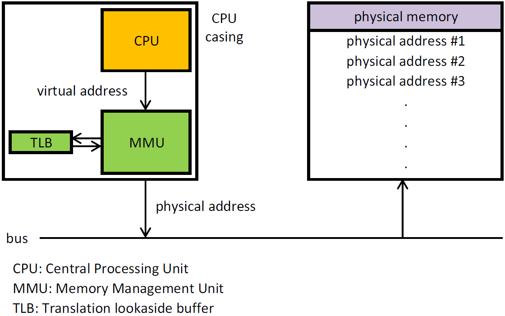
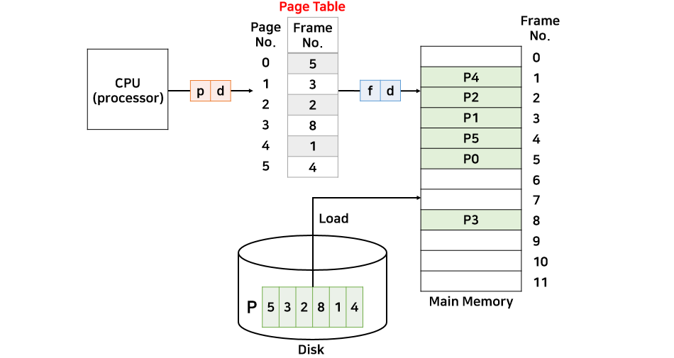

# 10. 가상메모리

## 01. 가상 메모리란?

`Bloatware 문제` 로 인해 메모리 크기보다 더 큰 프로그램을 실행할 수 있는 기법이 필요합니다.

스와핑의 경우에는 너무 시간이 오래 걸려 **가상메모리(virtual memory)** 가 등장하였습니다.

각 프로세스에 실제 메모리 주소가 아닌 가상의 주소를 할당하는 방식으로 프로세스의 일부만 메모리에 적재하고도 실행 할 수 있게 하는 방식입니다.

> Bloatware 문제
>
> 메모리의 크기가 증가하는 것보다 더 빠르게 소프트웨어의 크기가 증가하는 문제

## 02. 페이징

대부분의 가상 메모리는 **페이징**이라는 기법을 사용합니다.

### 가상 주소와 MMU

프로그램은 **가상 주소**를 참조하고, 가상 주소는 **MMU(Memory Management Unit)**을 통해서 물리 주소로 매핑됩니다.

### 페이지와 페이지 프레임

가상주소공간은 고정된 크기의 단위로 구분되어 있으며 이 단위를 **페이지** 라고 하며, 물리 메모리는 이에 대응되는 단위를 **페이지 프레임**이라고 부릅니다. 

페이지와 페이지 프레임의 둘의 크기는 같으며, 컴퓨터 구조에 따라 512B~16MB까지 다양한 크기를 갖습니다.

### 내부 단편화

이러한 페이징 기법은 단점이 존재합니다.

위에서 말했듯이 컴퓨터 구조에 따라 페이지 크기를 결정하는데 프로세스의 크기가 페이지 크기의 배수가 아니라면 마지막 페이지는 일부 공간이 비게 됩니다.

하지만 최대로 낭비되는 공간도 (페이지의 크기-1) byte이기 때문에 무시해도 될 정도의 수준입니다.

### 페이지 폴트

가상주소공간의 개념 자체가 물리 메모리의 크기보다 더 큰 프로세스를 실행시키기 위해 나온 개념이므로 페이지의 수가 페이지 프레임의 수보다 더 많습니다.

그렇기 때문에 페이지 프레임에 매핑되지 못한 페이지들이 존재합니다.

만약 프로그램이 매핑되지 않은 페이지를 참조하면 어떻게 될까요?

MMU는 **present/absent 비트**를 이용해 매핑되어 있는지를 파악하고 매핑이 안되었다면 CPU에게 트랩을 발생시켜 운영체제에게 이를 알립니다. 

이를 **페이지 폴트** 라고 합니다.

>  present/absent 비트
>
> 어떤 페이지가 페이지 프레임과 매핑되어 있는지 나타내는 비트

운영체제는 적당한 페이지 프레임을 하나 골라 현재 필요한 페이지로 매핑하고 명령을 다시 실행하게 됩니다.

## 03. 페이지 테이블

가상 주소를 물리 주소로 매핑하는 과정을 좀 더 자세히 알아봅시다.

먼저 가상 주소는 페이지 번호(p)와 변위(d)로 구분됩니다.

페이지 번호를 통해 **페이지 테이블**에서 매핑되는 페이지 프레임 번호(f)를 찾을 수 있습니다.

페이지 프레임 번호(f)와 변위(d)를 통해서 물리 주소를 얻게 됩니다.

## 04. 세그멘테이션

세그멘테이션(Segmentation)은 페이징과 유사하지만 그 크기가 가변적입니다.

페이징은 페이지의 크기를 절대적으로 정해놓은데 비해, 세그멘테이션은 프로세스를 논리적 단위로 잘라 메모리에 배치하게 됩니다.

페이지와 마찬가지로 세그먼트 테이블이 있어 해당 테이블을 참조하여 매핑이 이루어집니다.

### 외부 단편화 

페이징이 내부 단편화가 단점이었다면, 세그멘테이션은 외부 단편화 문제가 발생합니다.

남아 있는 공간은 100MB로 C작업의 크기보다 더 큰 공간이 있음에도 불구하고 메모리에 할당될 수가 없습니다.

### 세그먼트 페이징 혼용 기법

하나의 세그먼트를 정수 배의 페이지 크기를 가져 하나의 세그먼트가 여러 개의 페이지로 분할하여 적재되는 방법입니다.

## 05. Translation Lookaside Buffers

페이징을 사용한다면 페이지 테이블 참조를 위해 최소한 한 번 이상의 추가적인 참조가 발생합니다.

이는 성능에 큰 영향을 미치기 때문에 새로운 해결 방법이 제안되었습니다.

페이지 테이블 참조 없이 가상 주소를 물리 주소로 매핑할 수 있는 작은 하드웨어를 사용하는 것입니다.

이 하드웨어를 **TLB(Translation Lookaside Buffers)** 라고 부르며 일반적으로 MMU 안에 존재합니다.

MMU가 주소 변환을 할 때 페이지 테이블 보다 TLB를 우선적으로 참고하여 페이지 테이블에 대한 참조를 최소화 합니다.