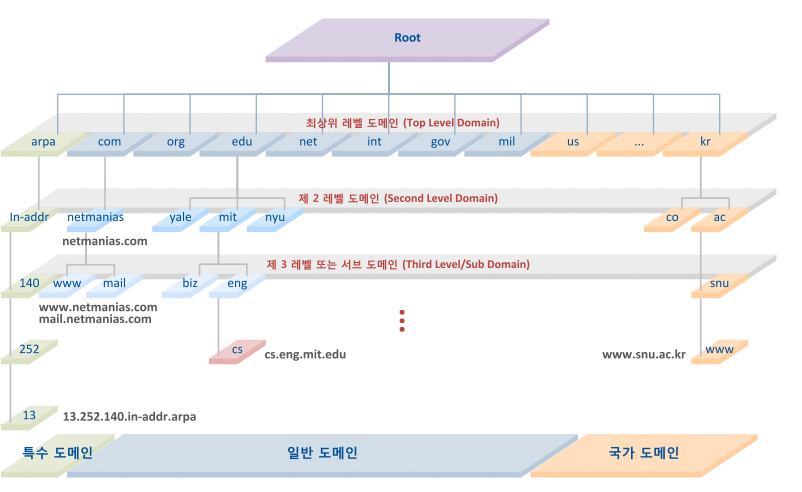
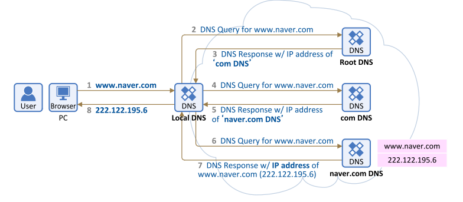

# [WEB] 웹 브라우저에 URL 입력 시 일어나는 일

네이버 접속 시 일어나는 동작을 자세하게 알아보도록 합시다.

## 주소표시줄에 URL 입력

웹 브라우저가 우선적으로 URL을 해석합니다.

웹 브라우저는 아래와 같은 구조를 가지고 있으며 해당 구조에 적합한지 판단합니다.

````
scheme:[//[user:password@]host[:port]][/]path[?query][#fragment]
````


만약 적합하지 않다면 기본 검색엔진에 검색을 요청하게 됩니다.

적합하다면 HSTS 목록을 확인합니다.

해당 목록에 있다면 첫 요청을 HTTPS로 보내고 아닌 경우 HTTP로 보냅니다.

> HSTS란
>
> HTTP Strict Transport Security의 줄임말로 HTTP 대신 HTTPS만을 사용하여 통신해야 한다고 웹 브라우저에게 알리는 보안 기능입니다.
>
> https://developer.mozilla.org/ko/docs/Web/HTTP/Headers/Strict-Transport-Security


## DNS 조회

`DNS`는 Domain Name Server로 도메인에 대한 IP주소를 반환하는 역할을 합니다.

IP 주소를 알고 있어야 연결이 가능하기 때문에 사용자가 입력한 도메인에 대한 IP 주소를 알아내기 위해 DNS를 조회해야합니다.

하지만 그 전에 아래 두 개의 과정을 우선합니다.

* 도메인이 캐시되어있는지 확인합니다. 
* 도메인이 캐시되있지 않다면 hosts 파일을 확인합니다. hosts 파일은 운영 체제가 호스트 이름을 IP 주소에 매핑해놓은 파일입니다.


도메인이 워낙 많기 때문에 전 세계 모든 도메인 정보를 가지고 있는 DNS 서버는 존재하지 않습니다.

아래 이미지와 같이 계층적인 구조를 가집니다.





웹 브라우저는 위 계층구조 중 검색한 도메인이 어디에 있는지 바로 알지 못하기 때문에 Root DNS 부터 차근차근 찾아가게 됩니다.

그 과정은 아래와 같습니다.



Root DNS를 통해 com DNS의 주소를 알아내고, com DNS를 통해 naver.com DNS의 주소를 알아내고, naver.com DNS로 부터 `www.naver.com` 의 IP 주소를 알아 낼 수 있었습니다.


## ARP

`ARP` 는 Address Resolution Protocol의 줄임말로 IP 주소에 맞는 MAC 주소를 가지고 오는 프로토콜입니다.

`MAC` 주소란 Media Access Control의 약자로 네트워크 카드 하드웨어에 부여되는 고유한 물리적 주소입니다.


### IP 주소가 아닌 MAC 주소가 필요한 이유

IP 주소와 MAC 주소 모두 고유한 주소이지만 IP 주소는 사설 IP 주소때문에 문제가 됩니다.

사설 IP 주소는 공인 IP 주소의 부족으로 등장하였으며 자기 네트워크망 내부에서만 사용할 수 있습니다.

사설 IP 주소를 사용하는 모든 네트워크는 하나의 공인 IP 주소를 사용하기 때문에 외부에서는 IP 주소만으로 찾을 수 없습니다.

이러한 이유로 MAC 주소를 사용하고, MAC 주소는 유일한 주소이기 때문에 IP 주소와 같은 문제가 발생하지 않습니다.


### ARP 동작 원리

* 송신자는 MAC 주소 요청을 위한 ARP 요청 패킷을 브로드캐스트로 전송합니다. 
* 모든 호스트와 라우터는 ARP 요청 패킷을 수신하고 해당하는 수신지만 자신의 MAC 주소를 응답하여 유니캐스트로 전송합니다.


## TCP 통신 및 렌더링

TCP 소캣을 열고 3-way handshake로 연결을 설정합니다.

서버와의 연결이 완료되었으면 HTTP를 통해 요청하고 응답받는 과정을 반복합니다. 

이 과정에서 웹 브라우저는 HTML, CSS, JS, 이미지 등의 리소스를 받게 됩니다.

그 후 해당 리소스들을 렌더링하여 사용자에게 보여주게 됩니다.


## 레퍼런스

https://owlgwang.tistory.com/1


## 질문할 사항


## 추가 공부할 키워드

