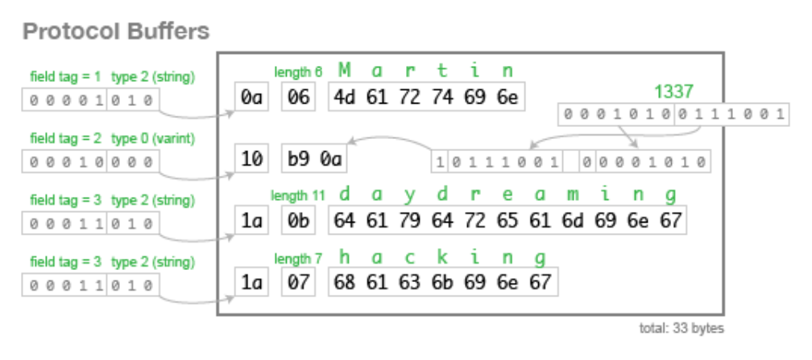

# [WEB] google이 만든 RPC, gRPC란

## gRPC란

`gRPC`는 구글에서 개발한 어디서나 실행할 수 있는 오픈소스 고성능 RPC 프레임워크입니다.

RPC는 Remote Procedure Call의 줄임말로 원격 프로시저 호출이라고 합니다. 이는 별도의 원격제어를 위한 코딩없이 다른 주소공간에서 함수나 프로시저를 실행할 수 있게 해주는 프로세스간 통신 기술입니다.

특히 MSA 구조에서 각각의 서버가 다른 언어와 프레임워크로 개발되었을 경우에도 RPC는 문제 없이 서버간의 통신이 가능해집니다.

또한 기존의 REST 방식의 경우에는, 표준이 없어 파라미터의 응답이 명시적이지 않았을 뿐 아니라 JSON 형태의 데이터를 Serialization하는 비용이 발생한다는 단점이 있었습니다.

RPC는 이러한 문제점까지 해결하며 사용이 많아지고 있습니다.


## Stub

RPC의 핵심 개념은 `Stub` 입니다.

서버와 클라이언트는 다른 주소 공간을 사용하고 있습니다. 

그렇기 때문에 함수호출에 사용되는 매개변수를 변환하는 작업이 필요합니다. 

안그러면 메모리 매개변수에 대한 포인터가 다른 데이터를 가리키게 됩니다.

> 무슨 말일까요?

이 변환을 담당하는 것이 바로 `Stub` 입니다.


### Marshalling과 Unmarshalling

Stub은 클라이언트와 서버 각각에 존재합니다.

client Stub은 함수 호출에 사용될 파라미터를 변환합니다. 이를 `Marshalling`이라고 합니다.

또한 서버에서 넘어온 결과를 변환합니다.

server Stub은 클라이언트가 전달한 매개변수를 역변환합니다. 이를 `Unmarshalling` 이라고 합니다.

또한 함수 실행 결과를 변환합니다.


## RPC의 동작 방식


1. Client가 Client Stub 호출
2. Client Stub가 파라미터를 표준 포맷으로 변경
3. Client Stub가 transport layer로 Server Stub에게 메세지 전송
4. Server Stub은 프로시저 호출
5. 프로시저가 완료되면 Server Stub으로 반환
6. Server Stub가 transport layer로 Client Stub에게 메세지 전송
7. Client Stub은 반환 값을 변환하여 Client에게 전달


## gRPC의 특징

### HTTP/2

`gRPC` 는 HTTP/2를 사용합니다.

이는 HTTP/1.1에 비해 여러 측면에서 장점을 가지고 있으며 이에 대한 자세한 내용은 아래 링크에서 참고할 수 있습니다.

https://ssungkang.tistory.com/entry/%EB%84%A4%ED%8A%B8%EC%9B%8C%ED%81%AC-HTTP-11-VS-HTTP-20


### Protocol Buffer

프로토콜 버퍼는 JSON, XML과 마찬가지로 직렬화 데이터 구조입니다.

프로토콜 버퍼는 다른 구조에 비해 데이터의 크기가 작습니다.

아래 예시를 봅시다.

아래 데이터를 JSON으로 표현한 경우 82byte의 크기가 사용되었습니다.

```json
{ 
  "userName":"Martin",
  "favouriteNumber":1337,
  "interests":["daydreaming","hacking"] 
}
```


하지만 이를 프로토콜 버퍼로 표현한다면 33byte로 표현 가능합니다.



어떻게 프로토콜 버퍼가 데이터를 표현하는지 위 그림에 나와있습니다.

필드명을 굳이 전부 표시하지 않고 5bit로 field tag에 숫자로 표현합니다.

또한 뒤에 3bit를 통해 type을 명시하며, 그 다음 byte에서는 데이터의 길이를 나타냅니다.

위 처럼 저장되면 사람이 보고 이해할 수 없기 때문에 `proto` 확장자를 가진 파일로 데이터에 대한 설명을 명시합니다.

``` protobuf
message Person { 
    required string user_name       = 1; 
    optional int64 favourite_number = 2; 
    repeated string interests       = 3; 
}
```


이를 통해 데이터의 크기를 최소화하고 통신을 더 빠르게 할 수 있습니다.


## RPC의 단점

gRPC에 대해 알아보고 있지만 gRPC의 단점은 기존 RPC의 단점과 동일하여 이에 대해 알아보겠습니다.


### 인간이 읽기 부적합

위에서 말한 `proto` 파일이 없을 경우에는 사람이 데이터를 해독하기에 어렵습니다.

따라서 유저와 직접적으로 소통하는 클라이언트일 경우 RPC 사용하기에 부적절합니다.

그렇기 때문에 내부 서비스간에 많이 사용됩니다.


### proto 문법

`proto` 파일을 작성하기 위한 문법을 숙지해야 합니다.


## 레퍼런스

https://jeong-pro.tistory.com/190

https://medium.com/naver-cloud-platform/nbp-%EA%B8%B0%EC%88%A0-%EA%B2%BD%ED%97%98-%EC%8B%9C%EB%8C%80%EC%9D%98-%ED%9D%90%EB%A6%84-grpc-%EA%B9%8A%EA%B2%8C-%ED%8C%8C%EA%B3%A0%EB%93%A4%EA%B8%B0-1-39e97cb3460


## 질문할 사항


## 추가 공부할 키워드

