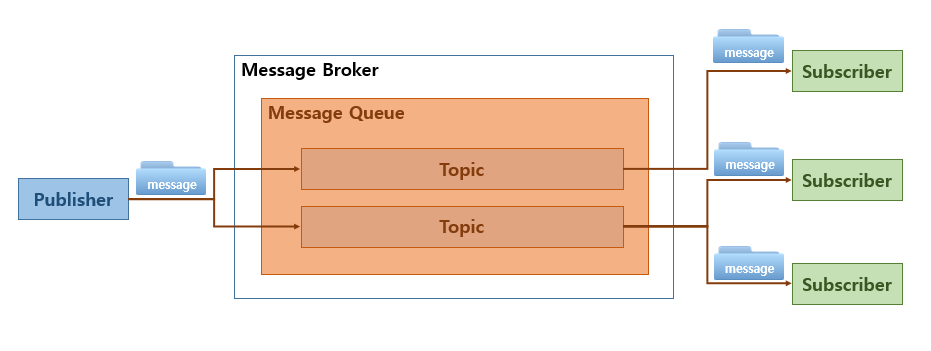

# [WEB] Apache Kafka란 

## Kafka란 

`Apache Kafka` 는 아파치 소프트웨어 재단이 스칼라로 개발한 메세지 브로커입니다.

`Kafka`는 쓰기에 최적화된 시스템이기 때문에 *Franz Kafka* 라는 작가의 이름에서 이름을 따왔습니다.

2011년 오픈소스로 공개되어 현재 데이터 파이프라인을 구축하는데 있어 많은 사랑을 받고 있습니다.

## Message Broker

`Kafka`는 Message Broker라고 했습니다.

Message Broker가 무엇일까요?

Message Broker란 publisher로 부터 전달받은 메세지를 subscriber로 전달해주는 중간 매개체입니다.

메세지가 적재되는 공간을 **Message Queue**라고 하며 메세지의 그룹을 **Topic**이라고 합니다.

서로 다른 subscriber가 Message Broker없이 단순히 DB에서 값을 주고 받는다면 어떠한 문제가 발생할까요?

실시간으로 대용량 데이터에 들어온다고 하면, table에 데이터가 빠르게 쌓이고 이를 빠르게 조회하는 것은 쉽지 않습니다.

## Kafka의 특징

### 다중 프로듀서, 다중 컨슈머

Kafka는 하나의 Topic에 여러 프로듀서가 동시에 메세지를 전송할 수 있습니다. 

또한 여러 컨슈머가 동시에 하나의 Topic에서 읽어 갈 수 있습니다.

뿐만 아니라 하나의 프로듀서가 여러 개의 Topic에 메세지를 전송할 수도, 하나의 컨슈머가 여러 개의  Topic에 메세지를 읽을 수도 있습니다.

### 파일시스템

기존의 메세징 시스템을 들은 메모리 상의 Queue에 메세지를 유지했습니다.

하지만 Kafka는 파일시스템에 메세지를 저장합니다.

따라서 컨슈머가 메세지를 바로 읽지 않아도 일정 기간 내에는 읽을 수 있습니다.

이로 인해 프로듀서와 컨슈머 사이에 속도 차이가 존재하거나, 컨슈머가 장애가 와서 지연되거나 할 때도 문제없이 동작할 수 있습니다.

다른 MQ들은 메모리를 사용하는데 비해 Kafka는 파일시스템을 사용하기 때문에 느리다고 생각할 수도 있지만 실제로 그렇지 않습니다.

Kafka도 내부적으로 디스크 I/O에 접근을 최소화하기 위해 메모리를 사용합니다.

### 확장성

Kafka는 운영 중 확장에 용이합니다.

message broker의 수, 프로듀서의 수, 컨슈머의 수, Topic의 수 등 운영 중에도 유연하게 수평적인 확장이 가능합니다.

### 고성능

Kafka는 대용량 실시간 로그 처리에 특화되어 있습니다.

이를 위해 기존의 MQ들이 제공했던 기능들을 제거함으로서 시스템 내부에서 복잡한 처리와 병목현상을 최소화하였습니다.

