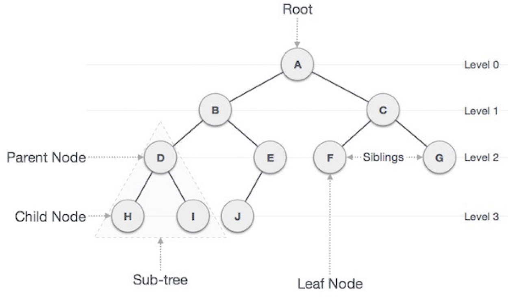
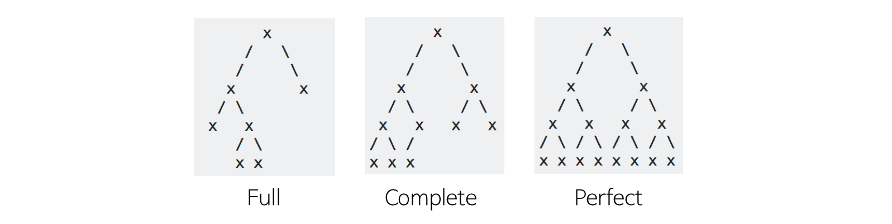

# 01. 트리

## 01. 트리란

트리는 일반적으로 대상 정보의 각 항목들을 계층적으로 연관되도록 구조화시키고자 할 때 사용하는 비선형 자료구조입니다.

그래프의 일종으로 DAG(Directed Acyclic Graphs)이기 때문에 사이클이 없습니다.

### 트리와 관련된 용어

* 루트 노드(root node): 부모가 없는 노드, 하나의 트리는 루트 노드가 유일

* 단말 노드(leaf node): 자식이 없는 노드

* 내부(internal) 노드: 단말 노드가 아닌 노드
* 간선(edge): 노드를 연결하는 선 
* 형제(sibling): 같은 부모를 가지는 노드
* 노드의 크기(size): 자신을 포함한 모든 자손 노드의 개수
* 노드의 깊이(depth): 루트에서 어떤 노드에 도달하기 위해 거쳐야 하는 간선의 수
* 노드의 레벨(level): 트리의 특정 깊이를 가지는 노드의 집합
* 노드의 차수(degree): 자식 노드의 개수
* 트리의 차수(degree of tree): 트리의 최대 차수
* 트리의 높이(height): 루트 노드에서 가장 깊숙히 있는 노드의 깊이
  

## 02. 이진트리

이진트리는 트리를 구성하는 노드들의 최대 차수(degree)가 2인 노드들로 구성되는 트리입니다.

### 이진트리의 종류

* 전 이진 트리(Full  Binary Tree)

  모든 노드가 0개 또는 2개의 자식 노드를 갖는 트리

* 완전 이진 트리(Completable Binary Tree)

  마지막 레벨을 제외한 모든 레벨에 노드가 존재하고 마지막 레벨은 왼쪽에서 오른쪽으로 채워지는 트리

* 포화 이진 트리(Perfect Binary Tree)

  전 이진 트리 + 완전 이진 트리로 모든 레벨에 노드가 차있는 트리

### 이진 탐색 트리

이진 탐색 트리는 Binary Search Tree, 줄여서 BST라고도 합니다.

모든 노드가 자신의 왼쪽 서브트리에는 현재 노드보다 작은 값이, 오른쪽 서브트리에는 현재 노드보다 큰 값이 오는 이진트리입니다.

탐색 연산은 평균적으로  `O(logN)` 의 시간 복잡도를 가지지만 최악의 경우에는 `O(N)` 의 시간 복잡도를 가집니다.

이진 탐색 트리가 한 쪽으로만 치우쳐진 편향 트리가 되는 경우인데 이를 해결하기 위해 균형잡힌 이진탐색트리, 레드블랙트리와 AVL 트리가 등장하였습니다.

## 03. 트라이

트라이(trie)는 대표적인 Non-Binary Tree로 문자열 검색에 효과적입니다.

자세한 내용은 아래의 블로그에 있습니다.

https://ssungkang.tistory.com/entry/Algorithm-Trie-%EC%9E%90%EB%A3%8C%EA%B5%AC%EC%A1%B0

## 레퍼런스

https://gmlwjd9405.github.io/2018/08/12/data-structure-tree.html

http://www.secmem.org/blog/2019/05/09/%ED%8A%B8%EB%A6%AC%EC%9D%98-%EC%A2%85%EB%A5%98%EC%99%80-%EC%9D%B4%ED%95%B4/

## 질문할 사항

* 두 번째 러퍼런스 제일 하단

## 추가 공부할 키워드

* 레드블랙트리와 AVL트리