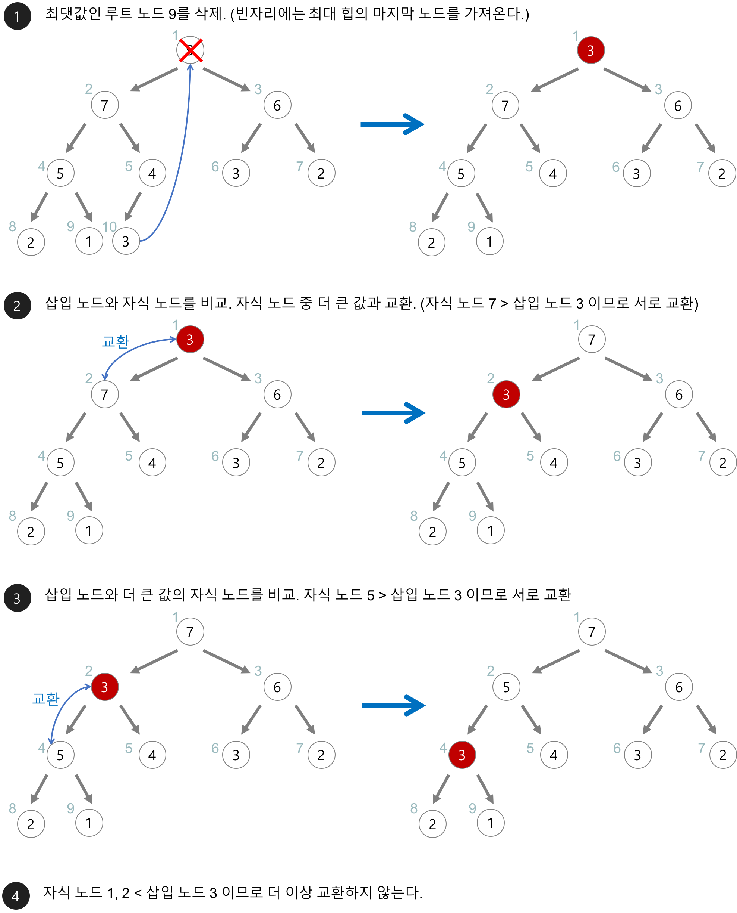

# 02. 우선순위 큐

## 01. 우선순위 큐란

일반적인 큐는 FIFO의 구조입니다.

그에 비해 **우선순위 큐** 는 들어간 순서에 상관없이 우선순위가 높은 데이터가 먼저 나오는 자료구조입니다.

우선순위 큐는 이를 위해 내부적으로 Heap이라는 자료구조를 사용합니다.

## 02. 배열이나 연결리스트로 구현한 우선순위 큐

### 배열로 구현한 경우

배열로 우선순위 큐를 구현한다고 생각해봅시다.

배열이 우선순위에 맞춰 정렬되어 있다고 생각하면 삽입하기 위해서는 `O(N)` , 삭제하기 위해서 `O(1)` 의 시간복잡도가 소요됩니다.

### 연결리스트로 구현한 경우

배열과 마찬가지로 삽입하기 위해 적절한 지점을 찾아야합니다.

삽입하기 위해서는 `O(N)` , 삭제하기 위해서 `O(1)` 의 시간복잡도가 소요됩니다.

## 03. 힙, Heap

### 힙의 특징

* 완전 이진 트리(Complete Binary Tree)
* 느슨한 정렬 상태 유지
* 자식 노드는 부모 노드보다 항상 크다 (최소 힙 기준으로 최대 힙은 반대)

### 데이터 삽입

* 힙에 새로운 요소가 들어오면 새로운 노드를 힙의 마지막 노드에 삽입
* 새로운 노드를 부모 노드들과 교환해서 힙의 성질을 만족

### 데이터 삭제

* 루트 노드의 데이터를 삭제
* 삭제된 루트 노드에는 힙의 마지막 노드를 가져옴
* 힙을 재구성

## 레퍼런스

https://gmlwjd9405.github.io/2018/08/12/data-structure-tree.html

https://chanhuiseok.github.io/posts/ds-4/

https://gmlwjd9405.github.io/2018/05/10/data-structure-heap.html

## 질문할 사항

## 추가 공부할 키워드

