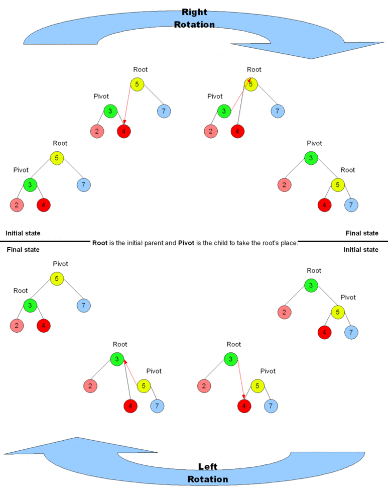
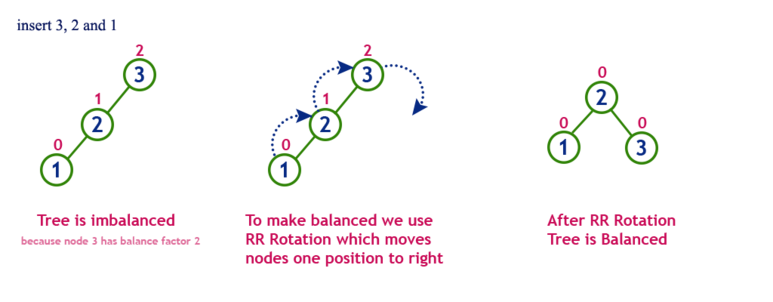
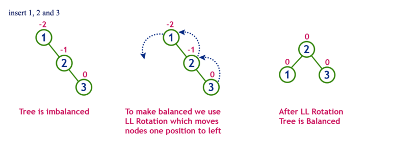
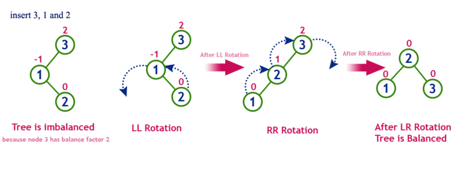
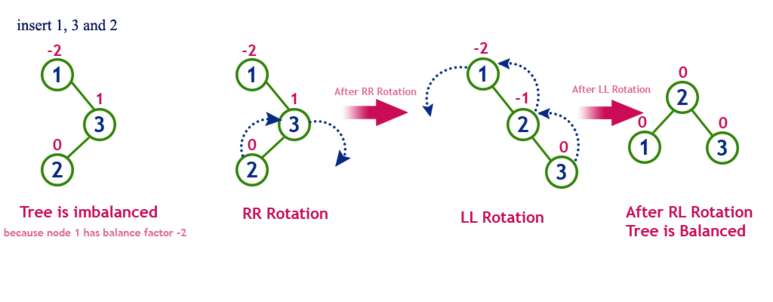

# 05. AVL 트리

## 01. AVL 트리란

AVL 트리는 이진탐색 트리의 문제점을 보완하기 위해 등장하였습니다.

이진 탐색 트리는 탐색 시간이 `O(logN)` 이지만 한 쪽으로 치우쳐진 편향 트리가 될 경우, 탐색 시간이  `O(N)` 이 됩니다.

따라서 트리의 균형을 맞춰준 것을 AVL 트리라고 합니다.

균형을 맞춘다는 것은 좌우 높이 차가 1이하가 되도록 하는 것입니다.

## 02. 균형 유지 전략

AVL 트리는 균형을 유지하기 위해 트리를 재배치합니다.

트리를 재배치 하기 위해서 트리를 회전 시킵니다.

회전은 왼쪽과 오른쪽으로 할 수 있으며 아래와 같이 수행됩니다.

트리의 균형이 깨진 경우를 4가지로 나눠 각 상황에 맞춰 적절한 회전으로 균형을 맞추게 됩니다.

### 왼쪽 서브 트리의 왼쪽 서브 트리에 의해 균형이 깨진 경우

이 경우 오른쪽으로 회전을 진행합니다.

### 오른쪽 서브 트리의 오른쪽 서브 트리에 의해 균형이 깨진 경우

이 경우 왼쪽으로 회전합니다.

### 왼쪽 서브 트리의 오른쪽 서브 트리에 의해 균형이 깨진 경우

이 경우 왼쪽으로 한 번, 오른쪽으로 한 번 회전합니다.

### 오른쪽 서브 트리의 왼쪽 서브 트리에 의해 균형이 깨진 경우

이 경우 오른쪽으로 한 번, 왼쪽으로 한 번 회전합니다.

## 레퍼런스

https://www.zerocho.com/category/Algorithm/post/583cacb648a7340018ac73f1

https://blog.naver.com/qbxlvnf11/221371740002

## 질문할 사항

## 추가 공부할 키워드

