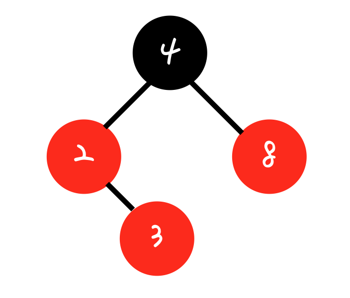
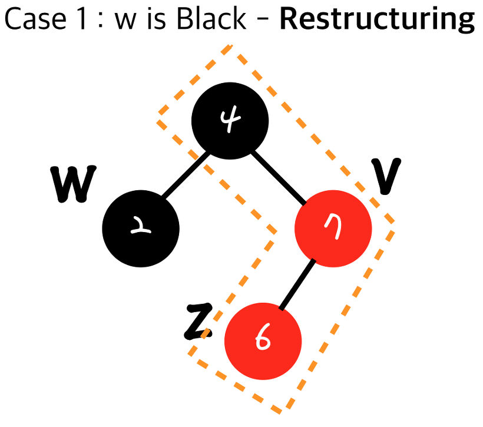
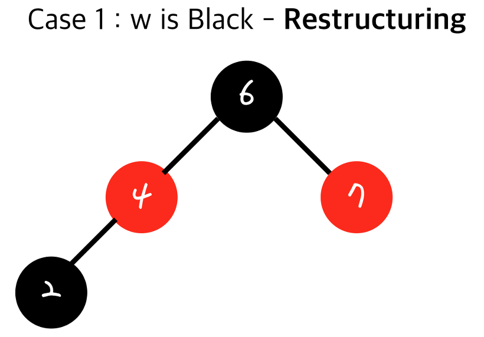
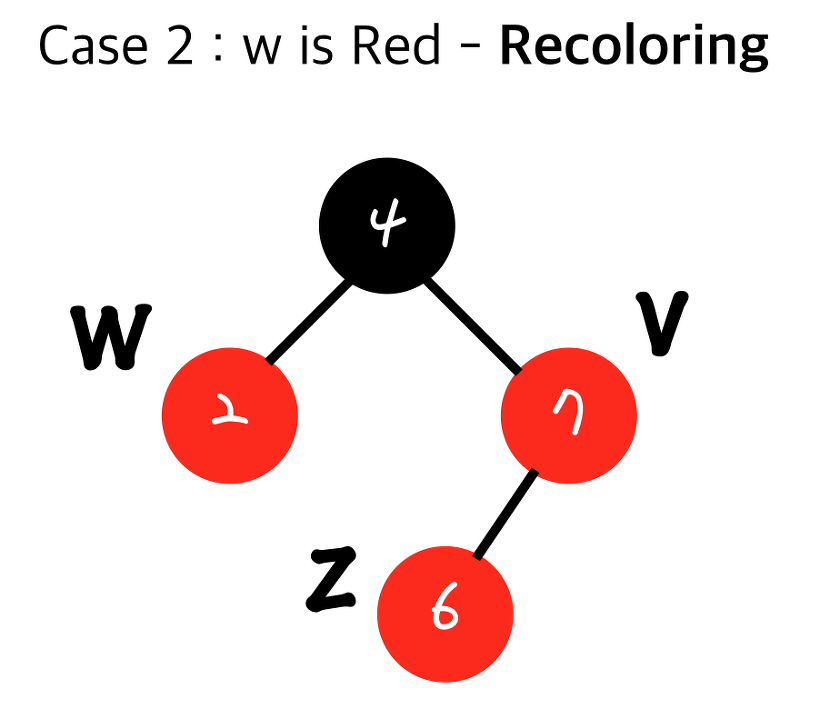
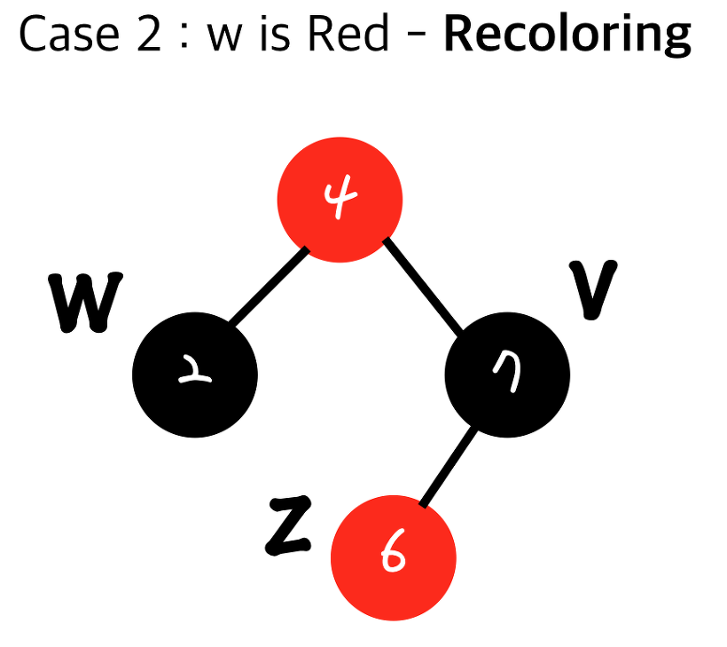

# 06. red black 트리

## 01. red black 트리란

red black 트리는 이진탐색 트리의 문제점을 보완하기 위해 등장하였습니다.

이진 탐색 트리는 탐색 시간이 `O(logN)` 이지만 한 쪽으로 치우쳐진 편향 트리가 될 경우, 탐색 시간이  `O(N)` 이 됩니다.

따라서 트리의 균형을 맞춰준 것을 red black 트리라고 합니다.

## 02. red black 트리의 조건

red black 트리는 4가지 조건을 가지고 있습니다.

* Root Property : 루트 노드의 색깔은 검정
* External Property : 모든 리프 노드들은 검정
* Internal Property : red 노드의 자식은 검정
* Depth Property : 리프 노드에서 루트까지 만나는 black 노드의 개수는 동일

## 03. Restructuring과 Recoloring

위 조건에 맞춰 red black 트리를 만들어보겠습니다.

우선 삽입되는 노드의 색깔은 모두 red 입니다.

따라서 4 - 2 - 8 - 3 순으로 데이터를 삽입하면 이진탐색 트리의 특징에 의해 아래와 같습니다.

하지만 이 때 2 - 3 사이에 `Internal Property` 를 위반하게 됩니다.

이를 해결하는 방법은 **Restructuring**, **Recoloring**  두 가지가 있습니다.

둘 중 어느 방법을 사용할지는 부모의 형제 노드를 보고 결정하게 됩니다.

### Restructuring

부모의 형제 노드가 black일 때 사용하는 방법입니다.

* 추가된 노드와 그 노드의 부모노드, 다시 그 부모노드를 오름차순으로 정렬
* 그 중 가운데 값을 부모노드로 만들고 black
* 나머지 두 노드를 자식노드로 만들고 red

이를 통해 위에서 아래와 같이 노드의 구조가 변경됩니다.

Restructuring은 다른 서브트리에 영향을 끼치지 않기 때문에 한 번으로 끝나고 자체의 시간 복잡도도 `O(1)` 입니다.

하지만 삽입 연산 후에 일어나기 때문에 삽입되는 시간복잡도는 `O(logn)` 으로 총  `O(logn)` 입니다.

### Recoloring

부모의 형제 노드가 red일 때 사용하는 방법입니다.

* 추가된 노드의 부모와 그 형제를 black으로 하고 부모의 부모 노드를 red로 색 변경
* 부모의 부모가 루트가 아니었을 경우 double red가 다시 발생할 수 있음

이를 통해 위에서 아래와 같이 노드의 색이 변경됩니다.

이 때 4 값을 가지는 노드가 루트 노드라면  `Root Property` 에 의해 black으로 바꿔줍니다.

만약 루트 노드가 아니라면 어떻게 될까요?

4 값을 가지는 노드의 부모가 black이라면 문제가 없지만 red라면 double red가 생긴 것이기 때문에 다시 상황에 맞춰  **Restructuring**, **Recoloring**  중 하나를 결정하게 됩니다.

Recoloring은 시간 복잡도 `O(1)`이지만 Restructuring와 다르게 위로 전파되기 때문에 최악의 경우 `O(logn)` 이 소요됩니다.

삽입 역시  `O(logn)`  이기 때문에 최종적으로  `O(logn)` 의 시간복잡도를 가집니다.

## 04. 결과

그렇다면 red black 트리는 어느 정도로 균형을 맞추고 있을까요?

루트 노드로부터 가장 먼 리프 노드와 가장 가까운 리프 노드를 생각해봅시다.

가장 가까운 리프 노드는 black 노드만 N개 존재하는 경우입니다.

가장 먼 리프 노드는 `Depth Property` 에 의해 black 노드는 N개 존재하고, 두 색이 번갈아가며 나타나야 하므로 red는 N-1개 존재합니다.

즉 가장 극단적인 경우에도 높이 차이가 2배 차이나므로 충분히 균형있다고 말할 수 있습니다.

따라서 red black 트리는 이진탐색트리 중에서도 성능이 가장 좋아 C++의 Map 등 여러 곳에서 사용되고 있습니다.

## 레퍼런스

https://zeddios.tistory.com/237

## 질문할 사항

## 추가 공부할 키워드

