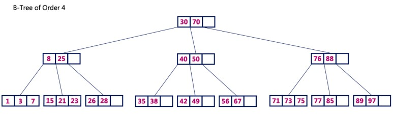
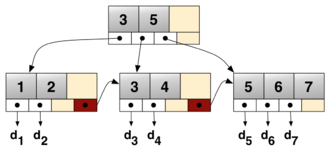

# 07. B 트리

## 01. 다원 탐색 트리

다원 탐색 트리는 AVL 트리의 문제점을 보안하기 위해 고안되었습니다.

AVL 트리는 균형을 맞추지만 이진트리이기 때문에 자료의 개수가 증가하면 트리의 높이가 계속해서 높아지게 됩니다.

**다원 탐색 트리** 는 AVL 트리 처럼 균형을 유지하며 하나의 노드가 여러 데이터를 저장하며, 자식 노드도 둘 이상을 가져 트리의 높이 문제와 균형을 맞추기 위한 비용 문제를 해결합니다.

### m-원 탐색 트리의 특징

* 각 노드는 0에서 최대  m개의 서브 트리를 가짐
* k개의 서브 트리를 가지는 노드는 k-1개의 자료를 가짐 (k<=m)
* 각 노드 안에서 자료들은 검색 키에 의해 정렬됨
  * i 번째 값 <= i 번째 서브 트리 내의 모든 값 < i+1번째 값
* 모든 서브 트리는 m-원 탐색 트리

우리가 흔히 알고 있는 이진 탐색 트리는 m=2일 때의 m-원 탐색 트리이고 지금 알아볼 B 트리도 m-원 탐색 트리 중 하나입니다.

## 03. B 트리

### B 트리의 특징

* 루트 노드는 리프 노드이거나, 2에서 m개의 서브 트리를 가짐
* 루트 노드와 리프 노드를 제외한 모든 노드는 아래와 같이 서브 트리를 가짐
  * [m/2] <= 서브 트리의 개수 <= m
* 리프 노드는 아래와 같이 데이터를 가짐
  * [m/2]-1 <= 데이터의 개수 <= m-1
* 모든 리프 노드는 같은 레벨에 있는 완전한 균형 상태

### 데이터 삽입

* 데이터 삽입은 리프 노드에서 시작
* 삽입할 위치를 찾기 위해 노드의 키 값을 왼쪽에서 오른쪽으로 탐색
* 노드에 빈 자리가 있으면 삽입 후 종료
* 노드가 꽉 차있으면
  * 삽입할 값과 리프 노드의 값들 중 중간값 선택
  * 중간값은 부모노드에 삽입
  * 중간값보다 작은 값은 왼쪽 자식 노드에 삽입
  * 중간값보다 큰 값은 오른쪽 자식 노드에 삽입

### 데이터 삭제

* 삭제할 데이터가 리프 노드에 있으면 단순 삭제
* 삭제할 데이터가 내부에 있으면 왼쪽 자식 노드와 오른쪽 자식 노드 중 여유 있는 곳에서 데이터를 가져옴
* 양 쪽 다 여유가 없다면 자식 노드 하나와 병합

## 04. B+ 트리

실제 검색 시스템에서는 대부분 대용량 데이터를 저장하기 때문에 차수가 5 이상인 다원 탐색  트리를 사용하게 됩니다.

이 경우 각 노드는 최대 4개의 데이터를 저장할 수 있고, 서브 트리를 최대 5개 가질 수 있습니다.

이 경우 전체 노드의 상당수가 비게 되어 메모리 낭비가 발생합니다.

이를 해결하고자 B 트리를 개선한 트리들이 등장하였습니다.

### B+ 트리

* 내부 노드들은 자료의 키 값만 저장하고 실질적인 데이터는 리프 노드에만 저장합니다.
* 리프 노드는 다음 리프 노드에 대한 포인터를 가지고 있어 B 트리에 비해 빠르게 순차 접근이 가능합니다.

## 레퍼런스

https://zeddios.tistory.com/237

https://blog.naver.com/qbxlvnf11/221382883022

## 질문할 사항

## 추가 공부할 키워드