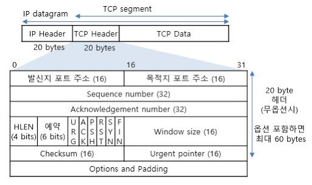
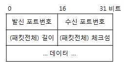

# 01_TCP_UDP

## 01. TCP

### TCP란?

TCP란 Transmission Control Protocol의 약자로 서버와 클라이언트가 데이터를 신뢰성 있게 전달하기 위해 만들어진 프로토콜입니다.

이름의 뜻에서 알 수 있듯이 전송을 제어합니다. 데이터가 전달되는 과정에서 유실될 수도 있고 순서가 바뀔 수도 있는데 TCP는 이를 바로 잡아줍니다.

### TCP의 특징

TCP의 여러 특징을 알아봅시다.

* 신뢰성

  TCP의 정의에서도 설명했듯이 TCP의 가장 중요한 특징입니다. 

  데이터가 유실되지 않고 순서가 보장된다는 의미로 TCP가 어떠한 방식으로 이를 보장하는지는 이후에 살펴봅시다.

* 흐름 제어(flow control)

  송신자와 수신자의 데이터 처리 속도 차이가 나는 경우, 송신자가 수신자가 받아들일 수 있는 데이터보다 더 빠르게 데이터를 보낸다면 데이터의 손실로 이어집니다.

  따라서 TCP는 이 속도를 기준으로 송신자가 보내야하는 데이터의 양을 제어하는 메커니즘을 구현합니다.

* 연결형

  TCP를 사용하여 데이터를 보내기 위해서는 먼저 연결이 설정되어야 합니다.

  송신자와 수신자가 3 way handshake를 통해 연결을 맺게 됩니다.

* 양방향성

  하나의 전송선로에서 데이터가 동시에 양쪽 방향으로 전송 될 수 있습니다.

  

### 프로토콜 헤더

TCP Header에는 어떤 필드들이 있고 어떤 역할을 하는지 알아봅시다.

#### 

| 필드명                 | 크기(bit) | 기능                                                   |
| ---------------------- | --------- | ------------------------------------------------------ |
| Source Port            | 16        | 발신지 포트 주소                                       |
| Destination Port       | 16        | 목적지 포트 주소                                       |
| Sequence number        | 32        | TCP 세그먼트에 있는 데이터의 첫번째 바이트에 대한 순번 |
| Acknowledgement number | 32        | 송신자가 수신자에게 기대하는 다음 바이트의 순번        |
| Window size            | 16        | TCP 세그먼트를 보내는 호스트의 현재 TCP 버퍼 크기      |
| HLEN                   | 4         | 워드 단위로 TCP 헤더의 길이                            |
| Checksum               | 16        | TCP 데이터와 헤더의 정확성을 검증                      |

## 02. UDP

### UDP란?

UDP란 User Datagram Protocol의 약자로 비연결형, 신뢰성 없는 전송 프로토콜입니다.

TCP가 데이터의 유실과 순서 변화를 바로 잡았던 것에 비해 UDP는 추가적인 기능이 없습니다.

단지 수신된 패킷에서 오류를 탐지하면 이를 폐기하는 정도의 오류제어 기능을 제공합니다.

### UDP의 특징

* 빠른 처리속도와 데이터 전송률

  데이터에 대한 재전송, 순서 보장 등 없이 데이터를 전송하기 때문에 빠르게 전송할 수 있습니다.

* 최소한의 오류 검출

  Checksum 필드를 통해 잘못된 데이터에 대한 기본적인 오류제어만 할 뿐 다른 추가적인 기능을 제공하지 않습니다.

* 비연결형

  연결을 위해 할당되는 논리적인 경로가 없기 때문에 패킷은 다른 경로로 전송되고, 각각의 패킷이 독립적인 관계를 이룹니다.

### 프로토콜 헤더

UDP Header는 TCP에 비해 비교적 단순하고 간단합니다.

헤더에 Option이 없기 때문에 8바이트로 고정이고, 그렇기 때문에 패킷 전체 길이를 알면 데이터의 크기 역시 구할 수 있습니다.

## 레퍼런스

https://musclebear.tistory.com/11?category=773007

http://www.ktword.co.kr/abbr_view.php?m_temp1=347

http://www.ktword.co.kr/abbr_view.php?m_temp1=323

## 질문할 사항
## 추가 공부할 키워드

* 프로토콜이란
* flow control vs Congestion control
* transport 계층의 다중화와 역다중화
* 3,4  way handshake
* Sequence number와 Acknowledgement number를 통해 어떻게 신뢰적인 데이터 전송을 보장하는지