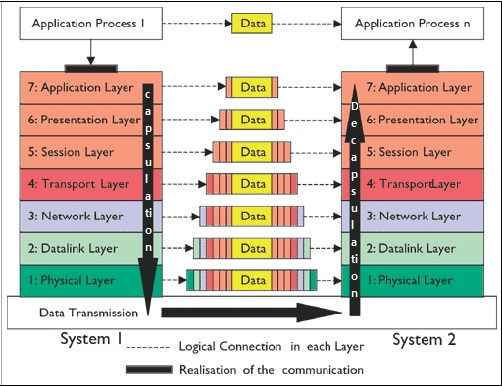

# 02_OSI 7계층

## 01. OSI 7계층

### OSI 7계층이란?

OSI는 Open Systems Interconnection의 줄임말로서 개방형 시스템이라는 의미입니다. 개방이 되어 있는 시스템이기 때문에 누구나 참조할 수 있고 사용할 수 있습니다.

기본 내부 구조 및 기술에 관계없이, 통신 또는 컴퓨팅 시스템의 통신 기능을 특성화하고 표준화하는 개념적인 모델입니다.

### OSI 7계층의 목적

OSI 7계층은 통신업체와 개발자가 만든 디지털 통신 제품 및 소프트웨어 프로그램이 상호 운용되도록 안내하고, 통신 장비간의 명확한 비교를 용이하게 합니다.  OSI 7계층 개념이 나오기 전에는 통신업체의 장비들은 자신의 업체 장비끼리만 연결이 되는 호환성 문제가 있었습니다.

또한 문제 발생 시, OSI 계층을 통해 범위를 좁혀 문제가 있는 부분을 파악 할 수 있습니다.

### OSI 7계층의 각 계층

#### 7. 응용 계층

* 최종 사용자가 실제로 상호 작용하며 네트워크 리소스에 대한 액세스를 허용

* 예 : 전자메일, 파일 송수신

  

#### 6. 표현 계층

* 네트워크 사의 여러 다른 기종 시스템들이 다른 데이터 표현 방식을 사용하는데 이를 하나의 통일된 구문 형식으로 변환
* 주요 역할
  * 공통 형식으로 변환
  * 암호화, 압축

#### 5. 세션 계층

* 안정적인 연결을 맺고 작업이 완료되면 연결을 끊는 역할로 에러 발생 시 복구를 관리

#### 4. 전송 계층

* 어떤 종류의 네트워크가 사용되었는지 이용자가 의식하지 않도록 하며 쌍방 이용자간에 투명하고 신뢰성 있게 양단 간에 논리적인 통신을 가능하게 함

* 역할

  * End-to-End : 두 호스트 간의 정보전달을 두 프로세스 간의 정보전달로 바꿈
  * 신뢰적 전송
  * 투명한 전송
  * 다중화/역다중화
  * 지연 및 대역폭 부족에 대한 보상 : 효율적인 데이터 전송을 위해 적당한 크기의 패킷으로 데이터 분리하고 수신 측에서는 이 패킷을 재결합

* 단위로 세그먼트를 사용

  

#### 3. 네트워크 계층

* 논리적인 주소(IP, IPX, ARP)를 담당하고 패킷의 전달 경로를 결정

* 주요 역할
  * 경로 제어(라우팅)
* 단위로 데이터그램, 패킷을 사용
* 사용 장비 : 라우터

#### 2. 데이터 링크 계층

* 물리 계층의 비트를 네트워크 계층이 사용할 수 있도록 전송 에러 없이 통신 채널로 변환
* 주요 역할
  * 프레이밍 : 데이터를 프레임으로 그룹화하여 전송
  * 흐름제어
  * 에러제어
  * 순서제어 
* MAC 주소 : 데이터 링크 계층에서 통신을 위한 네트워크 인터페이스에 할당된 고유 식별자
* 단위로 프레임을 사용
* 사용 장비 : 브리치, 스위치

#### 1. 물리 계층

* 전기 신호를 보내고 받을 수 있는 물리적 매체
* 다양한 특징의 하드웨어 기술로 인해 가장 복잡한 계층
* 단위로 비트를 사용

## 레퍼런스

https://mintnlatte.tistory.com/60?category=407845

https://jhnyang.tistory.com/194

## 질문할 사항

## 추가 공부할 키워드

* TCP/IP 4계층
* 세션 계층