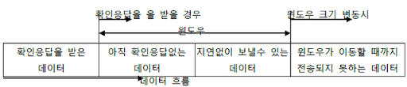
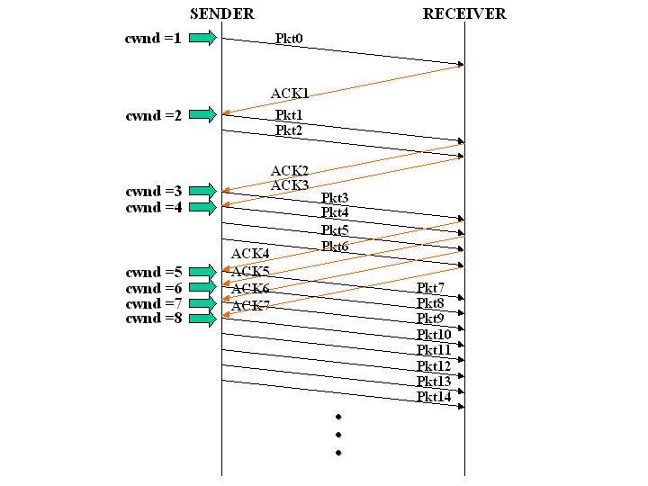

# 03_flow_control_congestion_control

## 01. flow control

### flow control이란?

**flow control**이란 한국말로 흐름제어라고 하며 송신측과 수신측의 데이터 처리 속도 차이를 해결하기 위한 기법입니다.

수신측이 받아들일 수 있는 데이터에 비해 송신측에서 과도하게 데이터를 전송한다면 대부분의 데이터들이 유실되고 비효율적인 통신이 됩니다. 이를 효율적으로 제어하는 것이 바로 **flow control**입니다.

**flow control**의 여러 방법에 대해서 알아봅시다.


### stop and wait


`stop and wait` 방식은 매번 전송한 세그먼트에 대한 응답을 받아야만 그 다음 세그먼트을 전송하는 방법입니다.

구조가 매우 직관적이고 간단한 대신 비효율적입니다.

하나의 세그먼트을 보낸 후에, 응답이 오기까지 송신자는 대기하게 되어 시간을 비효율적으로 사용하게 됩니다.


### sliding window

`sliding window` 방식은 수신자가 설정한 윈도우 크기만큼 송신자는 확인 응답없이 세그먼트을 전송하는 방법입니다.

윈도우 크기를 동적으로 정할 수 있기 때문에 `stop and wait` 에 비해 효율적으로 통신을 할 수 있습니다.


아래 그림을 보며 동작 원리를 알아봅시다.


송신자가 0번째 세그먼트을 보내고 윈도우의 좌측을 한 칸 줄입니다.

수신자는 0번째 세그먼트을 받고 마찬자기로 윈도우의 좌측을 한 칸 줄입니다.

1번째 세그먼트도 마찬가지로 동작합니다.

수신자는 송신자에게 ACK를 보냅니다. 

ACK 2가 도착했다는 것은 수신자가 2번째 세그먼트을 원한다는 의미로, 0과 1번째 세그먼트을 성공적으로 받았다고 볼 수 있습니다.

그럼 송신자는 슬라이딩 윈도우의 오른쪽을 두 칸 늘려 공간을 확보합니다.


윈도우에 대해 좀 더 자세히 보면 아래와 같이 정리할 수 있습니다.




그리고 윈도우의 크기는 아래와 같이 결정하게 됩니다.

```
송신 측 윈도우 크기 = min(수신 측 윈도우 크기, 혼잡 윈도우의 크기)
```

수신 측 윈도우 크기가 크다고 해서 이에 맞춰 데이터를 보낸다면 수신 측에 도달하기도 전에 유실될 가능성이 크며, 

혼잡 윈도우의 크기가 크다고 해서 이에 맞춰 데이터를 보낸다면 라우터들에서는 문제가 없지만 수신측에 도달해서 유실될 가능성이 커집니다.


## 02. congestion control

### congestion control이란?

**congestion control**이란 한국말로 혼잡제어라고 하며 송신측의 데이터 전달과 네트워크의 처리속도 차이를 해결하기 위한 기법입니다.

송신측에서 보낸 데이터가 수신측으로 바로 가지 않고 여러 라우터를 거쳐 도달하게 됩니다. 

이 때 하나의 라우터에 데이터가 몰릴 경우, 라우터가 모든 데이터를 처리할 수 없어 데이터가 유실되게 됩니다.

이 역시 비효율적인 통신이 되므로 이를 효율적으로 제어하는 것이 바로 **congestion control**입니다.


**congestion control**의 여러 방법에 대해서 알아 보기 전에 congestion window에 대해 알아봅시다.


### congestion window

**congestion window** 은 혼잡 윈도우라 하며 줄여서 CWND라고도 씁니다.

**congestion window**은 현재 네트워크의 혼잡 상황에 따라 결정되는 윈도우입니다.

네트워크가 혼잡하다면 해당 윈도우의 크기를 줄여 데이터를 많이 못 보내게 조절하고, 네트워크가 여유롭다면 윈도우의 크기를 늘려 데이터를 더 보낼 수 있게 조절합니다.

그리고 위에서 언급했듯이 송신 윈도우의 크기를 결정하는데도 중요한 영향을 미칩니다.


**congestion window**의 크기는 네트워크의 혼잡함으로 결정이 됩니다.

중간에 세그먼트가 유실이 된다면 혼잡한다고 판단하여 줄이고, 성공적으로 세그먼트가 도착하면 서서히 늘리게 됩니다.

그렇다면 처음에는 크기를 어떻게 정해야할까요?

처음 윈도우의 크기는 **1MSS**로 합니다.

여기서 **MSS**란 Maximum Segement Size를 의미하며 한 세그먼트에서 최대로 보낼 수 있는 데이터의 양을 의미합니다.

MSS는 아래의 수식과 같이 계산합니다.

``` 
MSS = MTU - (IP 헤더길이 + IP 옵션길이) - (TCP 헤더길이 + TCP 옵션길이)
```

> MTU : Maximum Segement Size의 줄임말로 한 번 통신할 시 보낼 수 있는 최대 단위


### AIMD

AIMD는 Additive Increase Multiplicative Decrease의 줄임말로 합 증가, 곱 감소 방법입니다.

세그먼트가 성공적으로 도착한다면 보내는 세그먼트의 수(혼잡 윈도우의 크기)를 1씩 증가시키며 전송에 실패하면 세그먼트 수를 절반씩 줄입니다.

이 방법은 여러 호스트가 한 네트워크를 사용할 경우, 결과적으로 모두 동등한 대역폭을 공유하게 됩니다.


하지만 세그먼트의 수를 1씩 증가시키기 때문에 초기에는 높은 대역폭을 사용하기까지 오랜 시간이 걸립니다.

또한 네크워크가 혼잡해지는 상황을 미리 감지하지 못하고 혼잡해진 후에 대역폭을 줄이는 방식입니다.


### slow start

위 AIMD의 단점을 보완하기 위해 나온 방법입니다.

세그먼트를 처음에는 하나를 보내고 ACK가 성공적으로 올 때마다 세그먼트 수를 1씩 증가시킵니다.

즉, 매 주기보다 보내는 세그먼트 수를 2배씩 증가시켜 지수적 증가를 하게 됩니다.

이는 초기에는 높은 대역폭을 사용하기까지 오랜 시간이 걸리던 AIMD의 단점을 해결할 수 있습니다.




그렇다면 언제까지 전송 세그먼트 수를 지수적으로 증가시킬까요?

* 타임아웃 : 세그먼트를 보냈지만 일정시간 동안 ACK를 수신하지 못했을 경우에는 전송 세그먼트 수를 1로 초기화하고 다시 slow start를 진행합니다. 또한 이 때 slow start threshold를 혼잡이 검출 되었을 시점에서의 혼잡 윈도우의 절반으로 정합니다.
* slow start threshold 도달 : slow start를 중지하고 congestion avoidance로 전환합니다.
* 3개의 중복 ACK : slow start를 중지하고 fast retransmission로 전환합니다.


#### congestion avoidance

slow start threshold란 말 그래도 slow start 시, 혼잡이 예상되는 임계점입니다. 

따라서 혼잡 윈도우가 slow start threshold을 지나칠 경우에는 혼잡이 일어날 것이라 예상하고, slow start에서 **congestion avoidance** 로 변경합니다.

혼잡을 조심하기 위해 지수적인 혼잡 윈도우 크기 증가를 선형적으로 변경합니다. 

즉, 다시 혼잡 윈도우의 크기를 1씩 증가시키게 됩니다.


**congestion avoidance** 상황에서 타임아웃이 발생했을 경우, slow start일 때와 동일하게 동작합니다.


#### fast recovery

기존에는 혼잡이 발생했을 경우, 혼잡 윈도우의 크기를 1로 줄이고 slow start를 실행하였습니다.

지수적으로 증가한다고 하더라도 회복까지 시간이 걸리기 때문에 **fast recovery**가 등장하였습니다.

혼잡 윈도우의 크기를 절반으로 줄이고 선형 증가시키게 됩니다.


이 상태에서 타임아웃이 발생한다면 혼잡 윈도우의 크기를 1로 , slow start threshold를 손실이 발생했을 때의 혼잡 윈도우 크기의 절반으로 한 후 slow start로 전환합니다.


#### fast retransmission

**fast retransmission**은  slow start인 상태에서 3개의 중복 ACK를 수신했을 때 발생합니다.

3개의 중복 ACK가 왔다는 것은 이미 해당 세그먼트가 손실되었다고 간주하고 타임아웃이 발생하기 전에 해당 패킷을 재전송하게 됩니다.

또한 세그먼트가 손실되었기 때문에 약간의 혼잡이 있다고 판단하여 혼잡 윈도우의 크기를 절반으로 줄입니다.


## 레퍼런스

https://woovictory.github.io/2018/12/28/Network-Erro-Flow-Control/

https://evan-moon.github.io/2019/11/26/tcp-congestion-control/

## 질문할 사항

## 추가 공부할 키워드

* 대역폭(bandwidth) 과 전송속도(https://sonne21c.tistory.com/entry/%EC%A0%84%EC%86%A1%EC%86%8D%EB%8F%84bit-rate%EC%99%80-%EB%8C%80%EC%97%AD%ED%8F%ADBandwidth%EC%9D%98-%EC%B0%A8%EC%9D%B4%EC%A0%90)