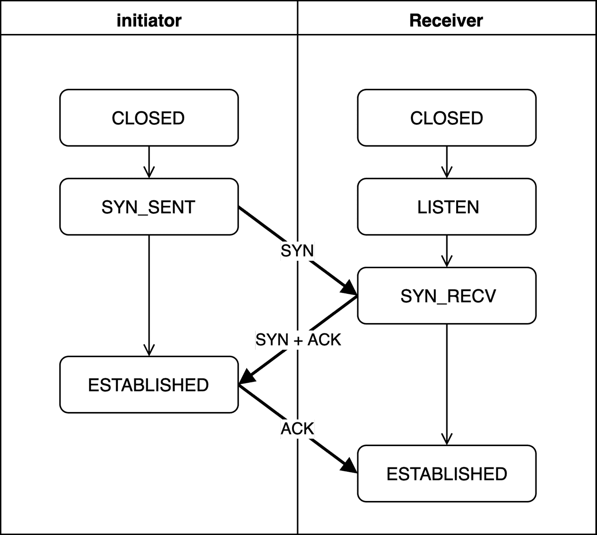
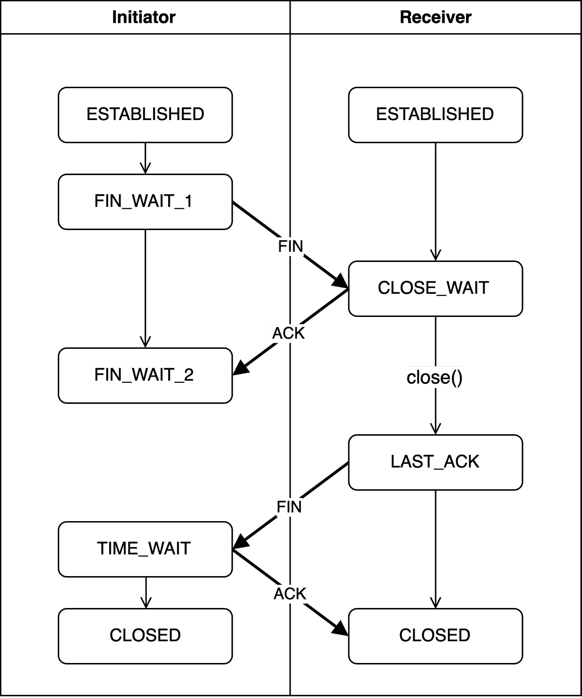

# 05. handshake

## 01. 들어가기에 앞서

TCP의 대표적인 특징은 **연결 지향(Connection Oriented)**입니다.

여기서 말하는 **연결** 이란 무엇일까요?

UDP도 데이터를 주고 받기 위해서는 연결이 필요한 것 아닐까요?


TCP에서 말하는 연결이란 **논리적인 연결**을 의미합니다.

당연히 UDP도 데이터를 주고 받기 위해서는 두 앤드포인트 간의 물리적인 연결이 필요합니다.


TCP는 논리적인 연결이 왜 필요한 것일까요?

데이터는 한 번에 한 덩어리를 보내는 것이 아니라 여러 개의 패킷으로 쪼개서 보내게 됩니다.

그렇기 때문에 수신 측은 여러 송신자에게 여러 패킷을 받을 수 있습니다.

이를 확실히 구분하기 위해서 논리적인 연결을 짓고 어느 앤드포인트에서 온 몇 번 째 패킷인지를 구분짓게 됩니다.


그리고 이 논리적인 연결을 하기 위해서, 혹은 종료하기 위해서 송신 측과 수신 측은 **handshake** 의 과정을 거치게 됩니다.


## 02. 3 way handshake

### 3 way handshake란

**3 way handshake** 는 송신 측과 수신 측이 연결을 하기 위해 필요한 handshake입니다.

3번의 통신과정을 거치기 때문에 3 way handshake라고 불릅니다.


### 3 way handshake 동작원리 

3 way handshake의 동작원리를 알아봅시다.



#### CLOSED

연결 요청을 시작하지 않은 초기의 상태입니다.


#### LISTEN

수신 측에서 송신 측의 요청을 기다리고 있는 상태입니다.


#### SYN_SENT

송신 측이 수신 측에게 연결을 요청하는 상태입니다.

랜덤한 숫자인 **시퀀스 번호**를 생성하여 SYN 패킷에 담아 보냅니다.

> SYN 패킷이란 연결을 하기 위한 특별한 패킷으로 TCP header의 SYN 필드를 통해 구분할 수 있습니다.


#### SYN_RECV

수신 측이 송신 측의 요청을 정상 수신한 상태입니다.

`SYN_SENT` 에서 보내준 SYN 패킷을 제대로 받았다는 의미인 **승인 번호**와 **시퀀스 번호**를 생성하여 송신 측에게 보내주기 됩니다.

일반적으로 승인 번호를 만드는 과정은 아래와 같습니다.

``` 
상대방이 보낸 시퀀스 번호 + 상대방이 보낸 데이터의 크기(byte)
```

하지만  handshake 과정에서는 데이터를 주고 받지 않기 때문에 1을 더해서 만들게 됩니다.


시퀀스 번호는 위와 마찬가지로 랜덤한 수로 생성하게 됩니다.


#### 송신자:ESTABLISHED

송신 측이 연결이 제대로 성립되었는지 확인하는 상태입니다.

자신이 보냈던 시퀀스 번호와 수신 측에서 온 승인 번호를 비교하여 제대로 연결이 되었음을 판단합니다.

또한 위와 마찬가지로 수신 측에서 온 시퀀스 번호에 1을 더해 승인 번호를 만들고 수신 측에 다시 보냅니다.


#### 수신자:ESTABLISHED

수신 측이 연결이 제대로 성립되었는지 확인하는 상태입니다.

자신이 보냈던 시퀀스 번호와 송신 측에서 온 승인 번호를 비교하여 제대로 연결이 되었음을 판단합니다.


## 01. 4 way handshake

### 4 way handshake란

3 way handshake가 송신 측과 수신 측이 연결을 하기 위해 필요했다면,

**4 way handshake** 는 연결을 종료하기 위한 과정입니다.


연결을 끊는데 일련의 과정이 왜 필요할까 라는 의문이 들 수 도 있지만, 한 쪽이 연결을 종료하고 싶어도 다른 쪽이 아직 보내지 않은 데이터 남아있을 수도 있기 때문에 양 쪽이 종료할 상태인 것을 확인하는 과정이 필요합니다.

4번의 통신과정을 거치기 때문에 4 way handshake라고 불릅니다.


4 way handshake는 3 way handshake보다 신경써야할 부분이 많습니다.

3 way handshake 과정에서 문제가 생기더라도 다시 연결을 하면 되지만 4 way handshake에서는 문제가 생긴다면 양 쪽이 서로의 응답을 기다리며 대기하게 될 수 있습니다.

이러한 데드락은 해당 프로세스들이 컴퓨팅 파워를 점유함으로서 병목 현상으로 지어집니다.


### 4 way handshake 동작원리 




#### FIN_WAIT_1

연결을 먼저 종료하고자 하는 요청자가 FIN 패킷을 상대방에서 보낸 후의 상태입니다.

>  FIN 패킷이란 연결을 종료하기 위한 특별한 패킷으로 TCP header의 FIN 필드를 통해 구분할 수 있습니다.


현재 상황에 맞는 시퀀스 번호를 보내면서 FIN 패킷을 통해 연결을 종료할 것을 요청을 합니다.


#### CLOSE_WAIT

요청자로부터 FIN 패킷을 받은 후, 이에 대한 승인 번호를 돌려준 후의 상태입니다.

전송할 데이터가 아직 남아있다면 이를 계속 전송하고, 전송이 끝났다면 close() 함수를 호출하여 다음으로 넘어갑니다.


#### FIN_WAIT_2

요청자가 상대방이 연결을 끝내고 싶어할 때까지 대기하는 상태입니다.

상대방으로 부터 온 승인 번호와 이전에 자신이 보낸 시퀀스 번호가 1 차이나는 것을 보고 연결이 정상적인지 확인합니다.

상대방이 아직 전송할 데이터가 남아 연결을 끊고 싶지 않을 수 있기 때문에 대기하는 상태입니다.

타임아웃을 정해 일정 시간이 경과하면 자동으로 넘어갈 수 도 있습니다.


#### LAST_ACK

`CLOSE_WAIT` 상태에서  더 이상 전송할 데이터가 없으면 close()를 호출하고 이 상태가 됩니다.

요청자가 종료를 제안하며 보냈던 FIN 패킷에 대한 긍정의 표시로 다시 FIN 패킷을 보냅니다.

해당 FIN 패킷에 담기는 시퀀스 번호는 이번에 전송해야하는 데이터의 시퀀스 번호를, 승인 번호는 마지작으로 자신이 응답했던 승인 번호를 그대로 사용합니다.

FIN 패킷을 보낸 후엔 이에 대한 응답이 올 때까지 대기합니다.


#### TIME_WAIT

의도치 않은 에러로 인해 연결이 데드락에 빠지는 것을 방지하기 위한 상태입니다.

FIN 패킷을 받은 요청자는 해당 패킷의 시퀀스 번호에 1을 더해 승인 번호를 만들고 ACK 패킷으로 응답합니다.


## 레퍼런스

https://evan-moon.github.io/2019/11/17/tcp-handshake/