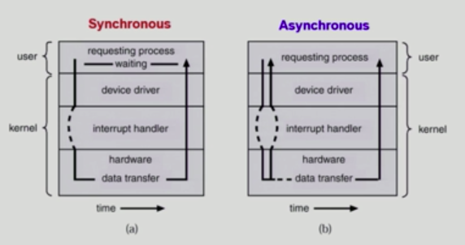

# 0. 인터럽트

> 현대의 운영체제는 인터럽트에 의해서 동작한다!

### 인터럽트란?

CPU가 명령어를 수행하는 동안, 병행적으로 발생하는 상황에 대처하기 위해서 필요한 제어 이동을 발생시키는 것을 의미합니다.

인터럽트가 발생한 시점의 레지스터와 Program Counter 를 save 한 뒤, 
CPU의 제어를 인터럽트 처리 루틴(Inerrupt Service Routine)에게 넘깁니다.

### 구분

- 하드웨어 인터럽트
  - 하드웨어 장치가 CPU에게 어떤 사실을 알려주거나, CPU 서비스를 요청해야 하는 경우
- 소프트웨어 인터럽트
  - 소프트웨어가 스스로 인터럽트 라인을 세팅합니다.
    - 예외 상황 혹은 시스템 콜

## 인터럽트 과정

A process 실행 중 어떤 입출력 명령 등 인터럽트가 발생하는 경우

- process A는 `system call`을 통해 인터럽트를 발생시킨다.
- CPU는 현재 진행 중인 기계어 코드를 완료한다.
- 현재까지 수행중이었던 상태를 해당 process의 **PCB(Process Control Block)**에 저장한다. (수행중이던 MEMORY주소, 레지스터 값, 하드웨어 상태 등...)
- PC(Program Counter, IP)에 다음에 실행할 명령의 주소를 저장한다.
- 인터럽트 벡터를 읽고 ISR 주소값을 얻어 **ISR(Interrupt Service Routine)**로 점프하여 루틴을 실행한다.
- 해당 코드를 실행한다.
- 해당 일을 다 처리하면, 대피시킨 레지스터를 복원한다.
- ISR의 끝에 IRET 명령어에 의해 인터럽트가 해제 된다.
- IRET 명령어가 실행되면, 대피시킨 PC 값을 복원하여 이전 실행 위치로 복원한다.

출처 : [https://velog.io/@adam2/인터럽트](https://velog.io/@adam2/%EC%9D%B8%ED%84%B0%EB%9F%BD%ED%8A%B8)

프로그램 진행 중 입출력이 필요해진 경우가 있을 때, user mode 에선 진행을 할 수 없습니다.

즉, kernel mode 로 진행해야 하며 시스템 콜을 거쳐서 가능합니다.

CPU의 제어권이 운영체제에게 넘어가며 특권 명령을 실행할 수 있습니다.

## 동기식, 비동기식 입출력 에서의 인터럽트

- 동기식 입출력
  - IO 요청 후 입출력 작업이 완료된 이후에 제어가 사용자 프로그램에게 넘어가는 방법
  - 구현 방법 1
    - IO 가 끝날 때까지 CPU를 낭비시킨다!
    - 단 하나의 IO 만 가능!
  - 구현 방법 2
    - IO 가 완료될 때까지 프로그램에게서 CPU를 뺏어온다.
    - IO 처리를 기다리는 줄에 프로그램도 같이 줄 세워둔다.
    - 다른 프로그램에게 CPU를 준다

- 비동기식 입출력
  - IO 가 시작된 후 입출력 작업이 끝나는 것을 기다리지 않고, 제어가 사용자 프로그램에게 즉시 넘어가는 경우

## DMA(Direct Memory Access)

작은 input 이 버퍼에 들어와있어서 인터럽트를 걸면 CPU에게 너무 잦은 인터럽트가 발생하게 됩니다.

따라서, 이를 해결할 수 있는 DMA Controller 를 사용하게 됩니다.

메모리에 접근할 수 있는 것은 CPU밖에 없었습니다. device controller가 직접 메모리에 접근할 수 없고 버퍼 등을 사용하여 CPU를 통해 메모리를 접근해 왔습니다.

하지만, 비효율이 높아지자 DMA 컨트롤러를 추가하게 되었습니다.

> 너무 잦은 인터럽트를 막자!

- 빠른 입출력 장치를 메모리에 가까운 속도로 처리하기 위해 사용
- CPU 중재 없이 device controller 가 device의 buffer storage의 내용을 메모리에 block 단위로 전송
- 바이트 단위가 아닌, block 단위로 인터럽트를 발생시킨다.

## 레퍼런스

- [https://velog.io/@adam2/인터럽트](https://velog.io/@adam2/%EC%9D%B8%ED%84%B0%EB%9F%BD%ED%8A%B8)
- http://www.kocw.net/home/search/kemView.do?kemId=1226304