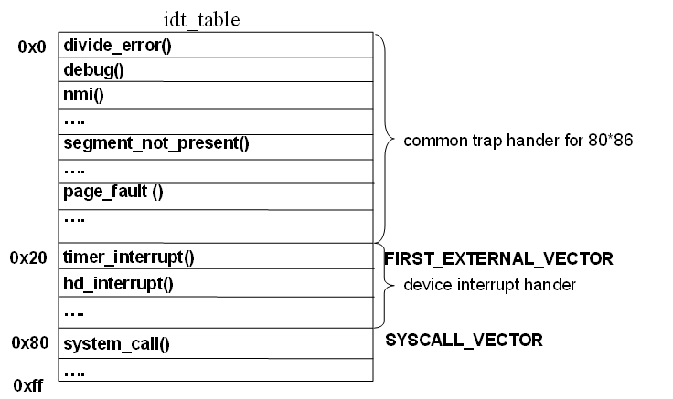
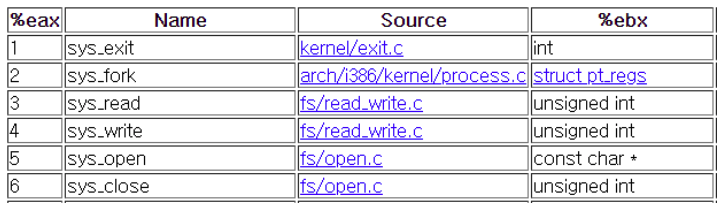

# 02. 시스템콜

## 0. 들어가기 전에

운영체제는 인터럽트 구동식입니다. 인터럽트가 발생하여 신호를 보내는 구조입니다.


#### 커널?

운영체제처럼 규모가 큰 프로그램이 모두 메모리에 올라간다면 한정된 메모리 공간의 낭비가 심합니다. 
따라서, 항상 필요한 부분만을 전원이 켜질 때 메모리에 올리고 
그렇지 않은 부분은 필요할 때 메모리에 올리게 됩니다.

이 때, 항상 메모리에 상주하는 운영체제의 부분을 커널이라고 합니다.


#### POSIX

> **p**ortable **o**perating **s**ystem **i**nterface의 약자로 이식 가능 운영 체제 인터페이스입니다. 서로 다른 UNIX OS의 공통 API를 정리하여 이식성이 높은 유닉스 응용 프로그램을 개발하기 위한 목적으로 IEEE가 책정한 애플리케이션 인터페이스 규격입니다.


## 1. 시스템 콜

운영체제에서 프로그램이 구동되는데 있어 
파일을 읽어오거나, 
파일을 쓰거나, 
화면에 메시지를 출력하는 등 많은 부분이 커널 모드를 사용합니다.

시스템콜은 이러한 **커널 영역의 기능을 사용자 모드가 사용 가능하도록,** 
프로세스가 하드웨어에 직접 접근하여 필요한 기능을 사용할 수 있게 해줍니다.

> 사용자 모드에 있는 프로그램이 커널 함수를 직접 호출할 수 없으므로 따로 프로그램이 커널 호출을 요청하는 시스템을 만들어서 커널이 처리해야할 일을 프로그램으로부터 받아서 처리하는 것이다. 만약에 없으면? 사용자 모드에서 아무것도 할 수 없게 된다! 그래픽 출력이라거나 파일 다루는 등 행위도 커널의 도움으로 이루어진다.
>
> https://namu.wiki/w/%EC%8B%9C%EC%8A%A4%ED%85%9C%20%EC%BD%9C

그렇기에 로우레벨 언어에 대한 이해 없이도 손쉽게 프로그래밍 할 수 있습니다.


### 시스템 콜의 과정

시스템 콜의 인터럽트 수행 과정을 살펴봅시다.

#### 1. 시스템콜 어셈블리 코드 실행

어셈블리어로 작성되어 있는 라이브러리 함수를 실행합니다.

```**[Assembly Code]**
mov eax, 1
mov ebx, 0
int 0x80
```

> eax : systemcall number (주소)가 저장
> ebx: systemcall argument 주소가 저장
> <int> 0x80 : <int>는 OP code
> 0x80: Interrupt Number (systemcall의 인터럽트 번호는 0x80)

#### 2. 시스템콜 인터럽트 명령어 호출

0x80 -> 시스템콜의 인터럽트가 실행됩니다

- 유저 모드 -> 커널 모드로 전환


#### 3. IDT (Interrupt Descripter Table) 참조



커널 모드에서 넘겨받은 인터럽트 번호 0x80에 매핑된 system_call() 의 주소로 이동하게 됩니다.


#### 4. kernal function 호출

systemcall table 을 통해서 eax 에 담긴 systemcall number 에 매칭되는 커널 함수를 호출합니다.



여기선 1에 해당하는 ```sys_exit()``` 이 실행된다고 할 수 있습니다.


#### 5. 함수 실행 종료

System_call 을 수행한 이후 커널모드에서 사용자모드로 전환됩니다.


### 시스템 콜의 종류

시스템 콜은 주로 5개의 유형으로 나눌 수 있습니다. 

1. **프로세스 제어(process Control)**

2. **파일 조작(file manipulation)**

3. **장치 관리(Device Management)**

4. **정보 유지(Information maintenance)**

5. **통신 (Communication)**

(각 유형별 자세한 내용은  https://luckyyowu.tistory.com/133 )


** chmod 도 시스템콜


## 레퍼런스

- https://luckyyowu.tistory.com/133
- https://mintnlatte.tistory.com/119
- https://m-falcon.tistory.com/239


## 추가 공부할 키워드

