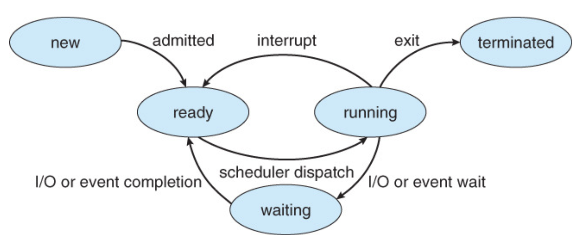

# 03. 프로세스와 스레드

CPU는 한순간에 하나의 프로세스만! 가능합니다. 하지만, 작업관리자에서 보면 스레드와 프로세스 보면 1개가 아닌 것처럼 보입니다.

즉, 짧은 시간에 프로세스를 교체하면서 진행하기 때문에 가능합니다.

> CPU는 한 순간에 오직 한 개의 프로세스를 실행하며 빠르게 다른 프로세스를 전환하여 병렬 작업을 가능케 합니다.
> 이 때 하드웨어적인 병렬성과 구분하기 위해 이를 **의사병렬성(pseudoparallelism)**이라고 합니다.

## 스케줄러(Scheduler)

운영체제의 일부분 코드라고 봐도 무방합니다.

- **장기 스케줄러 (job scheduler)**

  - 시작 프로세스 중 어떤 것들을 ready queue 로 보낼지 결정
  - **프로세스에 메모리를 주는 문제**
  - 보통 time sharing system(시분할 시스템)에는 장기 스케줄러가 없음 (무조건 ready)

- **단기 스케줄러 (CPU scheduler)**

  - 어떤 프로세스를 다음 번에 running 시킬지 결정
  - **프로세스에 CPU를 주는 문제**

  

- **중기 스케줄러 (Swapper)**

  - 여유 공간 마련을 위해서 프로세스를 통째로 메모리에서 디스크로 쫓아냄
  - **프로세스에게서 메모리를 뺏는 문제**

## 1. 프로세스

프로세스란 **메모리에 올라와 실행되고 있는 프로그램의 인스턴스**를 말합니다.

- 특징
  - os 로부터 **독립된 메모리 영역을 할당**받기 때문에 **다른 프로세스의 자원의 접근이 불가**합니다.
  - 프로세스는 최소 1개의 스레드를 가지고 있습니다.

#### 구성요소

- 코드
  - 프로그램의 코드 자체
  - 프로그램은 실행되기 전에 주기억장치에 CPU가 해석할 수 있는 바이너리 코 드 상태로 주기억장치에 저장 되는 영역
- 데이터
  - 프로그램의 전역 변수(global variable)나 정적변수(static variable) 할당 공간
- 스택
  - 지역 변수(local variable) 할당과 함수 호출 시 전달되는 인수(argument)값 저장
- 힙
  - **동적 할당 (프로그램 실행 중에 인위적으로 할당 및 해제)**
  - **스택보다 할당할 수 있는 메모리 공간이 많다는 것이 장점**이지만 
    포인터로 메모리 영역을 접근해야 하기 때문에 다른 자료구조에 비해서 데이터를 읽고 쓰는게 느리다. 
    - PS 를 하다보면, 플랫폼에서 스택의 크기를 제한하는 경우가 있기에, 전역으로 사용하면 스택 크기 제한으로 인한 문제 회피가 가능하며, **전역 변수는 쓰레기 값이 아닌 변수 타입마다 정해진 값으로 초기화**가 됩니다.

#### 프로세스 제어블록

프로세스에 대한 **정보는 PCB(프로세스 제어 블록)에 저장됩니다.**
각 프로세스마다 PCB가 존재하며 프로세스 상태에 대한 정보를 담고 있습니다.

생성될 때 고유의 PCB가 생기며, 완료되면 PCB는 제거됩니다.

프로세스는 CPU를 점유하여 작업을 처리하다가도 상태가 전이되면, 
CPU가 처리하던 작업의 내용들을 자신의 PCB에 저장하고, 
다음에 다시 작업을 수행해야 할 때 
PCB로부터 해당 정보들을 CPU에 넘겨와 작업을 진행할 수 있게 됩니다.

이러한 PCB 안의 내용은 다음과 같습니다.

- 프로세스 ID
- 프로그램 카운터
- 스택 포인터
- 메모리 할당
- 열린 파일들의 상태
- 스케줄링 정보

### 프로세스의 상태

- 생성 상태 (new)

- 준비완료 상태(ready)

  - CPU가 사용가능하게 될때 그것을 할당 받을 수 있는 상태

- 실행 상태(running)
  
- 프로세스가 CPU를 차지하고 있는 상태
  
  

- 대기 상태(waiting)
  - 프로세스가 CPU를 차지하고 처리하다가 
    입출력 처리 등을 하게 되면(인터럽트 발생)
    CPU를 양도하고 입출력 처리가 완료될 때까지 대기하고 있는 상태
  - **Blocked(wait, sleep)**
    - I/O 등의 event 를 기다리는 상태
      - ex) 디스크에서 file 읽어와야 하는 경우
  - **Suspended**
    - 외부적인 이유로 프로세스 수행이 정지된 상태
    - 프로세스는 통째로 디스크에 swap out 된다
      - Ex) 사용자가 프로그램 일시 정지 시킨 이유
      - 시스템이 여러 이유로 프로세스를 잠시 중단시킴
        - 메모리에 너무 많은 프로세스가 올라와있을 때
  
  - Blocked vs Suspended
    - blocked : 자신이 요청한 event가 만족되면 ready
    - suspended : 외부에서 resume 해줘야 active
  
- 완료 상태(terminated)

Ready -> running 으로 갈 때 대기하고 있는 프로세스는 여러 개 존재합니다. 이 중 하나 고르는 작업을 스케줄링이라고 하는데, 이는 다음에 자세히 알아보겠습니다.

## 2. 스레드

스레드는 프로세스 내에서 **할당받은 자원을 이용하여 동작하는 실행단위**를 의미합니다.

- 특징
  - 스레드는 프로세스 내에 존재하며, 프로세스가 할당받은 자원을 이용하여 실행됩니다.
    - 그렇기에 하나의 프로세스는 여러 개의 스레드를 가질 수 있습니다.(멀티 스레드)
    - **하나의프로세스의 자원을 공유하기에 다른 스레드의 결과를 확인**할 수 있습니다.
    - 그러나, **스레드는 프로세스 내에서 각각 stack 을 사용**하며 code, data, heap 영역은 공유합니다.

- 장점
  - 프로세스보다 생성 및 종료시간, 쓰레드간 전환시간이 짧습니다.
  - 프로세스의 메모리, 자원등을 공유하므로 커널의 도움없이 **상호간에 통신**이 가능합니다.

## 3. 멀티 프로세스와 멀티 스레드

### 멀티 프로세스

- **하나의 프로그램을 여러 개의 프로세스로 구성**하여 각 프로세스가 1개의 작업을 처리하도록 하는 것입니다.
  - 작업에 흐름이 여러 갈래로 생기는 경우, 여러 개의 프로세스로 하나의 작업을 구성할 수 있습니다.
- **장점**
  - 1개의 프로세스가 죽어도 자식 프로세스 이외의 다른 프로세스들은 계속 실행됩니다.
- **단점**
  - **Context Switching**을 위한 오버헤드(캐시 초기화, 인터럽트 등)가 발생합니다.
  - 프로세스는 각각 독립적인 메모리를 할당받았기 때문에 통신하는 것이 어렵습니다.
    - 비효율이 발생!
    - 1번째 프로세스가 로드
    - 이후 2번째 로드 (Context switching) 계속 발생...
    - **같은 작업을 하기 위한 프로세스인데, 따로 가지고 있는 정보, 메모리 때문에 비효율 발생**

따라서, 스레드가 필요하게 됩니다!

### 멀티 스레드

하나의 프로그램을 여러 개의 스레드로 구성하여 각각의 스레드는 1개의 작업을 처리할 수 있는 것을 말합니다.

-  장점
  - **메모리를 공유하기에, 통신이 쉽고 자원을 효율적으로 사용**할 수 있습니다.

  - 프로세스를 위해 자원을 할당하는 시스템콜이나 **context switching** 의 오버헤드를 줄일 수 있습니다.

    - 컨텍스트 스위칭이 없는 것이 아닌, 오버헤드가 작은 것!

- 단점
  - 하나의 스레드에 문제가 생긴다면 전체 프로세스가 영향을 받습니다.
  - 동시에 같은 자원에 접근하는 경우 자원 공유(동기화)의 문제가 발생할 수 있습니다.

멀티 스레드의 단점은 싱글 스레드의 장점이라고 볼 수도 있을 것 같습니다.

#### 스레드를 쓰는 이유?

멀티 스레드를 사용하게 되면 프로세스를 생성하여 자원 할당하는 과정도 줄고 오버헤드도 줄어듭니다.
또한, 하나의 프로세스 내에서 여러 스레드 간 통신 비용이 적기에 통신 부담이 적습니다.

### Context Switching?

멀티프로세스 환경에서 CPU가 어떤 하나의 프로세스를 실행하고 있는 상태에서 
인터럽트 요청에 의해 다음 우선 순위의 프로세스가 실행되어야 할 때 
기존의 프로세스의 상태 또는 레지스터 값(Context)을 저장하고 
CPU가 다음 프로세스를 수행하도록 새로운 프로세스의 상태 또는 레지스터 값(Context)를 **교체하는 작업**을 
**Context Switching**라고 합니다.

***Context? 문맥...?***

사용자와 다른 사용자, 시스템, 디바이스 간 상호작용에 영향을 미치는 현재 상황을 규정하는 정보들을 말합니다. 
=> CPU가 해당 프로세스를 실행하기 위한 해당 프로세스의 정보들

**Context Switching 때 해당 CPU는 아무런 일을 하지 못한다.** 
**따라서 컨텍스트 스위칭이 잦아지면 오히려 오버헤드가 발생해 효율(성능)이 떨어진다.**

### 그렇다면, 꼭 멀티 스레드가 답일까?

그런 것은 아닙니다.

멀티 프로세스를 활용하면 복잡하고, 시간이 오래 걸리는 작업을 별도의 프로세스를 생성 후 병렬 처리한다면 더 빠른 시간 내에 해결이 가능합니다. (ex. 빅데이터, 머신러닝 등)

다만, 병렬 프로그래밍 등에 대한 사전 지식과 컨텍스트 스위칭 시 발생하는 오버헤드에 대해서 고려해봐야 할 것입니다.

## 레퍼런스

- https://mangkyu.tistory.com/92?category=761303
- https://jeong-pro.tistory.com/93
- https://jwprogramming.tistory.com/16

## 추가 공부 키워드

- 세마포어와 뮤텍스

- 스케줄링

  

