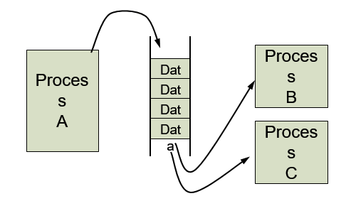

# 04. 프로세스 간 통신

## 1. 프로세스 사이 통신(IPC)이란?

프로세스간 통신(InterProcess Communication)이란,
프로세스들은 각각 독립적인 메모리 공간을 가지고 있기 때문에 이를 공유하기 위해선 
프로세스 간에 데이터 및 정보를 주고받기 위한 메커니즘을 말합니다.

- 커널에서 IPC를 위한 도구를 제공하며, 시스템 콜의 형태로 프로세스에게 제공된다.

## 2. 프로세스 간 통신 종류 및 특징

프로세스간 통신(IPC)에는 크게 두 가지 모델이 있습니다.

1. 공유 메모리(Shared Memory) 모델
2.  메시지 전달(Message Passing) 모델

### 2.1 공유 메모리 모델

OS 로부터 독립된 메모리 영역을 할당받는 프로세스는 다른 프로세스 자원의 접근이 불가하지만, 
프로세스 간 데이터 및 정보를 주고받기 위해 메모리를 공유하는 방식을 택할 수 있습니다.

- 2개 이상의 프로세스들이 주소 공간의 일부를 공유하며,
  공유한 메모리 영역에 읽기, 쓰기를 통해서 통신을 수행합니다.
- 공유 메모리가 설정되면, 그 이후의 통신은 커널의 관여 없이 진행 가능합니다.

#### 장점

- 커널의 관여없이 메모리를 직접 사용하여 IPC 속도가 빠름
- 프로그램 레벨에서 통신 기능을 제공하여 자유로운 통신이 가능

#### 단점

- 구현이 어려움

#### 컨텍스트 스위칭 관점

- 공유 메모리 모델에서의 IPC는 해당 프로세스가 CPU를 사용하는 행위이다. 
- 즉, IPC를 많이 한다고 컨텍스트 스위칭 많이 일어나지 않는다.

#### 동기화 관점

> 프로세스 동기화 : 하나의 자원을 한 순간에 하나의 프로세스만 이용하도록 제어

- 커널이 동기화를 제공하지 않으며, 부가적인 방법이 필요합니다.
  - 접근 제어 방식은, locking 이나 세마포어 등이 있습니다.

#### 공유 메모리 구현 IPC

- 공유메모리 (모델과 구현의 이름이 동일)

#### 버퍼

- 협력적인 프로세스의 예로, 생산자 - 소비자 문제를 들 수 있습니다.
- 생산자 - 소비자 문제에 대한 해결책은, **공유 메모리** 를 사용하는 것이며, 
  이 때 생산자가 정보를 채워 넣을 수 있고 소비자가 정보를 소모할 수 있는 버퍼가 반드시 사용 가능해야 합니다.

> 생산자 -소비자 문제란?
>
> 생산자가 데이터를 생상하면 소비자는 그것을 소비하는 형태에서 발생하는 문제를 말합니다.
> 생산하는 속도와 소비하는 속도의 차이로 인해 버퍼를 사용하여 이 차이에서 발생하는 문제를 해결할 수 있습니다.

### 2.2 메시지 전달(Message Passing)

#### 특징

- 커널을 경유하여 메시지를 송,수신자끼리 주고 받으며, 커널에서는 데이터를 버퍼링합니다.

- 프로세스 간 메모리 공유 없이 동작이 가능합니다.

#### 장점

- 구현하기에 간단하며, 사용하기 편리합니다.

#### 단점

- 커널을 경유하므로, 속도가 느립니다.

####  컨텍스트 스위칭 관점
- 메시지 전달 모델에서의 IPC는 해당 프로세스 입장에서 일종의 입출력(I/O)로 볼 수 있다.
  -  즉, IPC를 하면 할수록 컨텍스트 스위칭이 많이 일어난다.

#### 동기화 관점

- 송수신 시 커널이 동기화를 제공
  - 프로그램은 동기화에 대한 고려 없이 사용할 수 있다.

#### 메시지 전달 모델의 구현 IPC

- PIPE, Message Queue, Socket , Signal 등이 존재합니다.

### 2.3 메시지 전달 모델의 구현 IPC

메시지 전달 모델은 다양한 종류로 구현되어 있는데 간단하게 알아보겠습니다.

#### PIPE

- 통신을 위한 메모리 공간을 생성하여 프로세스가 데이터를 주고받게 해줍니다.
- 파이프를 활용한 단방향 통신입니다.
  - 2개의 프로세스가 서로 통신을 할 때, 2개의 파이프가 필요합니다.
  - 100개의 프로세스가 서로 통신하기 위해선, 9900(100 * 99) 개의 파이프가 필요하게 되기에,
    자원의 낭비가 심하다는 단점이 있습니다.

#### Message Queue

큐 자료구조를 사용하여 프로세스의 통신을 구현합니다.

메시지 큐에 쓸 데이터에 번호를 붙임으로써 여러 개의 프로세스가 동시에 데이터를 쉽게 다룰 수 있습니다.
메시지 큐를 사용하기 위해선 메시지 큐 id를 알아야하는데, 일반적인 사용에서 프로세스는 이를 알기 어렵습니다.

#### Socket

운영체제가 제공하는 포트(Port)를 사용하여 통신하는 방법입니다.

프로세스는 포트 번호를 이용하여 통신하려는 상대 프로세스의 소켓을 찾아갈 수 있습니다.

다른 IPC와 달리 프로세스 위치에 독립적이며 원격에서 프로세스 간 데이터 공유할 때 사용할 수 있습니다.

#### Signal

- 프로세스 아이디(PID) 를 아는 특정 프로세스에게 커널을 통하여 이벤트를 전달하는 방법입니다.
  - 시그널 번호를 통해 이벤트를 구분할 수 있으며 시그널 번호는 사전에 모두 정의되어 있는 상태입니다.

- 송신 측에서 프로세스가 시그널 보내는 동작은 수신 측 프로세스 상태와 무관하게 수행되며, 
  수신측 프로세스는 시그널 종류에 따라 시그널 핸들러를 통하여 처리 방법을 지정할 수 있습니다.

## 질문할 사항

## 레퍼런스

- http://blog.naver.com/PostView.nhn?blogId=bycho211&logNo=220985701140
- https://sweetday-alice.tistory.com/174
- https://mangkyu.tistory.com/9

