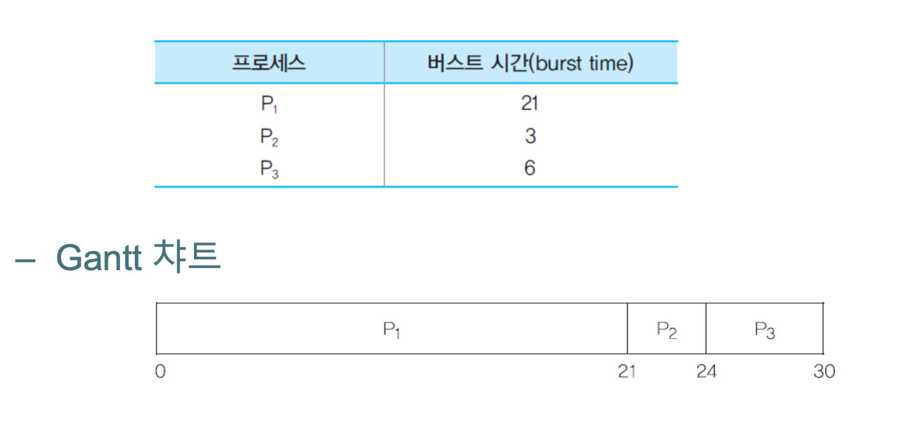

# 05. 프로세스 스케줄링

프로세스가 CPU를 항상 사용하는 것은 아닙니다.

입출력 시 CPU는 일을 하지 않고 가만히 있게 되는데, 프로세스는 CPU 의 사용을 반복하게 됩니다.

그렇다면, 여러 프로세스를 처리할 때 한 프로세스의 모든 작업이 끝날 때까지 기다렸다가 다음 프로세스를 진행하는 비효율적인 방법이 아닌, 
실행 가능한 시점까지 실행하고, CPU를 사용하지 않는 작업을 할 때 다른 프로세스가 실행된다면 CPU 사용 효율을 높일 수 있을 것입니다. 

위와 같은 아이디어를 구현하는 것이 프로세스 스케줄링 입니다.

프로세스 스케줄링은 OS에서 가장 중요한 일 중 하나이며 이를 구현하기 위해 다양한 알고리즘이 있습니다.

## 1. 스케줄링 분류

### 방법. 환경별 분류

- 비선점 스케줄링
  - 하나의 프로세스가 CPU 에 할당되면,
    그 프로세스의 수행이 끝날 때까지 CPU는 프로세스로부터 빠져나올 수 없습니다.

- 선점 스케줄링
  - 하나의 프로세스가 CPU를 차지하고 있을 때, 
    다른 프로세스가 현재 수행중인 프로세스를 중지시키고 자신이 CPU를 차지할 수 있습니다.

### 스케줄링 평가 기준(Scheduling Criteria)

- CPU 이용률 : 프로세스를 돌리는 과정에서 CPU가 사용되는 시간
- 처리율(Throughput) : 단위 시간당 처리할 수 있는 프로세스 양
- 반환시간 : 프로세스가 new 상태에서 terminated 상태로 나올 때까지 걸리는 시간
- 대기 시간 : CPU를 차지하기까지 대기하는 시간의 합
- 응답시간 : 일반적으로 대화형 시스템에서 입력에 대한 반응 시간

## 2. 비선점 스케줄링

**그 프로세스의 수행이 끝날 때까지 CPU는 프로세스로부터 빠져나올 수 없습니다.**

### FCFS 스케줄링

> First-Come, First Served

말 그대로, 먼저 온 프로세스가 먼저 CPU를 점유합니다.

프로세스들은 대기 큐에 도착한 순서에 따라 CPU를 할당받게 됩니다.

대기 시간을 통해서 효율성을 본다면,
CPU를 사용한 시간(burst time)이 짧은 프로세스가 먼저 도착하는 것이 나중에 도착하는 것보다 효율적입니다.

이런 효과를 호위 효과(Convey effect) 라고 합니다.

- 먼저 도착한 프로세스가 CPU에서 수행되는 버스트 시간이 매우 길면, 그 다음 도착한 프로세스가 첫 번째 프로세스가 끝날 때까지 매우 긴 시간을 기다리게 되는 것

### SJF 스케줄링

> Shortest Job First

위에서 언급했듯이 가장 짧게 수행되는 프로세스가 가장 먼저 수행됩니다.

평균대기시간을 보면 SJF 가 FCFS보다 반드시 빠름을 알 수 있습니다. 

하지만 문제점은 프로세스가 수행 시간이 얼마나 긴 것인가를 정확히 알아야하는데 이 정보를 알기 어렵습니다.

실제 측정한 시간으로 예측해서 SJF를 사용할 수도 있지만, 이는 오버헤드가 매우 큰 작업으로 잘 사용되지 않습니다.

### 우선순위 스케줄링

말그대로 우선순위가 높은 프로세스가 먼저 선택되는 스케줄링 알고리즘입니다. 

하지만 몇가지 문제가 발생합니다.

- **무한 대기 또는 기아 현상 (Starvation)**
  - 낮은 우선순위의 프로세스가 CPU를 무한히 대기하게 하는 경우입니다.

- **해결방법 : 에이징**
  - 낮은 우선순위의 프로세스들의 무한 대기 문제에 대한 해결책입니다.
  - 오랫동안 시스템에서 대기하는 프로세스들의 우선순위를 점진적으로 증가시키는 방법입니다.

## 3. 선점 스케줄링

**하나의 프로세스가 CPU를 차지하고 있을 때, 다른 프로세스가 현재 수행중인 프로세스를 중지시키고 자신이 CPU를 차지할 수 있습니다.**

### 라운드 로빈 스케줄링

시분할 시스템을 위하여 고안된 선점 스케줄링 방식입니다.
각 프로세스는 같은 크기의 중앙처리장치 시간을 할당받으며
할당시간의 크기는 보통 10ms 에서 100ms 입니다.

다만 적절한 할당크기 시간을 선택해야하는데,
이 값이 너무 크면 FCFS와 동일한 형태가 되고
이 값이 너무 작으면 컨텍스트 스위칭 비용이 더 커져 CPU를 분배하는데 대부분의 시간을 소모하게 됩니다.

 

### 다단계 큐 스케줄링

여러 개의 큐를 사용하는 방식입니다. 

프로세스는 기준에 따라 여러 그룹으로 나눌 수 있는 경우에 유용한 방식입니다.

또한 각 큐마다 다른 스케줄링 방식을 사용할 수 있습니다.
큐마다 우선순위를 지정해 줄 수 있으며
큐마다 CPU 시간, 다른 스케줄링 방식 등을 적용할 수 있습니다.

이 또한 하위 큐의 우선순위가 낮다면 마찬가지로 기아 현상이 발생할 수 있습니다.

그렇기에 우선순위가 낮은 큐에도 CPU 할당 시간을 지정해주어 기아 현상을 막을 수 있습니다.

### 다단계 피드백 큐 스케줄링

위의 다단계 큐와 여러 개의 큐를 사용하는 것이 유사합니다.

모든 프로세스가 가장 위의 큐에서 CPU 점유를 대기합니다. 
이 상태에서 큐에서 대기 시간이 너무 오래 걸릴 경우 아래의 큐로 프로세스를 옮겨 대기 시간을 조정할 수 있습니다.

만약 우선순위 순으로 큐를 사용하고 있을 때,
아래 큐의 우선순위가 낮아 기아 현상이 발생할 경우 다시 우선순위가 높은 위쪽의 큐로 옮길 수도 있습니다.

## 추가 공부 키워드

## 질문 사항

큐의 우선순위에 의한 기아 현상 해결

## 레퍼런스

- 전공 수업 자료
- https://velog.io/@codemcd/%EC%9A%B4%EC%98%81%EC%B2%B4%EC%A0%9COS-6.-CPU-%EC%8A%A4%EC%BC%80%EC%A4%84%EB%A7%81

