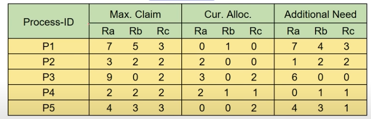

# 08. 교착 상태 (Deadlock)

## 1. 교착상태(Deadlock)란?

> 교착상태란?
>
> 둘 이상의 프로세스가 자원을 점유한 상태에서 
> 서로 다른 프로세스가 점유하고 있는 자원을 요구하며 무한정 기다리는 현상

### 교착상태 발생 조건

교착상태가 발생하기 위해선 아래 4가지 조건을 모두 충족하면 교착상태가 발생합니다.
*(모두 만족하면 좋지 않다는 의미)*

- **상호배제**
  - 한 번에 한 개의 프로세스만이 공유자원 사용 가능
- **점유와 대기**
  - 최소한 하나의 자원을 점유하고 있으면서 
    다른 프로세스가 점유하고 있는 자원을 
    추가로 점유하기위해 대기하는 프로세스가 있어야 합니다. 

- **비선점**
  - 다른 프로세스에 할당된 자원은 사용이 끝날 때까지 강제로 빼앗을 수 없습니다.
- **환형 대기**
  - 공유자원과 공유자원을 사용하기 위해 대기하는 프로세스들이 
    원형으로 구성되어 있어 
    자신에게 할당된 자원을 점유하면서 앞이나 뒤에 있는 프로세스의 자원을 요구해야 합니다. 

이해를 돕기 위해 지난 챕터에서 봤던 식사하는 철학자 문제를 가져와서 비유해 보겠습니다.

> - 상호배제
>   - 젓가락은 한번에 한 철학자만 사용 가능
> - 보유 및 대기
>   - 집어든 젓가락을 계속 들은 채로 반대쪽 젓가락을 기다린다
> - 비선점
>   - 이미 누군가 쥐고있는 젓가락을 뺏을 수 없다
> - 환형 대기
>   - 모든 철학자는 자신의 오른쪽 철학자가 젓가락을 내려놓기를 기다린다
>

## 2. Deadlock 해결 방법

1. **deadlock prevention (예방)**
2. **avoidance (회피)**
3. **detection and recovery (탐지 및 복구)**
4. **Ignorance(무시)**

## 2.1 prevention 예방 방법

절대 발생하지 않게 하는 방법입니다.

> 4개의 deadlock 발생 필요 조건 중 하나를 제거!

- **상호 배제 -> 모든 자원의 공유 허용**
  - 현실적으로 불가능합니다.
- **비선점 -> 모든 자원에 대해 선점 허용**
  - 비선점 조건을 제거합니다.
  - 이또한 현실적으로는 불가능합니다.
  - 유사한 방법으로는,
    - 프로세스가 할당 받을 수 없는 자원을 요청한 경우
      **기존 가지고 있던 모든 자원을 반납 및 작업을 취소합니다.**
    - 심각한 자원 낭비...

- **보유 및 대기 -> 필요 자원 한번에 모두 할당**
  - 필요한 모든 자원을 프로세스에게 할당한 경우 종료될 때까지 반납되지 않습니다.
    - 자연스레 데드락 해결
  - but, 자원의 낭비가 발생합니다.
    - 필요없는 순간에도 갖고 있기 때문!
  - 무한 대기(기아현상; Starvation) 발생가능합니다.
- **환형 대기 -> 환형 대기 제거**
  - 자원에게 순서를 부여합니다.
  - R1, R2, ... Rn
  - 프로세스는 순서의 한쪽 방향으로만 자원 요청 가능합니다.
    - 원형 발생 불가!
  - 마찬가지로, 자원의 낭비가 발생합니다.
    - 순서에 맞지 않으면 자원의 사용이 불가합니다.

어느 조건을 지우든, 약간의 문제가 발생하게 됩니다.

- **아예 불가능하거나,**
- **자원의 낭비가 심하거나!**

## 2.2 Deadlock Avoidance 회피

시스템의 상태를 계속 감시합니다.

deadlock 상태가 될 가능성이 있다면 자원 할당 요청을 보류하게 됩니다.

-> 시스템을 항상 **safe state**로 유지합니다.

- **Safe State**
  - **모든 프로세스가 정상적으로 종료 가능한 상태**
  - Safe sequence 가 존재 (위와 같은 의미)
  - deadlock 상태가 되지 않을 수 있음을 보장합니다.

- **Unsafe state**
  - deadlock 상태가 될 가능성이 존재
    - 반드시 발생하는 것은 아닙니다. (단순 가능성!)

### 예시

#### 가정

> - 프로세스 수 고정
> - 자원의 종류와 수 고정
> - 프로세스가 요구하는 자원 및 최대 수량을 알고 있음
> - 프로세스는 자원을 사용 후 반드시 반납

*(1 ~ 3번 조건은 비현실적이긴 하지만 가정을 해봅시다 )*

#### Dijkstra's algorithm 

- **Banker's algorithm** (은행원 알고리즘)
  - deadlock 회피를 위한 이론적 기법입니다.
  - **가정**
    - 한 종류의 자원이 여러 개
    - 시스템은 항상 safe state로 유지
  -  실행을 할 수 있는상태의 순서 (Safe Sequence)가 하나라도 있으면 safe state
  - 그렇지 않다면 unsafe state -> 교착상태 발생 가능성이 존재
  - **실행**
    - 각 프로세스(고객)가 자원(돈)을 얼마나 필요로 하는지 -> max claim
    - 현재 프로세스(고객)에 할당된 자원(돈)이 얼마나 있는지 -> current allocated
    - 현재 이용가능한 자원(돈)이 얼마나 있는지 -> available

#### Habermann's algorithm

- 다익스트라 알고리즘의 확장
- 여러 종류의 자원을 고려한 방법입니다.
- 시스템을 항상 safe state로 유지!

safe sequence 를 찾아서 확인할 수 있습니다.

**예시**

초기 자원 상태 (10, 5, 7) -> 현재 남은 자원 (3, 3, 2)일 때,
safe sequence 를 찾아보세요.

### 회피 방법의 단점

- 오버로드가 큼
  - 항상 시스템을 봐야하기 때문
- 자원 이용도가 낮음
  - safe state 유지를 위해 사용되지 않는 자원이 존재할 수 있습니다.
    - 중간에 사용하지 않는 프로세스가 생겨 unsafe -> safe가 된다 하더라도,
      쓸 수 있어도 못 쓰는 경우가 발생합니다.
- **실용적이지 않음**
  - **프로세스 수와 자원 수가 고정** 
  - 프로세스 별 필요한 최대 자원 수를 알고 있어야 함

## 2.3 Deadlock detection and deadlock recovery methods 탐지 및 복구

>  **데드락을 피하지 않겠다**

### 검출

주기적으로 deadlock 발생 확인합니다.

데드락이 발생한다면 그 때 회복 과정이 필요합니다.

### 2.3.1 Process Termination

> 프로세스 종료

데드락 상태인 프로세스 중 일부를 종료합니다.

- **Termination cost model**
  - 종료시킬 데드락 상태의 프로세스를 선택합니다.
  - **termination cost**
    - 우선 순위
    - 종류
    - 총 수행시간
    - 남은 수행 시간
    - 종료 비용 
    - ...

#### - Lowest-termination cost process first

비용이 가장 적은 프로세스를 종료합니다.

가장 간단하고 오버헤드가 작습니다.

하지만 불필요한 프로세스가 종료될 가능성이 있습니다. (특정 프로세스가 종료되더라도 데드락이 해결되지 않을 수 있음)

#### - Minimum cost recovery

최소 비용으로 데드락을 해소할 수 있는 프로세스를 선택합니다.

모든 경우를 고려해야하기에 복잡하며 오버헤드가 크게 됩니다.

### 2.3.2 Resource Preemption

> 자원 선점

데드락 상태를 해결하기 위해 선점할 자원을 선택합니다.

해당 자원을 갖고 있는 프로세스를 종료시켜 선점할 수 있습니다.

**단점**
데드락 상태가 아닌 프로세스가 종료될 수 있습니다.

**선점할 자원 선택**

- preemption cost model 필요합니다.
- 자원 r 개에 대해서 O(r)만큼의 복잡도

### 2.3.3 Checkpoint-restart method

> 종료하고 처음부터 시작하지 말자 ! 체크포인트에서부터 시작 (Rollback)

위의 두 가지 방법은 데드락을 해결하기 위해선 프로세스가 종료됩니다. 이후 다시 처음부터 작업을 시작해야 합니다.

따라서 **프로세스 수행 중 특점 지점마다 context를 저장하는 방법**을 생각할 수 있습니다.

프로세스 강제 종료 이후 가장 최근의 **checkpoint 에서 재시작**하게 됩니다.

## 2.4 deadlock Ignore 

일명 **타조 알고리즘**으로 알려져 있습니다.

머리를 땅속에 파묻고 아무 문제가 없는 것처럼 생각하는 방법입니다.
<u>*윈도우나 리눅스에서 데드락 해결하기 위한 방법*</u>

시스템에 문제가 발생하였을 때 위에서 언급했던 회복을 하는 것이 아닌,
모르는 척하고 그대로 놔둡니다.

PC가 종료되거나 시스템 초기화를 거쳐 문제가 발생하기 전 상태로 돌아가 시스템이 정상작동하게 되기에,
아무 문제 없이 진행할 수 있습니다.

## 레퍼런스

- [youtube HPC Lab. KOREATECH 강의 (Deadlock)](https://www.youtube.com/channel/UCHvXywxOtwLedY5OX-Teg5w)
- http://egloos.zum.com/sungod0/v/3158395
- 

## 추가 공부할 키워드

- 자원선점 종료

## 질문할 사항

