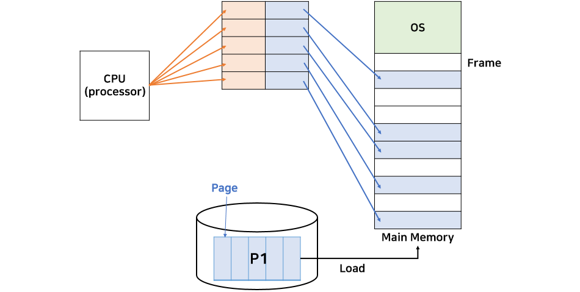
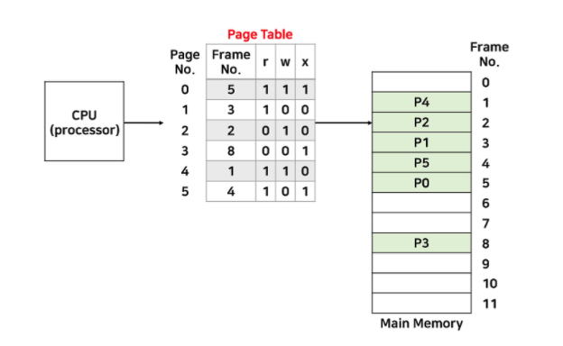
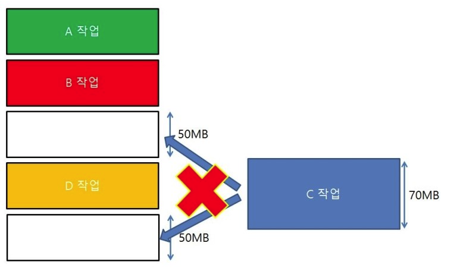

# 09. 가상 메모리

## 1. 가상 메모리?

> 주기억장치의 이용가능한 메모리 크기보다 훨씬 더 큰 주소 지정을 할 수 있도록 합니다.

하나의 프로세스 전체가 모두 메모리에 있지 않고 일부만 있더라도 수행이 가능합니다.

프로세스를 실행할 때, 실행에 필요한 부분만 메모리에 올려둘 수 있습니다.

가상 주소 공간을 구성하는 것을 **가상 메모리** 라고 하고,
실제로 주소 공간을 구성하는 것을 **주기억장치(main memory)** 라고 합니다.

실제 물리적 저장 공간과 가상 저장 공간 사이 **사상(mapping)** 은 OS에 의해 수행됩니다.

- **가상 주소 공간**
  - 수행 중인 프로세스가 참조하는 가상 메모리 상의 주소 범위
- **실제 주소 공간**
  - 컴퓨터 시스템에서 사용 가능한 주기억장치 상의 주소 범위

### 1.1 동적 주소 변환

> 프로세스가 수행될 때 가상 주소를 실제 주소로 변환하는 메커니즘

가상 주소는 실제 주소에 빠르게 매핑되어야 합니다. 

**인위적 연속성**

가상 주소 공간 상의 연속된 주소는 실제 주소 공간에서도 연속적일 필요는 없습니다.

#### 1.1.1 블록 사상(매핑) Block Mapping

동적 주소 변환에서는

- 가상 주소에 대한 주기억장치 내 존재 여부
- 존재하는 경우 어디에 위치하는지

나타내는 테이블을 관리하게 됩니다.

매핑이 바이트 단위로 수행된다면 매핑 정보가 너무 커져 메인 메모리를 많이 차지하게 됩니다.

이를 막기 위해 **블록(block)** 이라는 단위로 매핑 항목을 묶음으로써 여러 가상 메모리 블록이 위치하는 장소만 알 수 있도록 합니다.

블록 크기가 같다면 -> 페이지
가상 메모리 구성 -> 페이징

블록 크기가 다르다면 -> 세그먼트
가상 메모리 구성 -> 세그먼테이션

## 2. 페이징

> 가상 기억 장치를 같은 크기의 블록 (페이지) 로 나누어 사용하는 기법

- 페이지 (Page)
  - 가상 메모리를 일정한 크기로 나눈 블록
  - 프로세스는 페이지의 집합이라고 할 수 있습니다.
- 프레임 (Frame)
  - 실제 주소 공간, 물리 메모리를 일정한 크기로 나눈 블록
  - 메모리는 프레임의 집합이라고 할 수 있습니다.

프레임에 페이지가 들어가기에 프레임과 페이지는 같은 크기로 관리됩니다.

페이지를 프레임에 할당하게 됩니다.

- MMU(memory management unit) 내부의 재배치 레지스터 값을 바꿈으로써
  CPU 는 프로세스가 연속된 메모리 공간에 위치한다고 착각하게 됩니다.

### 동적 주소 변환

- 가상 주소는 페이지 사상(매핑) 테이블 통해 실제 주소를 구할 수 있습니다.
  - 가상주소 v = (p, d) 로 표현
  - p : 페이지 번호. d : 변위
- 매핑 테이블 통해 프레임 번호 p'을 얻어내고 실제 주소 r = p' + d 로 알 수 있습니다.

### 내부 단편화

이러한 페이징 기법에도 단점은 존재합니다. **메모리 낭비 발생!**

일정한 크기의 페이지 단위로 프로세스를 나누게 되는데,
이 경우 프로세스의 크기가 페이지 크기의 배수가 아니라면 
마지막 페이지는 프레임을 전부 채울 수 없습니다.

하지만 최대 낭비되는 크기는 페이지 크기 - 1  byte 정도로 작은 크기이기에 무시할 수 있습니다.

### 보호

페이징을 통해 해킹 등을 방지할 수 있습니다.

페이지가 메인 메모리에 적재된 위치를 알기 위해서 프레임을 알아야 합니다.

이를 다시 알기 위해서 페이지 테이블을 경유해야겠죠?

모든 주소는 페이지 테이블을 경유하기에 테이블 단위에서 read, write, execute 각각 r, w, x 비트를 두어 해당 수행이 가능한지 여부를 확인할 수 있게 보호할 수 있습니다.

w 비트값이 0인 페이지에 쓰기 작업을 시도하면 인터럽트가 발생해 프로세스가 종료됩니다.

### 공유

같은 프로그램을 쓰는 복수 개의 프로세스가 있다면 Code, Data, Stack 영역 중 Code 영역은 공유가 가능합니다.

이를 공유하여 메모리 낭비를 줄일 수 있습니다.

단, 순수 코드(Pure code), 재진입이 가능한 코드여야 합니다.

이 때 페이지 테이블 코드 영역이 같은 곳을 가리키게 하면 공유를 할 수 있습니다.

### 페이지 인출 기법

사용자 프로그램이 실행을 위해 보조 기억 장치로부터 페이지 단위로 메인 메모리에 옮겨지는 방법은 2가지가 존재합니다.

*요구 페이징과 예상 페이징 기법 2가지입니다.*

### 요구 페이징 (Demand Paging)

**특징**

- 메인 메모리에 옮겨진 페이지는 모두 프로세스에 의해 실제로 참조되는 페이지입니다.
- 프로그램의 실행 순서는 정확히 예측할 수 없기에, 
  새로운 페이지를 미리 적재하는 것은 잘못된 결과를 초래할 수 있습니다.
- 어느 페이지를 메인 메모리로 옮길지 결정하는 것에 대한 오버 헤드를 최소화할 수 있습니다.

**단점**

- 프로세스가 새로운 페이지를 필요할 때 적재해야하는데, 
  **새 페이지가 적재될 때마다 그 프로세스는 페이지가 메인 메모리로 옮겨질 때까지 대기만 해야합니다.**

**대부분 요구 페이징 기법을 사용합니다.**

### 예상 페이징 (Anticipatory Paging)

프로세스가 필요로 하는 페이지를 OS가 예측하여 메인 메모리에 미리 적재시키는 방법입니다.

- 예측이 올바를 경우 실행 시간이 많이 감소하게 됩니다.
- 다른 프로세스에 영향 주지 않고 가속화될 수 있습니다.

**단점**

- 이러한 예측에 오버헤드가 크다면 오히려 손해가 됩니다.

## 3. 세그먼테이션 (Segmentation)

세그먼트는 프레임에 비해 크기가 가변적인 것이 특징인데,

프로세스를 논리적 단위로 잘라서 메모리에 배치하기에 그 크기가 가변적입니다.

매핑은 세그먼트 테이블을 이용하여 확인할 수 있습니다.

### 보호

- 페이지 테이블 처럼,
  세그먼트 테이블도 r, w, x 비트를 두어 세그먼트 단위 접근 제어가 가능합니다.
- 페이징과 달리 세그먼트는 논리적 단위이기에, 보안적으로 우월하다고 할 수 있습니다.
- Ex) write 과정이 담긴 연산이 2개의 프레임으로 나뉘어져 있고, 그 중 하나는 w 비트 값이 0 이라면?
  Ex) 2개 이상의 연산 과정이 섞여 있다. 이 때 비트 설정은?

### 공유

세그먼트의 공유는 페이징의 그것에 비해 매우 단순합니다.

**페이징**

- 3개의 페이지 분량의 공유가 필요하다면 
  각 부분별 페이지를 조작해야하는 등 어려운 부분이 많습니다.
  - 각 페이지 마다 공유되었음을 나타내기 위한 각 항목 필요
  - 부분적 페이지 조작 -> 복잡!

**세그먼트**

- 세그먼트는 특정 세그먼트가 공유된다고 선언한 경우
  - 자료구조는 그것이 공유된 세그먼트 내에 있다고 선언한 이후 그 크기가 가변적으로 조절할 수 있기에
    한 세그먼트를 그냥 공유하면 됩니다.

### 외부 단편화

세그먼트 크기가 고정이 아니여서 오는 단점입니다.

세그먼트 크기가 지나치게 커서 메인 메모리에 적재할 수 없는 경우가 발생할 수 있습니다.

이를 해결하기 위해서 세그먼트와 페이징을 혼용해서 사용하기도 합니다.

### 세그먼트 페이징 혼용 기법

하나의 세그먼트를 정수 배의 페이지 크기를 가져 
하나의 세그먼트가 여러 개의 페이지로 분할하여 적재되는 방법입니다.

## 레퍼런스

- 박규석 외 3명, 운영체제, 생능출판, 4장 가상 메모리
- [운영체제 페이징 velog.io/@codemcd](https://velog.io/@codemcd/%EC%9A%B4%EC%98%81%EC%B2%B4%EC%A0%9COS-13.-%ED%8E%98%EC%9D%B4%EC%A7%95)
- [외부 단편화 - 이미지](https://m.blog.naver.com/rbdi3222/220623825770)

## 추가 공부 사항

## 질문 키워드

