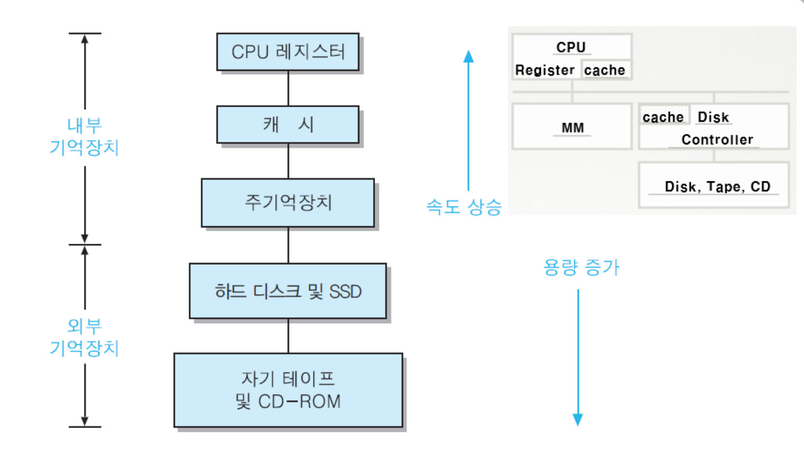

# 09. 메모리 관리


## 01. 메모리 계층 구조



> 메모리를 필요에 따라 여러 종류로 계층을 나누어 둔 것을 의미합니다.

상위 계층일수록 CPU가 메모리에 더 빨리 접근할 수 있습니다.

- 내부 기억장치
  - CPU가 직접 액세스할 수 있습니다.
  - CPU 레지스터와 캐시는 CPU 내에 존재하기에 매우 빠르게 접근할 수 있습니다.
- 외부 기억장치
  - CPU가 직접 접근할 수 없고 device controller 등 통해서만 접근할 수 있습니다.


하위 계층으로 내려갈수록, 

- 용량 증가
- 비트당 가격 감소
- 지역성의 원리로 인해 액세스 빈도는 낮아집니다.


### 지역성의 원리?

기억장치의 접근이 일부 특정 영역에 집중되는 현상을 말합니다.

프로세서가 기억 장치의 한정된 몇몇 위치를 집중적으로 액세스하면서 작업을 수행하게 됩니다.

첫 번째 계층의 기억장치에 대한 접근이 하위 계층에 비해 더 많음을 알 수 있습니다.

**-> 지역성의 원리가 적용된다면 액세스 시간이 감소합니다.**


## 2. 주소공간이란

### 주소공간이란

> 프로그램이 실행되면 메모리에 할당되는 공간을 의미합니다.

일반적으로 코드, 데이터, 스택 부분으로 구분되어져 있습니다.

- Code
  - 프로그램의 코드가 저장되어 있습니다.
- Data
  - 전역변수 같은 데이터가 저장되어 있습니다.
- 스택
  - 함수나 지역 변수가 저장되어 있습니다.


## 3. 메모리 재배치

가상 메모리에 대해서는 다음 챕터에서 자세히 다룰 예정입니다.


### 하드웨어 기반 주소 변환

MMU (메모리 관리 장치)내의 2개의 레지스터를 사용하여 주소 변환이 일어나게 됩니다.

**Base와 Limit 레지스터를 사용**하여 실제 메모리의 원하는 위치에 가상 주소 공간을 배치할 수 있고, 프로세스가 자신의 주소 공간에만 접근할 수 있도록 할 수 있습니다.

base 레지스터는 가상 주소 공간이 실제 메모리에 재배치되었을 때 주소 공간의 시작부분을 가리킵니다.

```text
실제 메모리 주소 = 가상 주소(논리적 주소 값) + base 레지스터
```


limit 레지스터는 CPU에서 수행중인 프로세스의 논리적 주소의 최대값, 프로세스의 크기를 가지고 있습니다.

그런데, 가상 주소 값과 base 레지스터 값의 합이 프로세스의 주소 범위를 넘어갈 경우 
프로세스가 접근해선 안되는 영역에 접근하게 되는 문제가 발생할 수 있습니다.

그렇기에 논리적 주소를 요청했을 때 limit 레지스터 값보다 작은지 검사하게 됩니다.


## 4. 기억장치 교체 - 스와핑 

기억장치 관리기법에 있어서 수행이 완료될 때까지 프로그램은 주기억장치 내에 적재되어 있었는데,
스와핑을 통하면 그렇게 할 필요가 없습니다.

**스와핑(Swapping) 방법은 프로세스 전체를 디스크에서 메모리로 적재한 뒤 보조 기억 장치에 적재한 다른 프로세스 메모리와 교체하는 기법입니다.**

한번 기억장치를 차지한 작업은 인터럽트 등이 발생해 더이상 실행될 수 없을 때까지 실행된 후, 작업이 아예 제거되고 다음 작업이 적재되는 방식입니다.

하나의 작업이 완료되기까지 주기억장치와 보조기억장치를 왕복하는 교체 과정을 여러 번 거치게 됩니다.


(초기에는 스와핑이 사용되었지만 현재는 페이징 시스템의 기초가 되어 많이 사용되는 것 같진 않습니다.)


## 5. 가용 메모리 관리

2가지 방법으로 관리할 수 있습니다.

- 비트맵 관리
  - 메모리 할당 단위별로 비트맵을 사용하여 관리할 수 있습니다. (사용중 : 1, 비사용중 : 0)
  - 메모리 할당시 프로세스의 크기에 연속된 0을 찾는 것은 시간 소모가 커 오버헤드가 발생할 수 있습니다.

- 연결리스트 관리
  - 홀(hole)과 프로세스(Process)로 구분되는 연결리스트를 사용하여 메모리 관리하는 방법이 있습니다.
  - 홀과 프로세스 구분비트, 시작주소, 크기, 다음연결포인터 4개의 요소로 노드를 구성


### 

## 6. 메모리 할당 알고리즘


### 최초 적합 (First-Fit)

- 메모리를 처음부터 검사하며 최초로 사용가능한 공간에 할당해줍니다.

- **장점**
  - 빠른 할당 가능

- **단점**
  - 공간 활용률이 떨어지게 됩니다.


### 다음 적합 (Next-fit)

- 이전 빈공간 할당 후의 위치에서부터 최초 적합이 이뤄집니다.


### 최적 적합 (Best-fit)

- 메모리 공간 중 프로세스가 들어갈 수 있는 가장 작은(최적) 공간에 할당해줍니다.

- 장점
  - 공간 활용률이 당연히 높아집니다.
- 단점
  - 공간 크기 순서대로 정렬되어 있지 않다면 전체를 검색하기에 메모리 검색 시간이 늘어나게 됩니다.


### 최악 적합(Worft-fit)

- 항상 가장 큰 빈 공간에 할당합니다.
- 단점
  - 공간 크기 순서대로 정렬되어 있지 않다면 전체를 검색하기에 메모리 검색 시간이 늘어나게 됩니다.


### 빠른 적합

- 홀을 별도의 리스트로 유지

- 빈 공간의 크기로 정렬된 기법 사용


## 레퍼런스

- https://jinhyy.tistory.com/33
- [레지스터 velog.io/@adam2](https://velog.io/@adam2/OS%EA%B8%B0%EC%B4%88%EB%A9%94%EB%AA%A8%EB%A6%AC-%EA%B4%80%EB%A6%AC%EC%A3%BC%EC%86%8C-%EB%B0%94%EC%9D%B8%EB%94%A9)
- [가용 메모리 https://s1107.tistory.com/12](https://s1107.tistory.com/12)
- 


## 질문할 사항


## 추가 공부할 키워드

- 지역성의 원리