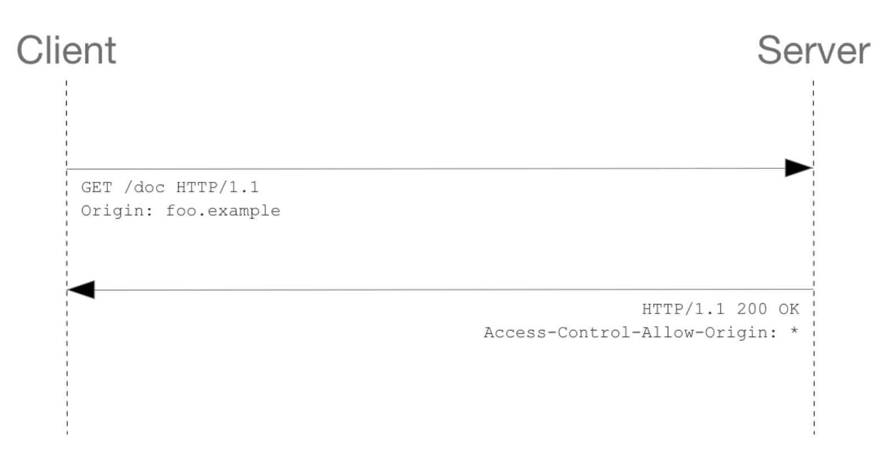
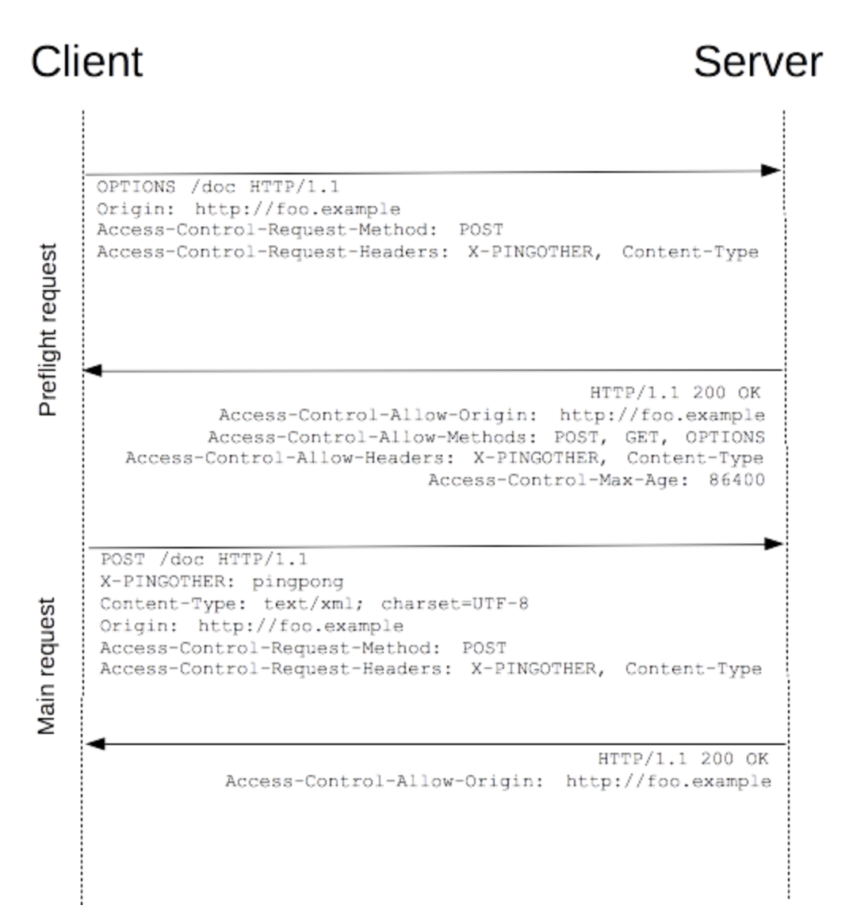

# 01. CORS

> Cross-Origin Resource Sharing

교차 출처 자원 공유....?

Origin(Host)를 가로질러 자원에 접근할 수 있는 권한을 부여하는 정책!

추가 HTTP 헤더를 사용하여, 
한 출처에서 실행 중인 웹 애플리케이션이 
다른 출처의 선택한 자원에 접근할 수 있는 권한을 부여하도록 브라우저에 알려주는 체제


## 그래서 CORS가 무엇인가요?

CORS 가 무엇인지 이해하기 전에 SOP를 먼저 이해해야 합니다.


### SOP : Same-Origin Policy

> 동일 출처 정책

한 origin으로부터 로드된 document 또는 script가, 다른 origin의 리소스와 상호작용할 수 있는 방법을 제한하는 중요한 보안 메커니즘을 의미합니다.
즉, HTML, CSS 요청은 SOP에 의해 제한되지 않습니다. (Cross-origin embedding은 일반적으로 가능)
-> img 태그, link 태그, script 태그는 다른 도메인의 자원을 가져올 수 있습니다.

이 때, scheme(프로토콜), host, port 만 가지고 origin 을 판단하게 됩니다.


### SOP 가 없다면?

https://www.youtube.com/watch?v=6QV_JpabO7g?t=300s

위 링크 참조하시면 좋습니다.

**간단하게 요약**

1. Iframe

SOP가 없다면,

- 공격자는 유저가 접속한 사이트에서 스크립트를 통해 mail 을 iframe 통해서 로드가 가능
- iframe 내부 document까지 접근 가능

SOP가 있다면, iframe 내부에 로드된 document의 origin 이 다르니까 iframe 을 참조할 수 없게 합니다.


**브라우저는 보안 상의 이유로 스크립트에서 시작한 교차 출처 HTTP 요청을 제한합니다**.
따라서 교차 출처 리소스 공유에 대한 헤더(CORS)를 응답시 반환 해주어야 합니다.

- 포트가 다르다면?
  - 브라우저 정책마다 다르지만, 포트까지는 달라도 괜찮습니다. ~~(익스플로러만 문제)~~


#### Cross-origin 네트워크 접근이 필요하다면?

지금까지 소개해온 CORS와 다른 1가지를 추가한 2가지 방법이 있습니다.

- JSONP
  - CORS가 등장하기 전의 방법입니다. 자세한 동작 방식은 생략하겠습니다.(현재는 거의 사용되지 않습니다.)
  - 모든 origin 을 대상으로 SOP를 무력화하는 방법입니다.
  - 하지만 이 방법은 절대 사용하면 안됩니다.
- CORS
  - 허용할 origin 만, Access-Control-Allow-Origin 에 추가합니다.


## CORS 시나리오


CORS 동작하는 방식은 3가지가 있습니다.

- 단순 요청
- Preflight 요청
- 인증정보 포함하는 요청


### 단순 요청

뒤에서 언급할 preflight 요청 없이 단순하게 요청하는 방식입니다.
이를 만족하려면 조건은 다음과 같습니다.

- GET, HEAD, POST에 해당하는 HTTP 메소드인 경우
- requset 헤더의 종류가 다음의 경우만 있을 경우(다른 헤더는 포함 X)
  - Accept, Accept-Language, Content-Language, Content-Type 
    - Content-Type 가 다음 값일 경우에만 해당
      -  application/x-www-form-urlencoded
      - multipart/form-data
      - text/plain
- 요청에 ReadableStream 객체가 사용되지 않는 경우


이 조건을 만족한 경우, 서버에서 Access-Control-Allow-Origin 헤더에 접근이 허용될 Origin에 정보를 담아 응답하고, 브라우저가 요청한 Origin과 허용된 Origin 과 비교를 통해 요청한 응답을 제공하게 됩니다.



이미지 출처 : https://developer.mozilla.org/ko/docs/Web/HTTP/CORS

이미지의 경우, 서버에서 모든 도메인 접근을 허용하고 있습니다.

Access-Control-Allow-Origin 값이 bar.example~~ 처럼 되어 있었다면, Client 의 origin과 다르기에 접근할 수 없었을 것입니다.


### Pre-flight 요청

가장 일반적으로 쓰이는 방식입니다.

OPTIONS 메소드를 사용하여 다른 도메인의 리소스로 HTTP 요청을 보내 전송이 안전한지 먼저 확인합니다.




### 인증 정보를 포함하는 요청 (Credential Requests)

Credential requests는 cookies와 HTTP Authentication 정보를 인식합니다. 
기본적으로 Cross-site에 대한 XMLHttpRequest 혹은 FetchAPI 요청에서 브라우저는 자격증명에 대한 정보를 보내지 않기 때문에, 특정한 플래그를 설정해주어야 합니다.

```javascript
const invocation = new XMLHttpRequest();
const url = 'http://bar.other/resources/credentialed-content/';

function callOtherDomain() {
  if (invocation) {
    invocation.open('GET', url, true);

    // 헤더에 Access-Control-Allow-Credentials 에 true 값 
    invocation.withCredentials = true; 

    invocation.onreadystatechange = handler;
    invocation.send();
  }
}
```


## CORS 설정

그렇다면 지금까지 클라이언트 입장에서 CORS 문제를 해결해서 보내는 것처럼 보입니다. 실제로 html view 쪽 뿐만 아니라, 서버에서도 CORS 설정을 할 수 있습니다.

주로 개발 환경에서, production 환경에선 nginx 를 proxy 서버로 설정하여 생기는 문제가 종종 발생합니다. 이에 유념하여 CORS 설정을 하면 됩니다. 

(Proxy 는 네트워크에 따로 작성해두었습니다.)


## 레퍼런스

- https://blog.naver.com/dnvld1/222039760747
- [https://velog.io/@pilyeooong/CORS란-무엇인가](https://velog.io/@pilyeooong/CORS%EB%9E%80-%EB%AC%B4%EC%97%87%EC%9D%B8%EA%B0%80)
- https://developer.mozilla.org/ko/docs/Web/HTTP/CORS
- https://blog.naver.com/dnvld1/222039760747

