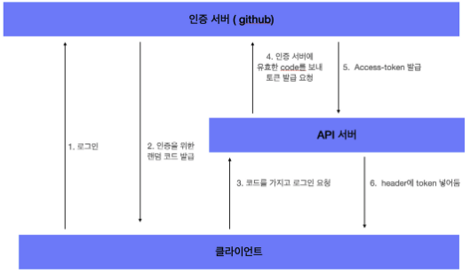

# 쿠키와 세션 

Feat. 로그인, STATEful vs STATEless

## 로그인의 종류

로그인, 즉 사용자 인증을 하려면 여러가지 방법이 있습니다.

가장 단순한 방법은 계정 정보를 `request header` 에 넣어서 보내는 방식입니다. 이는 권장되지 않습니다. 
http 방식으로 보내고 이를 탈취할 경우 사용자의 계정정보를 손쉽게 얻을 수 있기 때문에 사용되지 않습니다.

그렇기에 사용할 수 있는 방법은 session, cookie 로그인 방식이라고 할 수 있습니다.

## Session, Cookie 방식

로그인 순서는 다음과 같습니다.

1. 사용자 로그인
2. 서버에서 사용자를 확인한 뒤, 사용자의 ID 값을 토대로 세션 저장소에 저장한 뒤, 이와 연결되는 세션 ID 발행
3. 사용자는 서버에서 세션 ID 를 받아 쿠키에 저장한 뒤, 인증이 필요한 요청마다 쿠키를 header 에 넣어 보낸다.
4. 서버는 쿠키를 받아 세션 저장소와 대조한 뒤 정보를 가져온다.

- 세션 : 서버에서 가지고 있는 정보. 

**장점**

- 세션, 쿠키 방식은 쿠키를 매개로 인증을 거친다. 즉, session ID 값이 담긴 http 요청이 탈취, 혹은 노출되더라도 그 안에 유의미한 값은 없다. (https 요청을 사용하여 안의 정보를 읽기 어렵게 만들 필요는 있다.)
- 사용자마다 고유의 id 값을 발급 받기에 쿠키값을 통해 일일이 회원 정보를 확인할 필요 없어서 서버의 자원에 접근하기 용이할 것이다.

**단점**

- 서버에 따로 세션 저장소를 사용하기 때문에 서버에 추가적인 부하가 있을 수 있다.
- 서버의 확장성이 낮아지게 된다.

이러한 단점을 개선한 로그인 방식이 토큰 인증 방식입니다.

## 토큰 인증 방식

> stateful 서버 vs stateless 서버

우선 stateful 서버와 stateless 서버에 대한 이해가 필요합니다.

stateful 서버는 클라이언트에게서 요청을 받을 때 마다 클라이언트의 상태를 계속 유지하고, 이를 서비스 제공에 이용합니다. 

- 유저가 로그인하면, 세션에 로그인이 되었다 저장하고, 서비스를 제공할 때 그 데이터를 사용

Stateless 서버는 말 그대로 상태를 유지하지 않습니다. 상태 정보를 저장하지 않고 서버는 클라이언트측에서 들어오는 요청만으로 작업을 처리합니다.  상태가 없는 경우 서버에 상태를 저장하지 않기 때문에 서버의 확장성을 높일 수 있습니다.

### 흐름

토큰 인증 방식의 흐름은 다음과 같습니다.

1. 유저가 로그인
2. 서버에서 계정 정보 검증 → 일치하면 유저에게 토큰을 발급
3. 클라이언트는 발급된 토큰을 저장해두고, 요청보낼 때 해당 토큰을 서버에 같이 전달
4. 서버는 토큰을 검증(만료, 일치 등)하고 응답

이 때 토큰은 http 요청의 header 에 포함되어 전달합니다.

## **OAuth**

> 다른 서비스의 회원정보를 통해 가입, 로그인하자!

`oauth` 는 다른 서비스의 회원 정보를 안전하게 사용하기 위한 방법이라고 할 수 있습니다.

자신의 아이디, 비밀번호 등을 입력하지 않아도 타 서비스의 정보를 우리의 서비스에게 전달할 수 있습니다.

### Access Token

`access token` 을 이용함으로써 해당 토큰에 관련한 고객의 정보를 가져올 수 있습니다.

**간단한 흐름**

1. 우리 서비스에 접속 및 github로 회원가입
2. github 로그인
3. 정상 로그인 시 우리 서비스로 토큰 값과 함께 리다이렉트
4. 해당 토큰으로 서버에서 고객의 정보를 받아올 수 있다

실제 github 로그인을 구현할 때 다음과 같은 흐름으로 구현할 수 있었습니다.

큰 흐름은 대부분의 서비스와 동일하거나 유사합니다.

## 레퍼런스

- https://velopert.com/2350
- https://velog.io/@undefcat/OAuth-2.0-간단정리
- https://tansfil.tistory.com/58?category=255594

