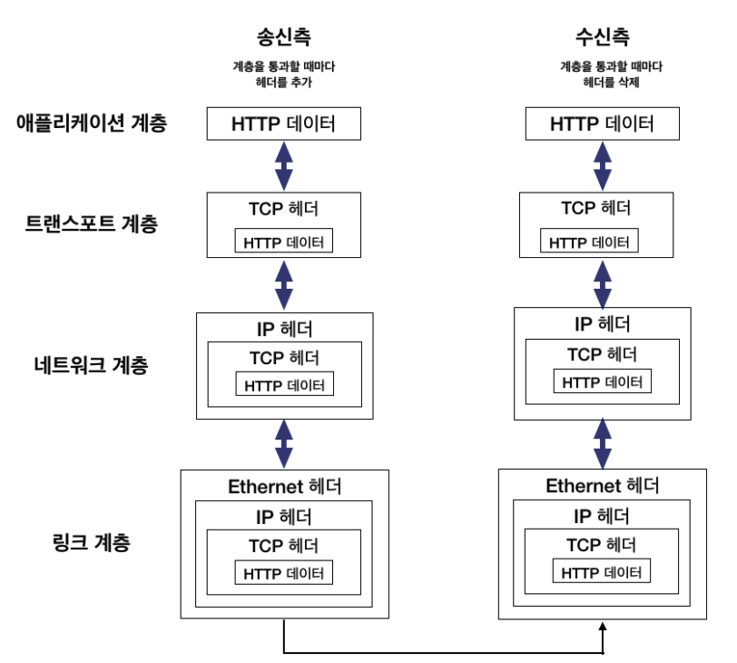

# 06. STATEful vs STATEless

stateful 과 stateless 두 개를 구분짓는 가장 큰 차이는 클라이언트의 상태 정보를 서버가 저장하는지 입니다.

## Stateful

Stateful '구조'는 Server와 Client간 세션의 'State(상태)'에 기반하여 Client에 response를 보냅니다. 
이를 위해 세션 '상태'를 포함한 Client와의 세션 정보를 server에 저장하게 됩니다. 

이를 따르는 대표적인 프로토콜은 TCP 입니다.

3-way handshake 과정을 거쳐서 양단간 세션 상태를 established 한 상태입니다.

## Stateless

Stateless '구조'는 server의 응답이 client와의 세션 '상태'와 독립적입니다. 

Stateless 구조에서 server는 단순히 요청이 오면 응답을 보내는 역할만 수행하며, 세션 관리는 client에게 책임이 있습니다.

대표적으로 UDP 와 http 가 stateless 에 해당합니다.

둘 다 server 에 데이터가 정상적으로 수신이 되었는지 확인을 하지 않고, server 에서 저장또한 하지 않습니다.

## 서버 확장의 관점

Stateful 한 서버의 경우, 스케일 아웃을 할 때 단점이 발생합니다. 클라이언트의 세션 정보가 스케일 아웃된 서버에 저장되어 있지 않기 때문에 추가적인 작업이 반드시 필요합니다.

이는 MSA 구조에서도 동일하게 발생합니다.

반면, Stateless 서버의 경우 클라이언트가 자신의 정보를 관리하여 서버에게 필요할 때마다 보내기 때문에, 
문제가 되지 않습니다.

따라서 스케일 아웃이 자유롭고 MSA 구조에도 적합하기 때문에 Stateless 구조가 각광받고 있습니다.

## 궁금한 사항

### TCP , TCP/IP, HTTP 차이?

- TCP 는 프로토콜

- TCP/IP 는 TCP가 4계층에서, IP는 3계층에서 관리!
   TCP와 IP의 합성어로 데이터의 흐름 관리, 정확성 확인, 패킷의 목적지 보장을 담당합니다. (데이터의 정확성 확인은 TCP가, 패킷을 목적지까지의 전송은 IP가 담당)

- HTTP 는 최상위 application 계층에서!

- 근데 TCP는 stateful? HTTP 는 stateless?
  - TCP/IP 계층 위에서 HTTP가 application 계층에서 구현된 프로토콜 아닌가...?

### 셀프 답변

https://stackoverflow.com/questions/19899236/is-tcp-protocol-stateless

> You can't assume that any stacked protocol is stateful or stateless just looking at the other protocols on the stack. Stateful protocols can be built on top of stateless protocols and stateless protocols can be built on top of stateful protocols.

## 레퍼런스

- https://5equal0.tistory.com/entry/StatefulStateless-Stateful-vs-Stateless-%EC%84%9C%EB%B9%84%EC%8A%A4%EC%99%80-HTTP-%EB%B0%8F-REST
- https://velog.io/@conatuseus/2019-09-10-2009-%EC%9E%91%EC%84%B1%EB%90%A8-xsk0ds2eqf
- https://stackoverflow.com/questions/19899236/is-tcp-protocol-stateless

