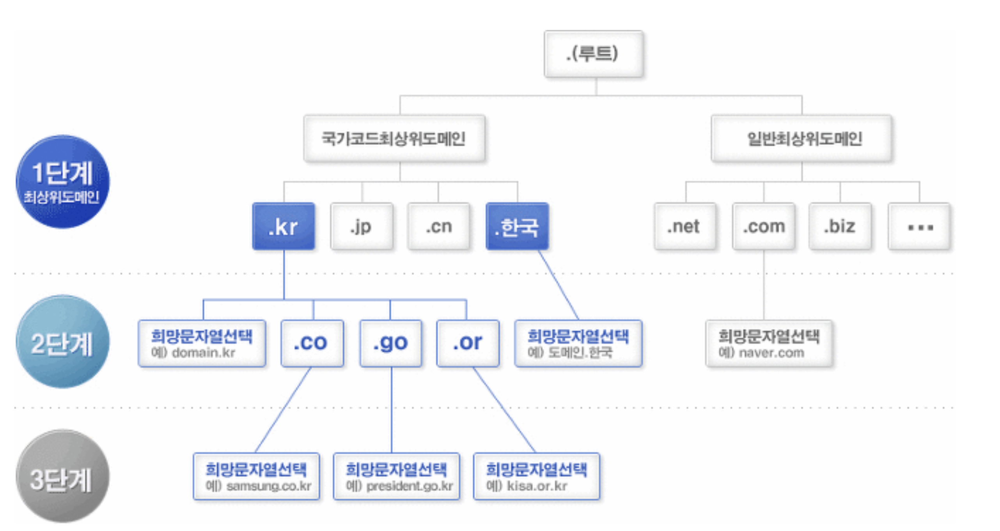
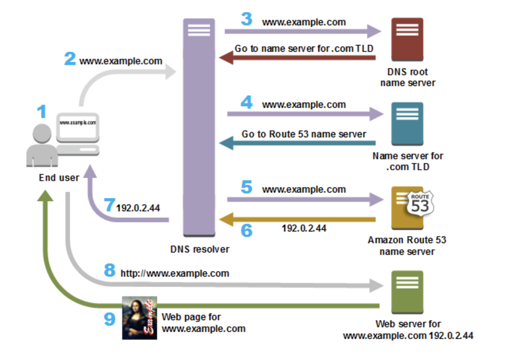
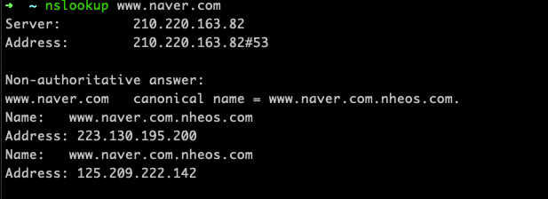

# 07. 브라우저를 통해 접속하는 모든 과정

우리는 naver.com 을 입력하는 것으로 네이버에 쉽게 접속할 수 있습니다.

하지만, IP 주소로 접속을 하지는 거의 않습니다. 외우기도 어렵고, 방문하는 곳마다 기록해두거나 암기하기가 어렵기 때문이죠.

그래서 IP 주소를 쉽게 알기 위해서, **도메인**이라는 개념이 도입되었습니다.

도메인은 IP 주소를 문자열에 매핑한 것이라 할 수 있습니다.

### IP 의 역할

**IP의 역할**은 개개의 패킷을 상대방에게 전달하는 것입니다. (패킷: 통신망을 통해 전송하기 쉽도록 자른 데이터의 전송 단위)

상대에게 전달하기까지 여러 가지 요소가 필요합니다. 그 중에서도 IP 주소와 MAC 주소(Media Access Control Address)라는 요소가 중요합니다.
IP주소는 각 노드에 부여된 주소를 가리키고 MAC 주소는 각 네트워크 카드에 할당된 고유의 주소입니다. IP주소는 변경 가능하지만 기본적으로 MAC 주소는 변경할 수 없습니다.

**통신은 ARP(주소 결정 프로토콜)를 이용하여 MAC 주소에서 한다**.

IP 통신은 MAC 주소에 의존해서 통신 합니다. 
인터넷에서 통신 상대가 같은 랜선 내에 있을 경우는 적어서 여러 대의 컴퓨터와 네트워크 기기를 중계해서 상대방에게 도착합니다. 
그렇게 중계하는 동안에는 다음으로 중계할 곳의 MAC 주소를 사용하여 목적지를 찾아가는 것입니다. 이때, ARP(Address Resolution Protocol: 주소 결정 프로토콜)이라는 프로토콜이 사용됩니다.

## DNS

> Domain Name System

분산 데이터 베이스로,
수많은 name server 가 계층형 구조로 트리 자료구조를 이루고 있습니다.

이는 Application 계층에서 활용됩니다.

## 접속하는 과정

DNS 서버로 총 3번의 쿼리가 전송됩니다. (이 때 DNS 서버는 모두 다릅니다.)

각 쿼리는 DNS resolver 를 거치게 됩니다.

1. 브라우저에 www.naver.com 으로 접속을 시도합니다.
2. DNS resolver 를 거쳐 우선 Root name server로 가게 됩니다.
   - 이는 TLD 네임 서버로 쿼리를 보내야 하기 때문입니다.
     - TLD : Top Level Domain (최상위 도메인)
     - .kr, .org, .com, ... 등이 포함된 최상위 도메인이라고 합니다.
   - Root name server 에서 TLD 중 .com 도메인의 네임서버로 보내야한다는 정보를 알 수 있었습니다.
3. 응답 받은 com DNS 서버의 IP 로 naver.com 을 관리하는 DNS server 로 IP를 질의하게 됩니다.
4. naver.com 의 관리 DNS server를 알게 되었고, 
   이 곳에게 www.naver.com 의 IP 를 질의하게 됩니다.

이 과정을 거쳐 www.naver.com 의 IP를 획득하게 됩니다.

이후, 한번 질의된 DNS는 메모리에 저장해뒀다가, 캐시로 사용할 수 있습니다.

아래는 AWS 에서 Route53 서비스 이용 시 흐름을 나타낸 것입니다.

[AWS 에서 제공하는 이미지]

1. 사용자가 웹 브라우저를 열어 주소 표시줄에 www.example.com을 입력하고 Enter 키를 누릅니다.
2. www.example.com에 대한 요청은  DNS 해석기(resolver)로 라우팅됩니다.
3. ISP의 DNS 해석기는 www.example.com에 대한 요청을 DNS 루트 이름 서버에 전달합니다.
4. ISP의 DNS 해석기는 www.example.com에 대한 요청을 이번에는 .com 도메인의 TLD 이름 서버 중 하나에 다시 전달합니다. .com 도메인의 이름 서버는 example.com 도메인과 연관된 4개의 Amazon Route 53 이름 서버의 이름을 사용하여 요청에 응답합니다.
5. ISP의 DNS 해석기는 Amazon Route 53 이름 서버 하나를 선택해 www.example.com에 대한 요청을 해당 이름 서버에 전달합니다.
6. Amazon Route 53 이름 서버는 example.com 호스팅 영역에서 www.example.com 레코드를 찾아 웹 서버의 IP 주소 192.0.2.44 등 연관된 값을 받고 이 IP 주소를 DNS 해석기로 반환합니다.
7. ISP의 DNS 해석기가 마침내 사용자에게 필요한 IP 주소를 확보하게 됩니다. 해석기는 이 값을 웹 브라우저로 반환합니다. 또한, DNS 해석기는 다음에 누군가가 example.com을 탐색할 때 좀 더 빠르게 응답할 수 있도록 사용자가 지정하는 일정 기간 동안 example.com의 IP 주소를 캐싱(저장)합니다. 자세한 내용은 TTL(Time to Live)을 참조하십시오.
8. 웹 브라우저는 DNS 해석기로부터 얻은 IP 주소로 www.example.com에 대한 요청을 전송합니다. 여기가 콘텐츠가 있는 곳으로, 예를 들어 웹 사이트 엔드포인트로 구성된 Amazon S3 버킷 또는 Amazon EC2 인스턴스에서 실행되는 웹 서버입니다.
9. 192.0.2.44에 있는 웹 서버 또는 그 밖의 리소스는 www.example.com의 웹 페이지를 웹 브라우저로 반환하고, 웹 브라우저는 이 페이지를 표시합니다.

[출처] https://aws.amazon.com/ko/route53/what-is-dns/

## 도메인 등록 시 CNAME 과 A 레코드는 무엇이였을까?

둘 다 서브 도메인 등록 시 필요한 정보였는데 정확히 무엇이였는지 알아보겠습니다.

### A 레코드

naver.com 에 해당하는 IP 주소는 naver.com 을 관리하는 DNS 서버에 기록되어 있겠죠?

그리고, www.naver.com  이 아닌, 예를 들어 chulhee.naver.com 으로 접근한다면 naver.com 관리하는 DNS 서버에서 이에 맞는 IP를 주어야 합니다.

A 레코드는 도메인에 맞는 IP 를 직접 매핑시키는 방법입니다.

### CNAME

CNAME 은 Canonical Name 의 약자입니다.

도메인 주소를 또 다른 도메인 주소로 매핑시키는 DNS 레코드 타입입니다.

| www.naver.com           | ....          |
| ----------------------- | ------------- |
| www.naver.com.nheos.com | www.naver.com |
|                         |               |

2번째 열이 CNAME에 해당합니다.

www.naver.com.nheos.com 을 입력하면 www.naver.com 을 알려주고, 이는 다시 IP 주소를 리턴해주어 IP 주소를 사용하게 됩니다.

- server
  - 210.220.163.82 : SK 브로드밴드의 DNS 서버
- www.naver.com 의 CNAME 으로 제공하고 있습니다.

### A record VS CNAME

**A 레코드**

- 장점
  - 바로 IP 주소에 찾아갈 수 있습니다 

- 단점
  - 자주 IP 주소가 바뀔 경우 번거롭습니다.

**CNAME**

- 장점
  - IP 주소가 자주 바뀌는 환경에 유연하게 대응할 수 있습니다.
- 단점
  - 실제 IP 주소 얻을 때까지 여러번 DNS 정보를 요청해야 합니다.

## 레퍼런스

- https://aws.amazon.com/ko/route53/what-is-dns/
- https://preamtree.tistory.com/35
- https://webdir.tistory.com/161
- https://m.blog.naver.com/PostView.naver?blogId=thdlcldlfrl&logNo=221438379584

