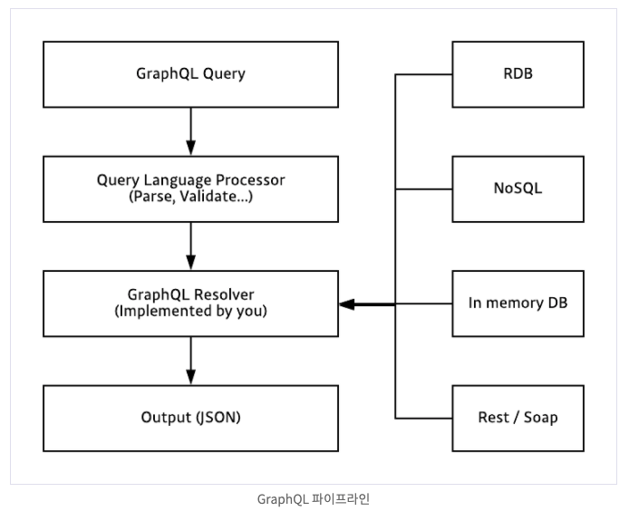

# 08. GraphQL, REST

Server 에 대해서 요청을 보냈을 때, 이에 맞는 응답을 보내줘야합니다. 

그 방식들의 종류에 대해서 알아봅시다.


## REST

> REpresentational State Transfer 

자원의 표현에 의한 상태 전달

모든 자원을 하나의 endpoint 에 연결해두고, 각 endpoint 는 자원과 관련된 내용만 관리하는 방법론입니다.

HTTP Method을 통해서 CRUD 작업에 대해서 매핑시켜 요청을 보내게 됩니다.

```
GET /posts :조회
POST /posts :생성
PATCH /posts/{id} :수정
DELETE /posts/{id} :삭제
```


### 장점

- REST는 기본적으로 웹의 기존 기술과 HTTP 프로토콜을 그대로 활용하기 때문에 웹의 장점을 최대한 활용할 수 있는 아키텍쳐 스타일이다.
  - HTTP 프로토콜을 사용하므로 REST API 사용을 위한 인프라를 구축할 필요가 없다.
  - HTTP 표준프로토콜을 따르는 모든 플랫폼에서 호환된다. (범용성)
- REST API 메시지가 의도하는 바를 명확하게 나타내므로 의도하는 바를 쉽게 파악할 수 있다.
- 서버와 클라이언트의 역할을 명확하게 분리한다.


### 단점

가장 큰 단점은 표준이 존재하지 않는다는 점입니다. 


~~(하지만, 각자 팀에서 CRUD 기반으로 RESTful 하게 작성을 하게 됩니다.)~~


## GraphQL

> Graph Query Language


 sql은 **데이터베이스 시스템**에 저장된 데이터를 효율적으로 가져오는 것이 목적이고, gql은 **웹 클라이언트**가 데이터를 서버로 부터 효율적으로 가져오는 것이 목적입니다.

sql의 문장(statement)은 주로 백앤드 시스템에서 작성하고 호출 하는 반면, gql의 문장은 주로 클라이언트 시스템에서 작성하고 호출 합니다.

서버사이드 gql 어플리케이션은 gql로 작성된 쿼리를 입력으로 받아 쿼리를 처리한 결과를 다시 클라이언트로 돌려줍니다. 
HTTP API 자체가 특정 데이터베이스나 플렛폼에 종속적이지 않은것 처럼 
마찬가지로 gql 역시 어떠한 특정 데이터베이스나 플렛폼에 종속적이지 않습니다. 

***심지어 네트워크 방식에도 종속적이지 않습니다. 일반적으로 gql의 인터페이스간 송수신은 네트워크 레이어 L7의 HTTP POST 메서드와 웹소켓 프로토콜을 활용합니다. 필요에 따라서는 얼마든지 L4의 TCP/UDP를 활용하거나 심지어 L2 형식의 이더넷 프레임을 활용 할 수도 있습니다***.




### REST 와 비교

REST API는 URL, METHOD등을 조합하기 때문에 다양한 Endpoint가 존재 합니다. 

반면, gql은 단 하나의 Endpoint가 존재 합니다. 

또한, gql API에서는 불러오는 데이터의 종류를 쿼리 조합을 통해서 결정 합니다.


### graphQL 구조

- 쿼리
  - Read 에 해당
- 뮤테이션
  - Create, Update, Destroy 


### 스키마와 타입

```graphql
type Character {
  name: String!
  appearsIn: [Episode!]!
}
```

- 오브젝트 타입 : Character
- 필드 : name, appearsIn
- 스칼라 타입 : String, ID, Int 등
- 느낌표(!) : 필수 값을 의미(non-nullable)
- 대괄호([, ]) : 배열을 의미(array)


### 리졸버 Resolver

데이터베이스 사용시, 데이터를 가져오기 위해서 sql을 작성 했습니다. 

그러나 gql 에서는 데이터를 가져오는 구체적인 과정을 직접 구현 해야 합니다. 

**gql 쿼리문 파싱은 대부분의 gql 라이브러리에서 처리**를 하지만, 
**gql에서 데이터를 가져오는 구체적인 과정은 resolver(이하 리졸버)가 담당하고, 이를 직접 구현** 해야 합니다.\

프로그래머는 리졸버를 직접 구현해야하는 부담은 있지만, 
이를 통해서 데이터 source의 종류에 상관 없이 구현이 가능 합니다. 

예를 들어서, 리졸버를 통해 

- 데이터를 데이터베이스에서 가져 올 수 있고, 
- 일반 파일에서 가져 올 수 있고, 
- 심지어 http, SOAP와 같은 네트워크 프로토콜을 활용해서 원격 데이터를 가져올 수 있습니다. 

리졸버 호출은 기본 스칼라 타입이라면 해당 데이터를 return 을 해주겠지만, 우리가 정의해둔 타입이라면 해당 타입의 리졸버를 호출하게 됩니다.(일종의 DFS)


### 그러면, RDBMS 시스템에 어떻게 사용이 될까?

- 조인
- N+1 문제
  - 무한히 DFS 를 타고 갈 수 있지 않을까?

> n+1문제는 이미 수많은 사람이 고민했습니다. 
> 대표적으로 나오는 방법은 배치를 적용해서 처리하는 겁니다. 
> Facebook에서 만든 [data-loader](https://github.com/facebook/dataloader)를 사용했다는 아티클이 많습니다. 
> `배치로드`로 일괄처리 하여 n+1문제를 줄이고 거기에 더해 각 요청에 관하여 캐싱을 하여 성능상의 이점도 있습니다. 엔드포인트가 하나인 graphql에서는 클라이언트 캐싱이 조금 힘든데요. data-lodaer를 통해 캐싱할 수 있습니다. 다만, 자주 비워줘야 하는 캐싱 관리 포인트와 메모리 부족 등을 겪을 수 있습니다.
> 쿼리가 실제로 어떻게 나가는지는 [join-monster](https://github.com/stems/join-monster)를 사용하면 됩니다. 여기에 더해 data-loader가 하는 일을 대체할 수 있습니다. 캐싱은 해주지 않지만 하나의 요청에만 적용하던 일괄처리를 모든 요청에 관한 일괄처리해서 더 빠른 퍼포먼스를 내고 n+1을 해결 할 수 있다고 합니다.

자세한 내용 : https://showerbugs.github.io/2018-04-20/Graphql-%EC%A0%81%EC%9A%A9%ED%95%A0-%EB%95%8C-%EA%B3%A0%EB%A0%A4%ED%95%A0-%EC%A0%90


## 레퍼런스

- https://tech.kakao.com/2019/08/01/graphql-basic/
- https://velog.io/@djaxornwkd12/REST-API-vs-GraphQL-%EC%B0%A8%EC%9D%B4%EC%A0%90-%EC%95%8C%EC%95%84%EB%B3%B4%EA%B8%B0
- https://showerbugs.github.io/2018-04-20/Graphql-%EC%A0%81%EC%9A%A9%ED%95%A0-%EB%95%8C-%EA%B3%A0%EB%A0%A4%ED%95%A0-%EC%A0%90


## 질문할 사항

- 네트워크 레이어에 종속적이지 않다??
- 