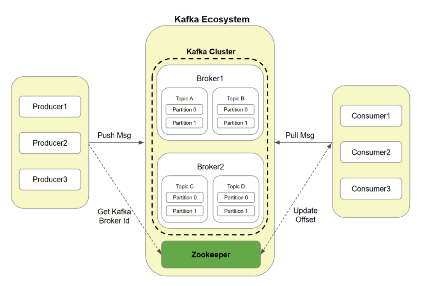

# 10. Kafka?

## 들어가기 전

### 메시지 큐

>  메시지 기반의 미들웨어로 메시지를 이용하여 여러 어플리케이션, 시스템, 서비스들을 연결해주는 솔루션

서비스를 운영하다 보면, 데이터 처리가 많아져 서버 성능이 낮아질 경우 서버가 마비될 수도 있습니다.

이를 처리하기 위해 DB 최적화 등 다양한 방법이 있지만 비용이 많이 드는 등 여러 한계점이 보입니다. 이를 해결해주는 것이 메시지 큐 입니다.

- 메시지 지향 미들웨어(Message Oriented Middleware : MOM)
  - 분산 시스템 간 메시지를 주고 받는 기능을 지원하는 소프트웨어나 하드웨어 인프라
- 메시지 큐(Message Queue : MQ)
  - MOM을 구현한 시스템
- 브로커(Broker)
  - Message Queue 시스템
- AMQP(Advanced Message Queueing Protocol)
  - 메시지 지향 미들웨어를 위한 프로토콜

**Producer(생산자)가 Message를 Queue에 넣어두면, Consumer가 Message를 가져와 처리하는 방식이다.**

- 한번 더 거치는 과정이 생기는데, 왜 더 효율이 좋아질까?

클라이언트와 동기 방식으로 처리할 경우 병목 현상이 발생하여 성능저하가 발생하지만, 
메시지 큐를 활용하여 중간 미들웨어에 메시지를 위임하여 순차적으로 처리하게 하기 때문에 성능이 개선됩니다.

## 카프카란?

**대용량 실시간 로그 처리에 특화된 메시지 큐 시스템**

### 기존의 문제점

- 하나의 서비스가 너무 많은 시스템과 연결
  - 유지 부담 상승 / 기능 개발 지연
- 엔드투엔드 연결 방식 아키텍처 문제
  - 실시간 트랜잭션 처리, 비동기 처리 동시에 이뤄지지만 통합된 전송 영역이 없어 복잡도 증가
  - 파이프라인 관리의 어려움
    - 통합 데이터 분석을 위해 서로 다른 데이터 시스템을 연결해야할 경우가 있는데, 데이터의 포맷이나 처리하는 방법이 다르다면 통합하기가 어렵다.

카프카를 메시지 전달의 중앙 플랫폼으로 두고, 

기업에서 필요한 모든 데이터 시스템(오라클, NOSQL, 하둡)뿐만 아니라 마이크로 서비스, 사스 서비스 등과 연결된 파이프라인을 만드는 것을 목표로 두고 개발되었다.

## 동작 원리

메시징 서버로 동작하게 됩니다.

- 프로듀서(퍼블리셔) : 메시지라고 불리는 데이터단위를 보냄
- 컨슈머(서브스크라이버) : 메시지를 가져감
- 브로커(Broker) : 아파치 카프카 애플리케이션이 설치되어 있는 서버

### 특징

- 역할 분리
  - 역할이 완벽하게 분리된 pub/sub 방식 적용
- 멀티 pub, sub
  - 하나의 토픽에 여러 프로듀서 또는 컨슈머들이 접근 가능한 구조
- 디스크에 메시지 저장
  - 디스크에 메시지를 저장하고 유지
  - 트래픽이 일시적으로 많아지거나 컨슈머에 오류가 있더라도 메시지 손실 없이 작업이 가능
- 확장성
  - 하나의 카프카 클러스터는 3대의 브로커로 시작해 수십대의 브로커로 무중단으로 확장이 가능
- 고성능
  - 내부적으로 분산처리, 배치 처리 등 다양한 기법 사용

## 레퍼런스

- https://gunju-ko.github.io/kafka/2018/12/21/%EC%B9%B4%ED%94%84%EC%B9%B4%EB%9E%80%EB%AC%B4%EC%97%87%EC%9D%B8%EA%B0%80.html

## 궁금한 사항

사실 잘 와닿지 않는다...

subscribe 하고 있으면 새로운 데이터가 오면 알아서 받는 것인지, 
해당 토픽에 요청해놓고 올 때까지 비동기적으로 동작하는 것이 끝인지?

## 공부할 키워드

- Pub/sub 모델 
  - redis pub sub