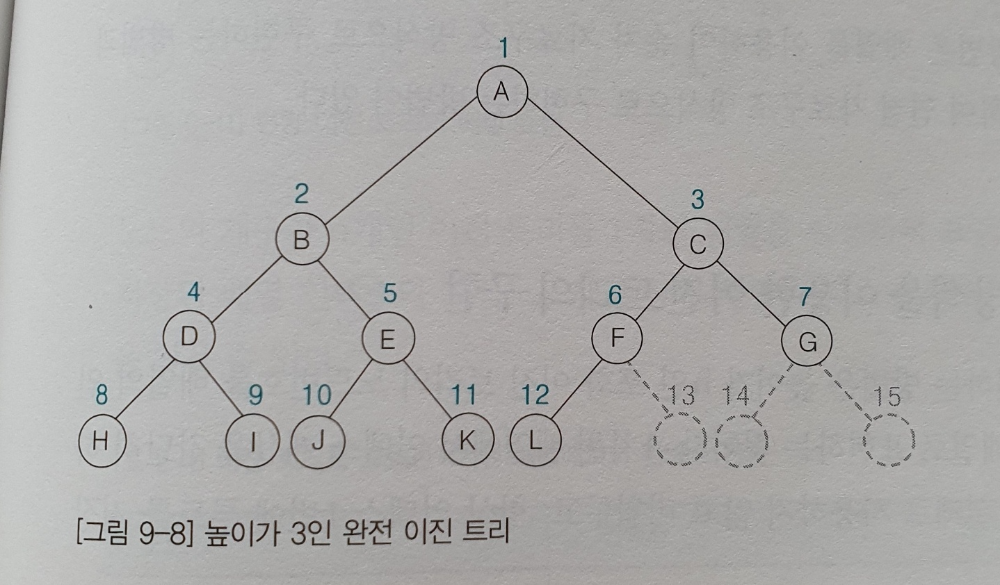

# 01. Tree 자료 구조


## 0. 들어가기 전에

리스트, 스택, 큐는 선형 자료 구조(Linear Data Structure)입니다. 
즉, 말 그대로 자료들이 나열된 구조가 선형입니다.

자료가 선형으로 나열되지 않은 자료구조는 **비선형 자료구조**라고 하는데, 
트리(Tree)는 이 중에서도 계층 관계를 가진
**계층형 자료구조**입니다.


### 용어 정리

- 노드
  - 트리를 구성하는 원소(자료)
- 간선(Edge)
  - 노드를 연결하는 선
- 루트 노드
  - 트리의 시작 노드에 해당
  - 레벨 0
- 차수 (Degree)
  - 한 노드가 가지는 서브 트리의 수, 즉 자식노드의 수를 차수 라고 합니다.
  - 자식 노드를 3개 -> 3차
  - 자식이 없음 -> 단말 노드(Leaf Node)

이 정도로만 간단히 용어를 정리하도록 하겠습니다.


## 1. 이진 트리

트리의 노드 구조를 일정하게 정의한다면 트리의 연산이 단순해져서 쉬워집니다.
따라서, **모든 노드의 차수를 2 이하**로 정하여 전체 트리의 차수가 2 이하가 되도록 만든 트리를 
**이진 트리(Binary Tree)**라고 합니다.


### 특징

- n 개의 노드를 갖는 이진트리는 n-1 개의 간선을 갖는다.
- 높이가 h 인 이진 트리가 가질 수 있는 노드의 최소 개수는 h+1개이며, 최대는 2^(h+1) -1 개이다.


### 분류

- 포화 이진트리
  - 높이 h에 대해 2^(h+1) -1 개의 노드 수를 갖는 이진 트리이다.
- 완전 이진 트리
  - 높이 h, 노드 수가 n 개 일때, 노드 n 번까지 빈 곳 없이 모두 위치와 그 노드가 일치하는 트리이다.



- 편향 이진 트리
  - 최소 노드 개수를 가지면서 왼쪽, 혹은 오른쪽 서브 트리만 갖는 트리


### 구현

코드 레벨에서 간단하게 바라봅시다.

이진 트리를 구현하는 방법은 배열을 이용한 **순차 자료구조**, 메모리 참조 변수 이용하여 **연결 자료 구조**로 구현하는 방식 등이 있습니다. 

이 중에서, 연결 자료 구조를 사용하여 구현한 방법을 간단하게 봅시다.

배열을 이용한 방법은 메모리 낭비, 삽입 및 삭제 연산이 비효율적이기 때문에 잘 사용되지 않습니다.

```java
class TreeNode {
  Object data;
  TreeNode left;
  TreeNode right;
}
```

와 같이 정의할 수 있습니다.

### 순회

계층적으로 저장해둔 이진 트리는 모든 노드를 방문하는 방법이 필요합니다.
모든 노드를 방문하며 노드가 갖고 있는 데이터를 처리하는 것을 **순회(Traversal)**이라고 합니다.

순회는 간략하게 방법만 소개하고 넘어가겠습니다.

- 전위 순회
  - 현재 노드 방문 - 왼쪽 서브 트리 이동 - 오른쪽 서브 트리 이동
- 중위 순회
  - 왼쪽 서브 트리 이동 - 현재 노드 방문 - 오른쪽 서브 트리 이동
- 후위 순회
  - 왼쪽 서브 트리 이동 - 오른쪽 서브 트리 이동 - 현재 노드 방문


## 2. 이진 탐색 트리

**탐색을 쉽게 하기 위해 이진트리를 사용**하여 저장할 데이터의 크기에 따라 노드의 위치를 정의한 트리입니다.

탐색을 하기 위해선 자료를 식별할 수 있는 유일한 키 값이 필요합니다.

효율적인 탐색 작업을 위해서 이진 탐색 트리를 다음과 같이 정의합니다.

- 모든 원소는 서로 다른 유일한 키를 갖는다.
- 왼쪽 서브 트리에 있는 원소의 키는 그 루트의 키보다 작다
- 오른쪽 서브 트리에 있는 원소의 키는 그 루트의 키보다 크다
- 왼쪽 서브 트리와 오른쪽 서브 트리도 이진 탐색 트리다.


### 연산

#### 삽입

같은 원소가 있는지 확인을 하기 위해 탐색을 합니다.

탐색에 실패 -> 해당 원소가 없기 때문에 그 자리에 원소를 삽입합니다.

#### 삭제

삭제 이후에도 전체 트리는 이진 트리를 구성하고 있어야하기에 **후속 처리가 필요합니다.**

삭제할 노드는 자식 노드의 수(차수)에 따라 3가지 경우가 있습니다.

- **단말 노드(Leaf Node) 인 경우 - 차수가 0**
  - 노드를 삭제하고, 부모 노드의 링크 필드를 null 로 설정합니다.
- **1개의 자식 노드 있는 경우 - 차수 1**
  - 부모 노드를 삭제하고, 자식 노드는 부모 노드의 자리를 물려 받습니다.
- **2개의 자식 노드 있는 경우 - 차수 2**
  - 직계 자손 노드 뿐만 아니라, 해당 서브 트리 전체에서 부모 노드에 대체될 후계자를 찾아야합니다.
  - 왼쪽 서브 트리에 있는 노드보다 키가 크고,
    오른쪽 서브 트리보다 키값이 작아야합니다.
    - 왼쪽 서브 트리에서 가장 큰 키값의 노드 or 오른쪽 서브 트리에서 가장 작은 키 값의 노드


## 레퍼런스

- 자바로 배우는 쉬운 자료구조, 한빛 아카데미


## 추가 공부할 키워드

- 레드블랙트리
- AVL 트리

## 질문할 사항

