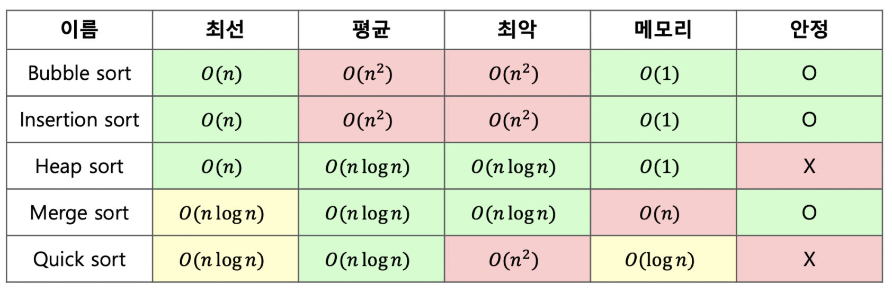

# 03. 정렬

다양한 정렬 방법에 대해서 정리해보겠습니다.



## 선택 정렬

> 전체 원소들 중 기준 위치에 맞는 원소를 선택하여 자리를 교환하는 방식입니다.

m 번째 위치에 들어갈 원소를 매번 찾습니다.

그렇기 때문에 전체 비교 횟수는 n*(n-1)/2 로, 시간복잡도는 O(N^2) 을 갖습니다.


## 버블 정렬

> 인접한 2개의 원소를 비교하여 자리를 교환하는 방식입니다.

전체 비교 횟수는 n*(n-1)/2 로, 시간복잡도는 O(N^2) 을 갖습니다.


## 삽입 정렬

정렬되어 있는 부분집합에 정렬할 새로운 원소의 위치를 찾아 삽입하는 방법입니다.

이해를 돕기 위해 간단히 S 와 U 라는 부분집합이 있다고 가정하겠습니다.


```python
arr = [15, 12, 24, 5, 17, 48, 20]
# s = arr[0:2]에 해당
# u = arr[2:]에 해당
```

부분집합 u에서 하나씩 꺼내면서 s 에 해당하는 부분집합에 올바른 위치에 삽입하는 것입니다.

이미 정렬되어 있는 경우 O(N)의 시간 복잡도를 갖지만

평균적으로 O(N^2) 의 시간 복잡도를 갖게 됩니다.


## 병합 정렬 (Merge Sort)

여러 개의 정렬된 자료의 집합을 결합하여 한 개의 정렬된 집합으로 만드는 방법입니다.

부분집합으로 분할(Divide)하고, 각 부분집합에 대해 정렬을 완성, 정복(Conquer) 하는 기법을 사용합니다.


배열을 이등분으로 분할하여 부분 배열을 만들고, 다시 해당 배열을 분할하는 작업을 반복하게 됩니다.
이후 부분 배열의 크기가 1이면 정렬하며 병합하는 과정을 진행하는데,
이 때 새로 병합하여 만든 부분집합을 저장할 공간이 추가로 필요하기 때문에 정렬할 원소 n개에 대하여 2*n개의 메모리 공간을 사용하게 됩니다.

**따라서 공간 복잡도 O(n)을 갖는다고 하며, 시간 복잡도는 항상 O(n*log n)을 갖습니다.**


## 퀵 정렬

퀵 정렬은 정렬할 전체 원소에 대해서 정렬을 수행하지 않고 **분할 정복을 통해 정렬을 수행합니다.**

기준값이라 하는 피봇(pivot)을 설정하고 이 값보다 작으면 왼쪽으로, 큰 원소는 오른쪽으로 이동하는 로직을 따릅니다.


- 분할
  - 정렬할 자료들을 기준값을 중심으로 2개의 부분집합으로 분할
- 정복
  - 부분 집합의 원소들 중 기준값보다 작은 원소는 왼쪽으로, 큰 원소는 오른쪽으로 정렬한다.
  - 부분 집합의 크기가 1 이하로 충분히 작지 않다면 순환호출을 이용하여 다시 분할

L과 R 을 사용하여 
왼쪽에서부터 피봇보다 크거나 같은 원소는 L로,

오른쪽에서부터 피봇보다 작은 원소를 R로 표시한 뒤 교환합니다.

L과 R이 만나면 피봇과 R을 교환합니다.

확정된 위치를 기준으로 만들어진 각 부분집합에 대해 퀵정렬을 순환적으로 반복 수행합니다.


## 힙 정렬

힙 자료구조를 이용하여 정렬하는 방법입니다.

힙에서는 항상 가장 큰 원소가 루트 노드가 됩니다.

삭제 연산 시 루트 노드의 원소를 삭제합니다.

따라서 노트 개수만큼 삭제 시, 내림 차순으로 정렬된 원소의 배열을 얻을 수 있습니다.

힙을 구성하는 평균 시간은 O(log n) 입니다. 

삭제 연산 및 재구성하는 연산에 대해서 힙의 재배열 과정과 동일하게 **시간 복잡도는 O(n log n)을 갖게 됩니다.**


## 어떤 정렬이 최선일까? - 참조 지역성의 원리

실제로 어떤 정렬이 가장 효율적일까요? 시간복잡도는 필수적인 지표중 하나입니다.

그렇기에 평균 시간 복잡도를 통해 판단한다면 
**merge sort, heap sort, quick sort 중 하나를 사용하는 것이 유리해 보입니다.**

그 중에서도 힙 소트는 메모리도 들지 않고 시간 복잡도가 최선의 경우와 최악의 경우 가장 빠른 것 처럼 보입니다.

하지만 시간 복잡도는 모든 상수배 및 상수의 합을 제거하고 표현하는데, 상수 C는 실제로 시간 복잡도에 큰 영향을 끼치는 요소입니다.

이 때 참조 지역성의 원리를 고려해야합니다.


### 참조 지역성의 원리

CPU가 미래에 원하는 데이터를 예측하여 속도가 빠른 장치인 캐시 메모리에 담아 놓고 캐시 적중률을 높이기 위해 사용하는 원리입니다.

최근에 참조한 메모리나 그 메모리와 인접한 메모리를 다시 참조할 확률이 높다는 이론을 기반으로 캐시 메모리에 담아놓기에, 캐시에 담겨진 데이터를 많이 읽을 수록 그 성능이 좋습니다.


#### 힙소트의 참조 지역성

참조 지역성이 좋지 않습니다. 
힙 소트 정렬 과정에서 부모 노드(i번째 노드)와 자식 노드(2*i번째 노드)의 비교는 인덱스의 관점에서 2배에 해당하거나, 그 절반에 해당합니다.

그렇기에 캐시의 적중률이 좋지 않습니다.


#### 머지 소트의 참조 지역성

인접한 덩어리를 기준으로 병합하기에 참조 지역성을 잘 만족하는 편입니다.

하지만, 병합하는 과정에서 메모리를 추가로 사용하는 단점이 있습니다.


#### 퀵소트의 참조 지역성

퀵소트는 pivot 주변에서 데이터의 위치 이동이 자주 발생하기 때문에 참조 지역성이 좋은 편입니다. 따라서 메모리를 추가로 사용하지 않습니다.

실제로 상수 C  값도 다른 정렬에 비해 작은 값으로 정의되어 있고 평균 시간 복잡도도 가장 빠르다고 알려져있습니다.

그러나 pivot 선정에 따라 최악의 경우 O(n^2)의 복잡도를 갖고 있습니다.


즉, 최악의 경우에도 메모리를 추가로 사용하지 않고, O(n* log n)으로 동작하는 정렬 알고리즘이 필요로 함을 알 수 있습니다.


## Tim Sort 알고리즘 등장

병합정렬(Merge sort)과 삽입정렬(Insertion Sort)의 아이디어를 적절히 섞어서 만든 알고리즘입니다. 

이 알고리즘은 최선의 시간 복잡도는 O(n), 평균은 O(nlog n*), 최악의 경우 시간 복잡도는 O*(nlog n) 을 갖습니다.

추가 메모리는 사용하지만, 머지 소트에 비해 적게 사용하며, 다른 정렬 알고리즘의 단점을 최대한 극복한 알고리즘이라고 합니다.

실제로 파이썬, java 등 많은 언어에서 해당 알고리즘을 표준 정렬 알고리즘으로 사용한다고 알려져 있습니다.

따라서 알고리즘 문제나 다른 정렬 문제를 해결할 때 별도로 정렬 알고리즘을 구현하는 것보다 내장 정렬 함수를 사용하는 것이 좋습니다.


### 왜 빠르지?

삽입 정렬은 시간 복잡도가 O(n^2)으로 높은 편입니다.

하지만 작은 n 값에 대해서 삽입 정렬의 실제 시간 복잡도 C_insertion * n^2 < C_quick * n * log n 이기에 작은 n 값에 대해선 삽입 정렬이 빠릅니다. **(C_insertion < C_quick )**

따라서 전체를 작은 부분 집합으로 잘라 각각을 insertion sort로 정렬한 뒤 병합하는 방법을 선택하여 더 빠를 수 있습니다.


## 레퍼런스

- [tim sort - https://d2.naver.com/helloworld/0315536](https://d2.naver.com/helloworld/0315536)
- 자바로 배우는 쉬운 자료구조, 한빛 아카데미

