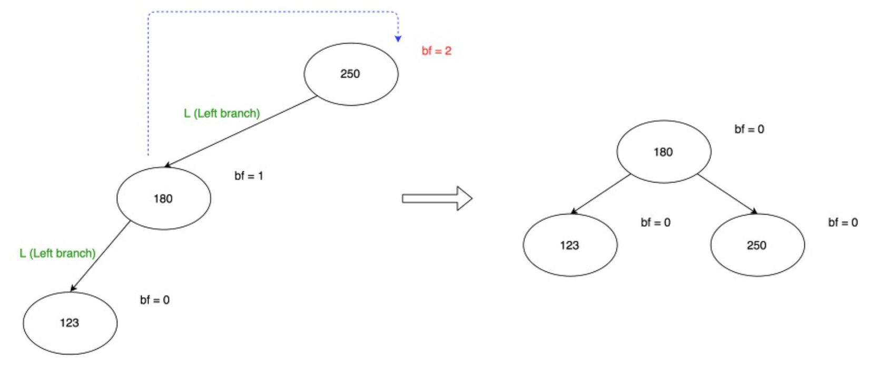

# 05. AVL Tree

이진 탐색 트리의 일종으로, 서브 트리의 높이를 항상 균형을 맞추어 한쪽으로 편향되지 않도록 하는 트리입니다.

-> 높이를 최소로 만들자!


## 용어 및 특징

- **Balance Factor**
  - (왼쪽 서브 트리의 높이) - (오른쪽 서브 트리의 높이)
  - 이 값의 크기가 작을 수록 균형이 유지한다고 할 수 있습니다.


### 특징

- AVL 트리에선 BF 값이 1 이하로 항상 균형된 트리를 만듭니다. 
- 편향 이진 트리가 만들어지지 않기 때문에, **이진 검색 시 항상 효율성을 보장할 수 있습니다.**


하지만 단점으로는,

- 프로그래밍 및 디버깅이 어렵습니다.
- 검색이 빠르지만 재균형을 하는데 시간이 소요됩니다.
- Tree 자료구조를 이룬 뒤 사용하는 분야에선 B-Tree 등 최적화된 다른 트리가 존재합니다.
  - DB에선 B-Tree를 사용합니다.


## 균형 맞추는 방법

노드의 삽입이나 삭제로 인해 서브 트리의 height의 차이가 발생할 수 있습니다. 그럴  때 **rotation** 을 통해 height를 낮춰 균형을 유지하게 됩니다.

4가지 형태에 의해 균형이 깨지게 되는데, 노드 X를 기준으로

- LL
  - X의 왼쪽 노드의 왼쪽에 삽입
- RR
  - X의 오른쪽 노드의 오른쪽에 삽입
- LR
  - X의 왼쪽 노드의 오른쪽에 삽입
- RL
  - X의 오른쪽 노드의 왼쪽에 삽입


LL 과 LR 기준으로 설명하겠습니다.


### LL

Left Branch - Left Branch




부모 노드 : A

자식 노드 : B

- A의 왼쪽 자식 = B의 오른쪽 자식
- B의 오른쪽 자식 = A

**부모 노드의 왼쪽 자식노드와 데이터를 교환하는 것입니다.**

반대로 RR 회전은 **부모 노드의 오른쪽 자식노드와 데이터를 교환하는 것입니다.**


### LR 


RR 회전과 LL 회전의 합이라고 할 수 있습니다.

30을 기준으로 RR 회전을 한 뒤, 44 기준으로 LL 회전을 해준 결과입니다.


의사 코드 

- A의 왼쪽 자식 = RR(B)
- LL(A)


## 실제 코드

항상 AVL 트리를 유지해야합니다. 따라서 삽입, 삭제할 때마다 항상 AVL 트리를 유지하도록 합니다.


```c++
nodeAVL *classAVL::insert(nodeAVL *root, int value)
{
  // 현재 트리가 비었을 때
  if (root == NULL)
  {
    root = new nodeAVL;
    root->data = value;
    root->left = NULL;
    root->right = NULL;
    return root;
  }
  
  // 크거나 같은 경우 왼쪽 서브트리에,
  else if (value < root -> data)
  {
    root->left = insert(root->left, value);
    root = balance(root);
  }
  
  // 크거나 같은 경우 오른쪽 서브트리에 삽입합니다.
  else if (value >= root->data)
  {
    root->right = insert(root->right, value);
    root = balance(root);
  }
  return root;
}

```

```c++
// 각각의 회전 경우 분리
nodeAVL *classAVL::balance(nodeAVL *temp)
{
  int factor = diff(temp);
  // 왼쪽 서브트리쪽으로 삽입이 되어 균형이 깨진 경우
  if (factor > 1)
  {
    // 그 왼쪽 자식노드에 문제가 발생
    if (diff(temp->left) > 0)
    {
      temp = ll(temp);
    }
    // 그 오른쪽 자식 노드에 문제가 발생
    else
    {
      temp = lr(temp);
    }
  }
  else if (factor < -1)
  {
    if (diff(temp->right) > 0)
    {
      temp = rl(temp);
    }
    else
    {
      temp = rr(temp);
    }
  }
  return temp;
}

```

```c++
// 회전

// LL 회전
nodeAVL *classAVL::ll(nodeAVL *parent)
{
  // RR 회전과 반대
  nodeAVL *temp;
  temp = parent->left;
  parent->left = temp->right;
  temp->right = parent;
  return temp;
}

// LR 회전
nodeAVL *classAVL::lr(nodeAVL *parent)
{
  // LR 회전은 왼쪽 자식을 기준으로 RR, 본인을 기준으로 LL회전
  nodeAVL *temp;
  temp = parent->left;
  parent->left = rr(temp);
  return ll(parent);
}

// RL 회전 함수
// LR 회전과 반대
nodeAVL *classAVL::rl(nodeAVL *parent)
{
  nodeAVL *temp;
  temp = parent->right;
  parent->right = ll(temp);
  return rr(parent);
}

```


## 레퍼런스

- [AVL Tree https://velog.io/@underlier12](https://velog.io/@underlier12/%EC%95%8C%EA%B3%A0%EB%A6%AC%EC%A6%98-%ED%95%99%EC%8A%B5-11-ytk5nzm3m2)
- [AVL Tree 코드 설명 https://m.blog.naver.com/PostView.nhn?blogId=wari7i7](https://m.blog.naver.com/PostView.nhn?blogId=wari7i7&logNo=220854191614&proxyReferer=https:%2F%2Fwww.google.com%2F)

