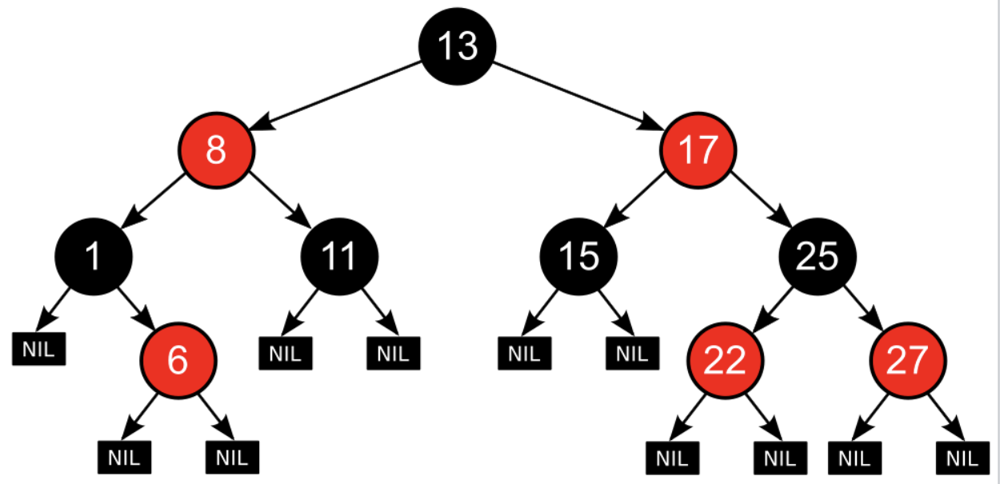

# 06. Red Black Tree

레드 블랙 트리도 이전에 배운 AVL 트리와 마찬가지로 편향 트리가 발생할 경우 생기는 문제점을 해결하기 위해서 나온 트리입니다. 하지만 AVL 트리와 달리 Red black tree는 이진 트리입니다.

레드 블랙 트리는 추가되는 노드에 색(Color: Red, Black)을 추가로 저장하여 색을 기준으로 균형을 맞추게 됩니다.

### 용어 정리

**h(v)** : v의 높이

**bh(v)** : v 에서 leaf nodes 갈 때 v를 제외한 black node의 개수

## 특징

- 모든 노드는 RED이거나 BLACK입니다.
- 루트 노드는 BLACK입니다.
- 모든 리프 노드는 BLACK이면서 nil (Null) 입니다. 
  - **(Leaf 노드는 독립된 노드로 실제로 표현되는 노드입니다)**
  - 나머지 노드는 내부 노드라고 합니다.

- Red Node 는 2개의 자식을 가지며, 모두 BLACK입니다.
  - Black Node의 자식은 red, black 관계 없습니다.

- 2개 이상 RED가 반복되지 않는다.
- 각 노드로부터 Leaf Node로 가는 black 노드의 개수는 항상 같습니다.
- **(v 서브 트리의 내부 노드 개수) >= 2^bh(v) - 1** 
- **높이 h -> O(log2 n)** 
  - h <= 2 log2 (n+1)

레드-블랙 트리는 자료의 삽입과 삭제, 검색에서 최악의 경우에도 일정한 실행 시간을 보장합니다. 

이는 실시간 처리와 같은 실행시간이 중요한 경우에 유용하게 쓰일 뿐만 아니라, 일정한 실행 시간을 보장하는 또 다른 자료구조를 만드는 데에도 쓸모가 있다고 합니다.

### 삽입

BST의 insert와 크게 다르지 않지만 추가적인 연산이 필요합니다.

(자세한 내용은 하단 레퍼런스 내용을 참고)

1. 새로운 노드 x를 삽입합니다.

2. x의 색을 red 로 초기화 합니다.

3. 4가지 경우로 나눠서 조정합니다.

   1. **x == root**
      - x를 black 으로 다시 변경합니다.

   2. **x.parent.color == black**
      - 추가 작업이 필요 없습니다.
   3. **x.parent.color == red**
      - red 는 2개 연속 올 수 없습니다.
        1. x.uncle.color == red
           - parent 와 uncle 모두 black으로,
           - Grand parent 에서 재귀적으로 다시 적용합니다.
        2. x.uncle.color == black
           1. x와 parent 교환을 위해 LR 

## 레퍼런스

- https://ko.wikipedia.org/wiki/%EB%A0%88%EB%93%9C-%EB%B8%94%EB%9E%99_%ED%8A%B8%EB%A6%AC
- https://www.youtube.com/watch?v=eAUbCgJBtcQ

## 추가 공부할 키워드

## 질문할 사항

