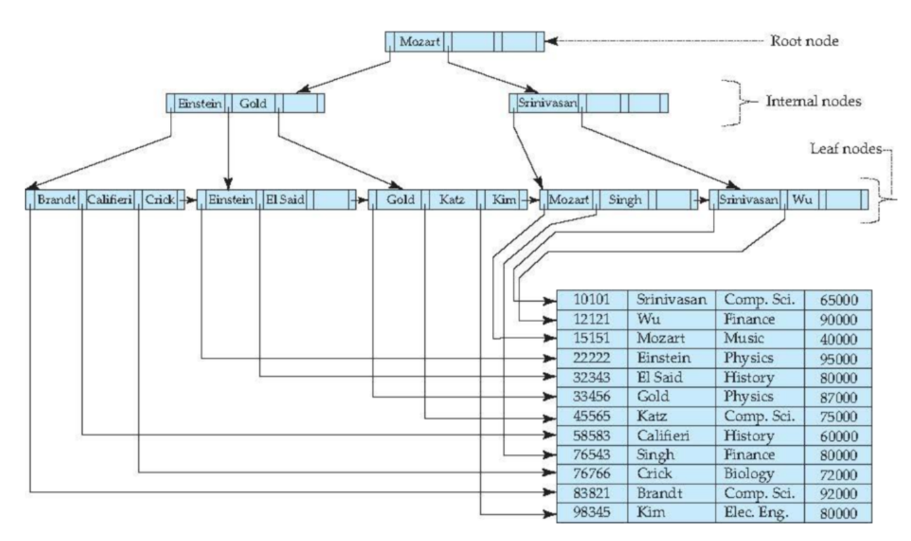

# 07. B-Tree, B+ Tree

B-Tree, Balanced Tree 로 균형을 유지하는 트리를 의미합니다.

일반적으로 데이터베이스, 파일 시스템에서 이 자료구조를 많이 사용합니다.

## 다원 탐색 트리

### 주의!

**Binray Tree 와는 전혀 다른 트리입니다!**

Binray Tree, 이진 트리는 최대 2개의 자식 노드를 가질 수 있지만, 
**B-Tree는 자식 노드의 개수가 2개 이상인 트리입니다.**

## B-Tree

### 특징

노드의 자료를 key, 노드의 자식을 child라고 한다면,

- 자료는 정렬된 상태로 저장됩니다.
- 차수를 t라고 했을 때, **노드의 key의 수는 최소값은 t-1개**이고 **최대값은 2*t-1개**이다.
  - t-1 <= 키의 개수 <= 2t-1
  - 2차 -> key는 반드시 1개 이상, 3개 이하의 키를 가질 수 있습니다.
  - 자식 노드는 4개까지 가질 수 있습니다.
- **차수를 t라고 했을 때, 노드의 child의 수의 최대값은 2*t개이다.**
- 차수는 2이상이어야 합니다.(t>=2)
- 노드의 key의 수가 n개라면 child의 수는 n+1개입니다.
- 밸런스 트리이기 때문에 단말 노드, Leaf 노드까지 가는 경로의 길이는 모두 동일합니다.
- 입력 자료는 중복될 수 없습니다.

### 삽입

데이터 k를 삽입할 때, root 노드에서부터

- 노드가 차있다면
  - 노드의 중앙값을 부모에게 넘겨주고 노드를 쪼개어 키의 개수를 줄입니다.
  - 쪼갠 이후 k를 삽입할 수 있습니다.
- 노드가 가득 차 있지 않다면
  - 다음 노드로 이동하고 재귀적으로 진행하면 됩니다.

### 삭제

t차 트리에서 
루트에서부터 삭제할 노드를 찾아가면서 삭제할 K의 노드의 키 개수가 t-1 개라면,
B-Tree 의 조건을 만족할 수 없습니다.

따라서, 재배치 혹은 병합을 통해 조건을 만족시켜줘야 합니다.

- 왼쪽 형제와 오른쪽 형제 중 한명 이상이 풍족한 경우
  - 풍족한 형제한테 key 하나를 빌려온다.
  - 형제한테 key를 빌려오는 경우에는 반드시 부모를 거쳐서 빌려와야한다.
- 둘 다 빈곤한 경우
  - 부모와 형제 노드와 해당노드를 병합해서 하나의 노드에 합친다.
  - 이것이 가능한 이유는 빈곤하다는 것은 t-1개의 key를 가지고 있다는 것과 같기 때문에 (형제노드의 ket 개수) + (해당 노드의 key 개수) + (부모) = (t-1)+(t-1)+(1)을 하면 2t-1개의 key를 >가진 완전 풍족한 노드로 병합할 수 있다.

### 단점

메모리의 낭비

## B+ Tree

B Tree의 변형 구조로, index 부분과 leaf 노드로 구성된 순차 데이터 부분으로 이뤄집니다.

leaf 노드는 순차 데이터 구조를 연결 리스트로 연결해놓은 형태입니다.

데이터의 빠른 접근을 위해서 내부 노드는 index의 역할만을, 
데이터는 leaf 노드에만 저장되어 있습니다.

따라서 인덱스된 순차 파일을 구성하는데 사용되며, 
연결 리스트로 연결되어 있어 탐색에 매우 유리합니다.

**leaf node**의 pointer들은 다음 칸의 key 값에 해당하는 **데이터의 실제 위치**를 저장하며,
마지막 pointer는 **다음 leaf node의 위치**를 저장합니다.

### 삽입

B-tree와 거의 동일하게 이루어집니다.

- 노드의 분열이 일어나면 중간 key 값이 부모 노드로 올라갈 뿐 아니라 새로 분열된 노드에도 포함되어야 합니다.
- 새 노드는 leaf 노드끼리의 linked list에도 삽입되어야 합니다.

### 삭제

- 재배치와 합병이 필요하지 않을 때는 leaf 노드에서만 삭제하면 됩니다.
- Index 부분은 다른 key 값을 찾는데 사용될 수 있기 때문에,
  leaf node의 값이 삭제되어도 삭제하지 않습니다.
- 재배치할 경우 index 부분의 node의 key 값은 변하지만, tree 구조는 변하지 않습니다.
- 합병을 할 경우 index 부분에서도 key 값을 삭제합니다.

## 레퍼런스

- https://velog.io/@mongle/Data-structure-B-tree-B-tree

- https://wangin9.tistory.com/entry/B-tree-B-tree

## 질문할 사항

- 

## 추가 공부 키워드

