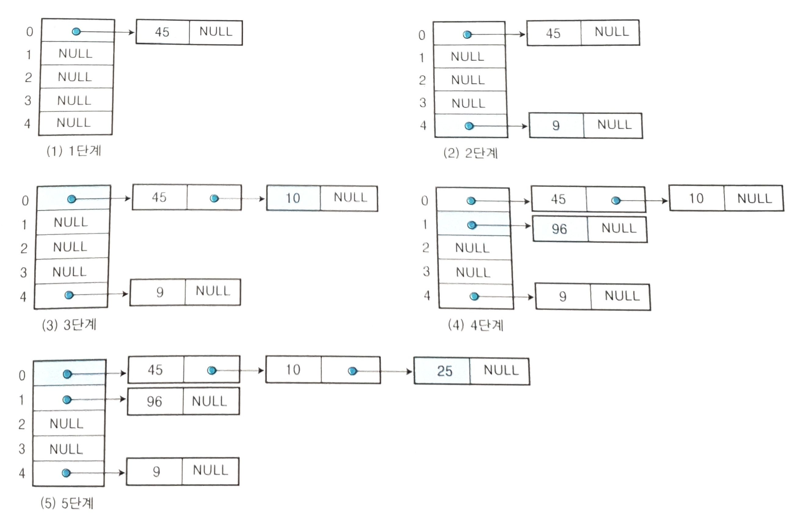

# 08. Hashing

해싱이란, 
키 값을 비교하여 찾는 검색 방법이 아닌,
**산술적인 연산을 이용하여 키가 있는 위치를 계산하여 바로 찾아가는 계산 검색 방식입니다.**

다른 검색 방법에 비해서 속도가 빠른 대신, 기억 공간을 많이 차지하게 됩니다.

또한 삽입 및 삭제가 많이 일어날 경우 유리한 방법입니다.

**해싱 함수**

- 키 값을 원소의 위치로 변환하는 함수

**해시 테이블**

- 해싱 함수에 의해 계산된 주소의 위치에 항목을 저장한 표

## 검색 방법의 분류

| 비교 검색 방식                          | 계산 검색 방식                                            |
| --------------------------------------- | --------------------------------------------------------- |
| 검색 대상의 키를 비교하여 검색하는 방법 | 키를 비교하지 않고 계수적인 성질을 이용하는 계산으로 검색 |
| 순차 검색, 이진 검색, 트리 검색         | 해싱 검색                                                 |

## 해싱 검색 방법

해싱 검색은 

키 값에 대해 해싱 함수를 계산하여 주소를 구하고,
구한 주소에 해당하는 해시 테이블에 찾는 항목이 있으면 검색에 성공합니다.

### 동거자

모든 키 값이 고르게 사용되기 보다, 많이 사용하는 비슷한 키가 존재하고, 사용빈도가 낮은 키도 존재합니다.
따라서, 키 만큼 버킷을 만드는 것은 메모리 공간을 낭비합니다.

해시 테이블에선 버킷의 수를 줄이고 같은 버킷 안에 여러 개의 슬롯을 두는 구조를 사용합니다.

이 때, 서로 다른 키 값을 가지지만 해싱 함수에 의해 같은 버킷에 저장된 키 값들을 동거자라고 합니다.

### 충돌

서로 다른 키 값에 의해서 해싱함수에 의해 주어진 버킷 주소가 같은 경우에 **충돌**이 발생합니다.

빈 슬롯에 동거자 관계로 저장하면 되지만,
빈 슬롯이 없는 경우 오버플로우 문제가 발생합니다.

## 해싱 함수

해싱 함수는 어떤 해싱 함수를 사용하느냐에 따라 검색 효율이 달라집니다.

- 계산이 쉬워야 합니다.
- 비교 검색 방법을 사용하는 것보다 계산이 빨라야 유의미합니다.
- 충돌이 적어야 합니다.
  - 충돌이 많다는 것은, 같은 버킷을 할당받는 키가 많다는 뜻!
  - 오버 플로우가 많이 발생할 수 있습니다.
- 해시테이블에 고르게 분포할 수 있게 주소를 만들어야 합니다.

해싱 함수의 종류는 여러가지가 있습니다.

- 중간 제곱 함수
- 제산 함수
- 승산 함수
- 접지 함수
- ...

## 오버플로우 처리 방법

우선 해시 테이블과 해싱 함수를 적절히 선택하여 오버플로우가 발생하지 않도록 하는 것이 제일 좋습니다.

그럼에도 발생한 경우 효율적으로 처리할 수 있어야 합니다.

- 선형 개방 주소법
  - 충돌이 일어난 키 값을 다른 비어있는 버킷을 찾아 저장하는 방법
- 체이닝
  - 여러 개의 항목을 저장할 수 있도록 해시 테이블의 구조를 변경

### 선형 개방 주소법 (Linear Probing)

> 충돌이 일어난 키 값을 다른 비어있는 버킷을 찾아 저장하는 방법

**예시**

해시 함수 h(k) = k mod 5

key = {45, 9, 10, 96, 25}

해시 함수에 의해 순차적으로 저장할 때, 

45, 9, 그리고 10을 저장할 때 충돌이 발생합니다. 

이 때 10을 버킷 1이 비어있으므로 1번 버킷에 넣어주게 됩니다.

따라서, **0 - 45, 1- 10, 4 - 9** 가 저장된 형태입니다.

### 체이닝

> 해시 테이블의 구조를 변경하여 각 버킷에 하나 이상의 키 값을 저장할 수 있도록 만드는 방법입니다.

버킷에 슬롯을 동적으로 삽입, 삭제하기 위해서 연결리스트를 사용합니다.

## 레퍼런스

- 자바로 배우는 쉬운 자료구조, 한빛 아카데미