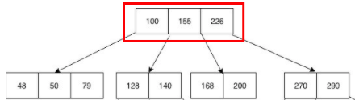

# 01. 데이터베이스의 인덱스

## 1. index란?

인덱스란 책의 목차, 색인이라는 뜻을 가지고 있습니다.
책의 목차를 활용하면 원하는 내용을 찾기 쉽다는 장점을 가질 수 있습니다. 

데이터베이스에서도 마찬가지입니다. 데이터베이스 테이블의 검색 속도를 향상 시키기위한 자료구조입니다.
데이터베이스에서도 테이블의 모든 데이터를 검색하면 시간이 오래 걸리기에, 자료구조를 활용하여 빠르게 조회할 수 있도록 도와줍니다.

### 왜 써?

`select`문을 사용해 원하는 조건의 데이터를 검색할 때, 
저장된 데이터의 양이 많다면 해당 테이블을 전체 스캔하게 되고, 많은 자원과 시간이 소모됩니다.

그렇기에 자주 조회되는 column에 대해 index table 을 따로 만들어 select 문에 대해서 index 테이블에 있는 값들로 결과 값을 조회할 수 있습니다. 

> 검색 연산의 성능 향상!

### 장단점

**장점**

- 테이블 조회 속도를 향상시킬 수 있다

**단점**

- 인덱스를 관리하기 위해 별도의 저장공간이 필요하다
- 잘못 사용하는 경우 성능의 저하 발생

#### 주의

위의 단점에서 언급한 '성능의 저하 발생'은 

- CREATE, DELETE, UPDATE 와 같은 DML 질의가 빈번한 속성에 인덱스를 걸게 되면 
  **인덱스 테이블의 변경과 정렬** 에 드는 오버헤드로 인해 성능저하가 발생할 수 있습니다.
- 어떤 컬럼이든 무분별하게 인덱스를 사용하는 것 또한 지양해야합니다.
  - 데이터의 중복도가 높은 컬럼은 지양

**왜 성능의 저하가 발생할까??**

인덱스는 B-Tree라는 자료구조를 주로 사용합니다.
트리구조에서 노드의 삽입 및 삭제가 일어날 경우 
항상 양쪽 자식의 밸런스를 유지하는 재정렬되는 과정이 일어납니다.

즉, 탐색 시간을 O(log N) 의 시간 복잡도를 항상 가질 수 있게 됩니다.

즉, 빈번히 삽입과 삭제, 수정(트리 구조에선 삭제 이후 새로운 삽입의 개념)이 발생하면
그만큼 재정렬하는 작업이 발생합니다. 그렇기에 성능의 저하가 발생할 수 있습니다.

## 3. B-Tree 자료구조를 선택한 이유

### B-Tree

이진 트리는 자식 노드가 최대 2개인 트리라면
B-Tree 자료구조는 자식 노드의 개수가 2개 이상인 트리를 말합니다. 

- 성립조건
  - 노드의 데이터가 n개라면 자식 노드의 개수는 n+1개
  - 노드 내의 데이터는 반드시 정렬된 상태

동작원리에 대해선 자료구조 챕터에서 다루겠습니다.

B-Tree 는 물론 탐색시간에 있어 매우 효율적인 자료구조입니다.

그렇다면 왜 같은 시간복잡도를 가진, 혹은 더 빠른 자료구조를 사용하지 않을까요?
안되는 이유는 무엇일까요?

#### B-Tree보다 빠른 해시테이블은?

해시 테이블은 해시 값을 이용하여 저장된 메모리 공간에 접근하기에 평균적으로 O(1)의 시간 복잡도를 갖습니다. 
탐색시간이 가장 빠른 자료구조라고 할 수 있는데, 
이는 비교하는 값에 대해서 찾을 수 없습니다.

**정렬이 되어있지 않기 때문에 <, > 에는 해시 값을 사용할 수 없습니다.**

그렇기에, 인덱스에 사용하기에 부적합합니다.

#### 그래서, B-Tree가 적합한 이유!

1. **항상 정렬된 상태로 특정 값보다 크고 작은 부등호 연산에 문제가 없다.**
2. **데이터 탐색뿐 아니라, 저장, 수정, 삭제에도 항상 O(logN)의 시간 복잡도를 가진다.**

## 레퍼런스

- https://mangkyu.tistory.com/96
- https://helloinyong.tistory.com/296

## 추가 공부 키워드

- 트리 자료구조