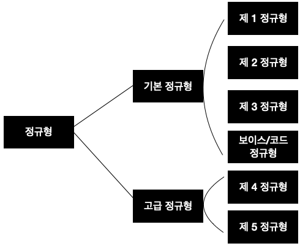

# 02. 정규화(Normalization)

## 들어가기전.

- 결정자 : 속성 간의 종속성을 규명할 때 기준이 되는 값
- 종속자 : 결정자의 값에 의해 정해지는 값
  - 속성 Y가 속성X에 의해 함수적으로 종속된다는 말은 
    속성 X의 값을 이용해 속성 Y의 값을 유일하게 식별할 수 있다는 의미

- 슈퍼키 : 테이블에서 **각 행을 유일하게 식별할 수 있는 하나 또는 그 이상의 속성들의 집합**
  - 유일성만 만족하면 슈퍼키가 될 수 있다.
- 후보키 : 각 행을 유일하게 식별할 수 있는 최소한의 속성들의 집합
  - 유일성과 최소성을 만족
- 기본키(PK): 후보키 들 중 하나를 선택. 
  - 최소성과 유일성을 만족
  - 테이블의 오직 1개.
  - 기본키를 제외한 후보키는 대체키라 한다.

## 정규화란?

> 함수적 종속성을 이용하여 릴레이션을 연관성이 있는 속성들로만 구성되도록 분해하여, 이상현상이 발생하지 않는 올바른 릴레이션으로 만들어나가는 과정을 정규화라고 한다.

데이터베이스를 잘못 설계했을 때, 불필요한 데이터 중복이 발생해 
릴레이션에 대한 데이터의 삽입, 수정, 삭제 연산을 수행할 때 **이상현상**(anomaly)이 발생할 수 있습니다.

그렇기에, 관계형 데이터베이스 설계에서 중복을 최소화하게 데이터를 구조화하는 프로세스를 **정규화**라고 할 수 있습니다.

함수적 종속성?
: 속성들 간의 관련성 

## 이상현상 ?

**이상현상 종류**

- 삽입 이상
  - 새 데이터 삽입하기 위해 불필요한 데이터도 함께 삽입해야하는 문제
- 갱신 이상
  - 중복 튜플 중 일부만 변경해 데이터가 불일치하게 되어 모순이 발생하는 문제
- 삭제 이상
  - 튜플을 삭제하면 꼭 필요한 데이터까지 함께 삭제되는 데이터 손실 문제

## 정규화의 종류

릴레이션이 정규화된 정도를 정규형으로 표현합니다.

각 정규형마다 제약조건이 존재하고, 특정 정규형의 제약조건을 만족하면 해당 정규형에 속합니다.
차수가 높아질수록 요구되는 제약조건이 많아집니다.

**차수가 높은 정규형에 속하는 릴레이션일수록 데이터 중복이 줄어 이상 현상이 발생하지 않습니다.**

### 제 1 정규형

> 릴레이션에 속한 모든 속성의 도메인이 원자값으로만 구성되어 있으면 제 1 정규형에 속한다.

릴레이션에 속한 모든 속성이 더는 분해되지 않는 원자 값만 가져야합니다. 

**예시**

| 고객 ID | 이벤트 번호 | 당첨여부 | 등급 | 할인율 |
| ------- | ----------- | -------- | ---- | ------ |
| 1       | 1, 2, 3     | y, n, y  | ...  | ...    |

위의 이벤트 번호나 당첨여부는 더 분해될 수 있습니다.

따라서 더이상 분해되지 않는 원자값을 갖도록 분해하면

**예시**

| 고객 ID | 이벤트 번호 | 당첨여부 | 등급 | 할인율 |
| ------- | ----------- | -------- | ---- | ------ |
| 1       | 1           | y        | gold | 10%    |
| 1       | 2           | n        | gold | 10%    |
| 1       | 3           | y        | gold | 10%    |

와 같은 형태로 분해하면 제 1 정규형에 속하게 됩니다.

하지만 불필요한 데이터 중복으로 인해 이상 현상이 발생할 수 있습니다.

### 제 2 정규형

>제1 정규형에 속하고,
>기본키가 아닌 모든 속성이 기본키에 완전 함수 종속되면 제2 정규형에 속한다

부분 함수 종속을 제거하고,
모든 속성이 기본키에 완전 함수 종속되도록 릴레이션을 분해하는 정규화 과정을 거쳐야 합니다.

**예시**

| 고객 ID | 등급 | 할인율 |
| ------- | ---- | ------ |
| 1       | gold | 10%    |

| 고객 ID | 이벤트 번호 | 당첨여부 |
| ------- | ----------- | -------- |
| 1       | 1           | y        |

기본키인 고객 아이디, 이벤트 번호에 완전 함수 종속되지 않는 등급, 할인율 속성이 있기에, 
두 개의 릴레이션으로 분해합니다. 
따라서 등급과 할인율에 대한 데이터 중복이 줄어들게 됩니다.

### 제 3 정규형

> 릴레이션 제2 정규형에 속하고, 
> 기본키가 아닌 모든 속성이 기본키에 이행적 함수 종속이 되지 않으면 제3 정규형에 속한다.

이행적 함수 종속은?

X -> Y, Y -> Z 일 때
X -> Z

하나의 릴레이션에 함수 종속 관계가 여러 개 존재하고, 논리적으로 이행적 함수 종속 관계가 유도되면 이상 현상이 발생할 수 있습니다. 

**예시**

| 고객 ID | 등급 | 할인율 |
| ------- | ---- | ------ |
| 1       | gold | 10%    |

릴레이션 내 속성 집합이 이행적 함수 종속 관계가 생겼으므로 2개의 릴레이션으로 분해를 합니다.

| 고객ID | 등급 |
| ------ | ---- |
| 1      | gold |
| 2      | vip  |

| 등급 | 할인율 |
| ---- | ------ |
| gold | 10%    |
| vip  | 20%    |

### 보이스/코드 정규형

> 릴레이션의 함수 종속 관계에서 모든 결정자가 후보키이면 보이스/코드 정규형에 속한다.

지금까지 예시로 들은 릴레이션 모두 하나의 기본키, 그리고 하나의 후보키를 가지고 있었습니다.
즉, 후보키 속성이 하나밖에 없어 이를 기본키로 선정한 경우입니다.
그러나 릴레이션에 여러 개의 후보키가 존재할 수도 있는데, 이 경우 제3 정규형까지 만족했더라도 이상현상일 발생할 수 있습니다.

하나의 강사는 하나의 강의를 가르치며, 모든 강의는 수강생이 존재하는
위와 같은 형태라고 했을 때,
기본키로 가질 수 있는 속성은

- {고객 아이디, 인터넷 강의}
- {고객 아이디, 담당 강사 번호}

2가지가 있을 수 있습니다. 이 중 {고객 아이디, 인터넷 강의}를 기본키로 선택해봅시다.

#### 이상 발생

강사 '홍길동01'에 의해 강의 '축지법'이 열렸는데 아무도 수강하지 않았을 때,
{고객 아이디, 인터넷 강의} 기본키에 해당하는 고객 아이디가 null 이 되는 이상이 발생하기에 삽입할 수 없습니다.

#### 해결 과정

이상현상의 원인은 후보키가 아니면서, 
함수 종속 관계에서 다른 속성을 결정하는 담당 강사 번호 속성이 존재하기 때문입니다. 
따라서 이상현상이 발생하지 않도록 하려면 
모든 결정자가 후보키가 되도록 릴레이션을 분해하면 됩니다.

- 기존
  강좌 신청 릴레이션
  [고객 아이디, 인터넷강좌, 담당 강사 번호]

- 고객 담당 강사 릴레이션 
  [고객 아이디, 담당 강사 번호]
- 강좌 담당 릴레이션
  [담당 강사 번호, 인터넷 강좌]

**개인적인 생각 **

> BCNF 의 경우 처음부터 이렇게 설계했을 거라고 생각하지 않는다. 다만 BCNF 에 해당하는 예를 찾다보니 위와 같은 예시가 나온 것 같다... 오히려 예시에서 왜 이렇게 설계 해야하나? 라는 의문을 가지게 된 케이스...
> 테이블을 설계하다 중간에 바꿔서 저런식으로 꼬인 경우가 있을 수도 있겠다라고 생각!

### 제 4 정규형

> 보이스/코드 정규형을 만족하면서 함수 종속이 아닌 다치 종속을 제거해야 만족할 수 있다.

### 제 5 정규형

> 제4 정규형을 만족하면서 후보키를 통하지 않는 조인 종속을 제거해야 만족할 수 있다.

실제로 데이터베이스를 설계할 때 모든 릴레이션이 무조건 제5 정규형에 속하도록 분해해야하는 것이 아닙니다. 

제3 정규형이나 BCNF를 만족하면 데이터 중복을 줄이고 이상현상 문제를 해결하기 때문에 4, 5 정규형에 대한 자세한 설명은 생략하겠습니다.

## 정규화 과정 정리

1. 비정규형 릴레이션
   - **속성의 도메인이 원자값으로 구성되도록 분해**
2. 제 1정규형 릴레이션
   - 부분 함수 종속 제거
3. 제2 정규형 릴레이션 (모든 속성이 기본키에 완전 함수 종속)
   - 이행적 함수 종속 제거
4. 제3 정규형 릴레이션
   - 후보키가 아닌 결정자 제거
5. 보이스코드 정규형 릴레이션 (모든 결정자가 후보키)

## 레퍼런스

- https://yaboong.github.io/database/2018/03/09/database-normalization-1/
- '데이터베이스 개론', 김연희, 한빛아카데미, 2018
- https://yaboong.github.io/database/2018/03/10/database-normalization-2/

## 추가로 공부할 키워드

- 