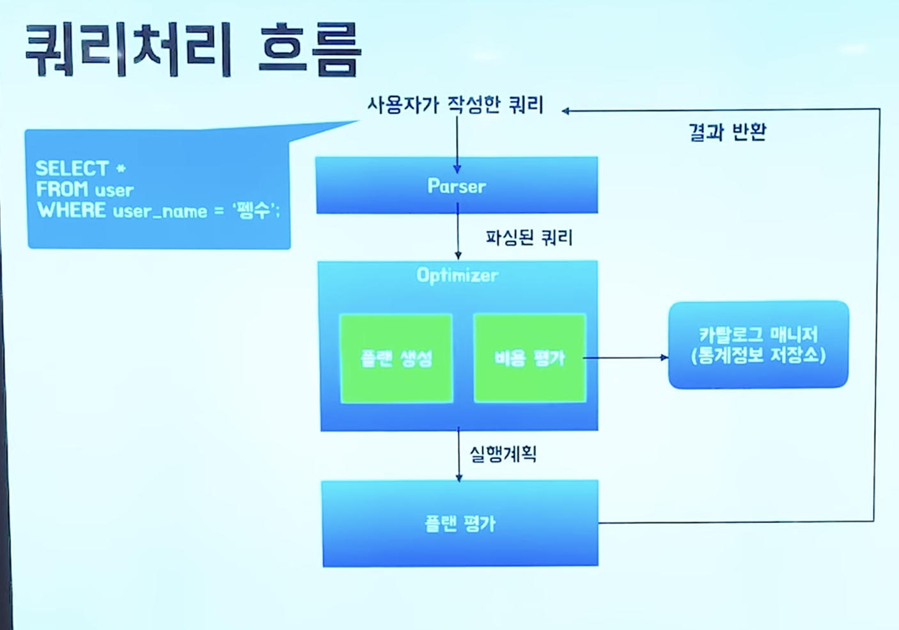

# 옵티마이저(임시)

DB에서 데이터 조회 및 저장하는 작업이 다대수

서버의 70% 이상이 SQL 처리 시간

쿼리 처리 흐름

## 옵티마이저란?

옵티마이저는 인덱스 유무, 데이터 분산 또는 편향 정도 등 통계 정보를 참고하여

여러 실행 계획을 작성,

비용을 연산,

가장 낮은 비용을 가진 실행계획을 선택하는 DBMS 핵심엔진!

옵티마이저는 한정된 통계로 인해 최적화를 못할 수 있습니다.
이 때 우리가 실행계획을 최적화하여 바꿔주어야 합니다.

## 실행계획

**sql 에서 요구한 사항을 처리하기 위한 절차와 방법**

동일한 SQL 에 대해서 결과를 내는 방법은 여러가지, 각 비용은 모두 다릅니다.

실행계획을 보기 위해서
mySQL `에선 explain + SQL` 문을 사용합니다.

(스캔 방식, 인덱스 , ....)

Full table scan 이 유리한 경우는

- 테이블 크기가 작거나
- 조건절이 없을 때
- 조건에 일치하는 레코드 수가 굉장히 많을 때

full table scan 이 유리합니다.

따라서  일반적으로는 Index scan 이 매우 유리합니다.

