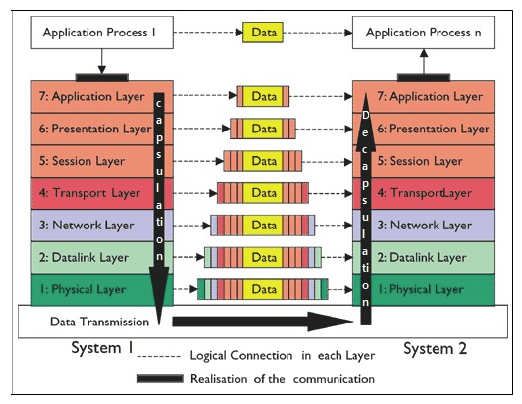

# 02 OSI 7 계층

들어가기 전에...

### 0.1 프로토콜?

: 송신자, 수신자 등 효과적인 통신을 위해 지켜야하는 규칙

- 기본구성 요소
  - 형식
  - 의미
  - 시간

이러한 프로토콜은 주요 기능은 오류 제어, 캡슐화, 흐름제어 등 다양한 기능을 하게 되는데 

이를 계층별로 구분하여 서로 다른 계층간에 임무를 나눌 수 있다.

### 0.2 프로토콜의 계층화

#### 원칙

1. 양방향 통신을 원하면 각 계층은 상반되는 2가지 작업의 수행이 가능
2. 각 계층의 객체는 동일해야한다.

이러한 계층 끼리 논리적으로 연결된다.( == 계층 대 계층 통신을 갖는다)

## 1. OSI 7 계층이란?

: 네트워크 통신이 일어나는 과정을 7단계로 나눈 것을 말한다.

각 계층은 독립되어 있으며 특정 계층의 문제가 생긴 경우 해당 단계의 문제로 국한지어 해결할 수 있다.

​	

## 1.1 계층의 종류

위에부터 아래 계층으로 소개

7 : application (응용)

6 : presentation(표현)

5 : session (세션)

4 : transport (전송)

3 : network (네트워크)

2 : data link (데이터링크)

1 : physical (물리)

#### 응용 계층(Application Layer )

: 사용자 또는 어플리케이션이 네트워크에 접근

- 사용자에게 보이는 유일한 계층

#### 표현 계층(Presentation)

: 응용계층으로부터 데이터를 전달 받거나, 전송하는 데이터의 인코딩 및 디코딩이 이루어짐

-> jpg, mpeg 등의 다양한 포맷을 구분하게 된다.

#### 세션 계층 (Session)

: 양단의 네트워크를 관리, 연결의 지속 및 세션을 만들고 유지

- 운영체제는 세션 계층에 속한다. <- 이게 뭔소리지?

#### 전송 계층 (Transport)

: 데이터를 전송하고 전송속도를 조절하며 오류가 발생한 부분은 다시 맞춰주는 계층

- 데이터를 수신한 경우
  - 전송 계층에서 데이터를 합하여 세션계층으로 보내준다.
- 데이터를 송신한 경우
  - 데이터 전송하는 속도를 조절해준다

#### 네트워크 계층 (Network)

: 전송 데이터를 목적지까지 경로를 찾아 전송하는 계층

- IP 주소의 지정
- 경로 라우트 선택
- 패킷의 전달

-> 네트워크 라우팅이 해당 계층에서 이뤄지게 된다.

#### 데이터 링크 계층

: 물리적인 네트워크 사이 데이터의 전송을 담당하는 계층

- 전송 시
  - 오류의 감지 및 재전송

MAC 주소를 가지고 통신하게 된다.

** MAC 이란?

#### 물리 계층

: 물리적인 통신 케이블을 통해 전기 신호 사용하여 비트 스트림 전송하는 계층

- 데이터의 종류나 에러는 확인하지 않는다

## 1.2 송수신 과정

전송 -> 캡슐화 

수신 -> 디캡슐레이션 진행

## 레퍼런스

- https://blog.naver.com/PostView.nhn?blogId=pst8627&logNo=221670903384

- https://jw3461.tistory.com/4
- 전공 자료

## 추가 공부 키워드

- 세션 계층에 운영체제가 속한다는 의미가 무엇인지?

## 상대방 질문 

