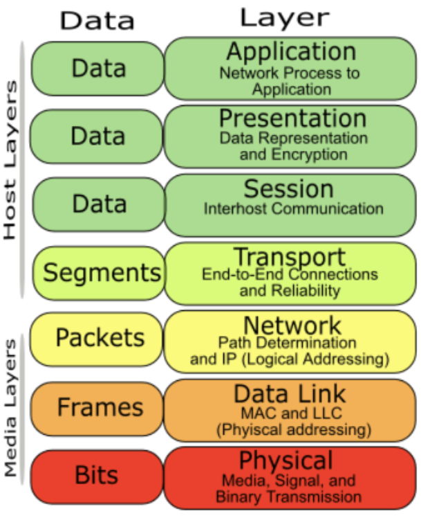
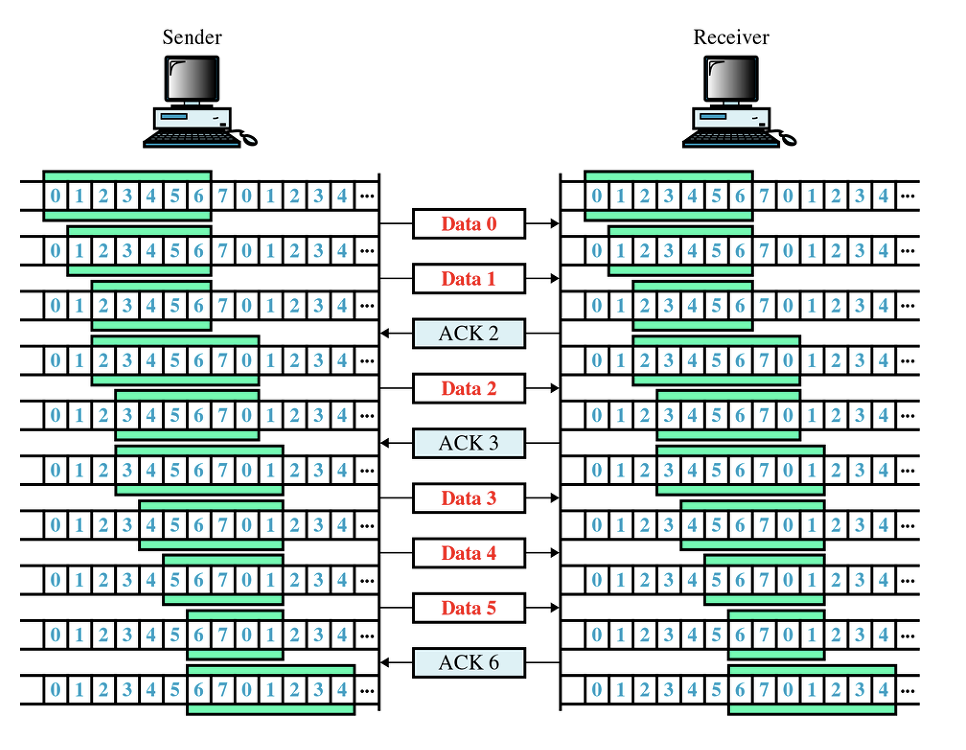
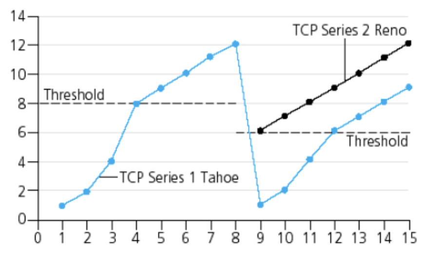

# 03. 흐름 제어와 혼잡 제어 - Flow Control, Congestion Control

## 0. 들어가기 전

세그먼트와 패킷, 그리고 프레임이라는 용어가 등장합니다. 이 용어들은 비슷하지만 분명히 구조가 다르기에 명시하고 넘어가겠습니다.

각 계층별로 데이터에는 헤더 정보가 추가되기 때문에 각각 다르다고 할 수 있습니다.

- 세그먼트 : 전송계층에 해당
- 패킷 : 네트워크 계층에 해당
- 프레임 : 데이터링크 계층에 해당

이미지 출처 : https://krylon.tistory.com/114

위의 이미지에 보이는 것처럼 추가적인 헤더 정보가 붙으며 캡슐에 쌓인다고 생각할 수 있습니다. 또한 흐름제어나 혼잡제어가 여러 계층에서 쓰이기 때문에 세그먼트와 프레임이라는 용어가 혼재되어 사용되고 있다고 이해하시면 될 것 같습니다.

## 1. 흐름제어( Flow Control)

흐름 제어는 **<u>송신측과 수신측의 데이터 처리 속도 차이를 해결하기 위한 기법</u>**입니다.

둘 사이의 속도 차이가 발생한다면(수신측보다 송신측이 더 빠를 경우) 문제가 발생합니다. 

- 수신측이 처리할 수 있는 데이터량(버퍼의 크기)보다 많이 수신하게 될 경우 손실되는 데이터가 발생

여기서 흐름제어는 더 빠른 송신자가 수신자를 이기지 못하도록 두 노드 간 데이터의 전송 속도를 관리하는 과정을 의미합니다.
이는 수신 노드가 전송 속도를 제어할 수 있도록 도와줍니다.

### 1.1 흐름제어의 방법

#### 1. 정지 대기 (Stop and Wait)

- 전송한 세그먼트에 대해 응답을 받으면 다음 세그먼트 전송이 가능
- 하나의 세그먼트 전송 이후 대기하기 때문에 비효율적

#### 2. 슬라이딩 윈도우 기법

*이 기법은 오류 제어와 동시에 흐름제어를 지원합니다.*

위에서 언급한 정지 대기 방법의 비효율적인 부분이 보완된 방법이 슬라이딩 윈도우 기법입니다.
전송측이 전송한 프레임에 대한 ACK 프레임을 수신하지 않더라도, 여러 프레임의 연속적인 전송을 허용합니다.

이미지 출처 : https://copycode.tistory.com/74

윈도우 크기 : ACK 를 받지 않고도 연속으로 전송할 수 있는 프레임의 갯수입니다. 위의 이미지에선 7개라고 할 수 있습니다.

- 0번 프레임을 전송
- 1번 프레임 전송
- 수신측 ACK2 전송 (-> 1번 프레임까지 수신 완료. 다음 프레임인 2를 보내달라는 의미)
- 송신측, 윈도우 2칸 우측으로 이동

와 같이 진행됩니다.

 

## 2. 혼잡 제어

혼잡 제어 (Congestion Control) 은 네트워크가 혼잡해지지 않도록 조절하는 것을 말합니다. 

#### 혼잡의 원인?

위의 흐름제어나 오류 발생을 막기 위한 오류 제어 등의 기법을 사용할 경우 재전송이 빈번히 일어나게 되는데,
이러한 경우가 많이 발생할 경우 네트워크가 혼잡해지게 됩니다.

### 2.1 혼잡제어 방법

혼잡 제어 알고리즘은 어떤 시점을 혼잡한 상태라고 파악할 것인지, 어떻게 회피할 것인지 선택해야 합니다.

#### 1. 슬로우 스타트 (Slow Start)

- TCP 연결 시작 시 , 혼잡 윈도우의 값을 1MSS로 초기화
- 세그먼트를 보낸 이후 응답을 받을 때마다 1MSS 씩 증가
  - 확인 응답을 받을 때마다 2^n 형태의 크기로 세그먼트를 전송

이 때, 끝도 없이 증가시킬 수 없습니다.

1. 타임아웃에 의한 손실이 발생할 경우 혼잡 윈도우를 1로 설정. 다시 슬로우 스타트 진행
   - Slow start threshold 임계점의 혼잡이 검출된 시점의 절반으로 임계점을 다시 정합니다.
     (아래 이미지에서 12 -> 6 으로 임계점 업데이트)
2. sst threshhold 값과 동일해지는 경우 slow start는 종료하고 **혼잡 회피** 모드로 전환합니다.
   - 혼잡 윈도우의 크기 증가율에 대해 주의합니다. 지수함수 꼴이 아닌 1MSS씩 증가합니다.
3. 3개의 중복 ACK가 검출될 경우 **빠른 회복** 상태로 전환합니다.

> MSS : Maximum Segment Size. TCP 에서 전송할 수 있는 데이터의 최대 크기.
>
> MSS = MTU - (IP Header의 크기) - (TCP Header의 크기)
>
> MTU: Maximum Transmission Unit. 패킷 혹은 프레임 기반 네트워크에서 전송될 수 있는 최대 크기의 패킷 또는 프레임.

#### 2. 혼잡 회피

설정해둔 slow start threshold 값에 도달할 경우,
**혼잡이 발생할 가능성이 높다**라고 판단, 
지수 형태가 아닌 1MSS 씩 선형으로 증가하게 합니다.

#### 3. 빠른 회복(Fast Recovery)

2가지 방법으로 구분할 수 있습니다.

- TCP Tahoe: 타임아웃, 혹은 3개의 중복 ACK 의한 손실이 발생할 경우 혼잡 윈도우를 1MSS 로 줄이고 슬로우 스타트 진행.
- TCP Reno: 3개의 중복 ACK 의한 손실이 발생하면 **혼잡 윈도우의 크기를 현재의 절반으로 줄이고 1MSS** 씩 증가하게 된다. 위의 그래프의 검정선에 해당한다.

1~4 : 슬로우 스타트

4~8 : 혼잡 회피

8~9 : 손실 발생. 다시 슬로우 스타트 진행. slow start threshold는 12의 절반인 6으로 설정.

Tahoe 는 혼잡윈도우의 크기를 1로, Reno는 12의 절반인 6으로 지정하게 되고 혼잡 회피 상태로 증가한다.

## 3. 계층별 흐름제어 혼잡제어 차이

*Flow control in transport layer ensures the delivery of the message globally, as the two points of connection over this protocol are logically connected.*

*Whereas in data-link layer, the concern is to deliver message locally, as the two points of connection over this protocol are physically connected

기본적으로 각 계층의 차이에 주목하여 흐름제어 및 혼잡 제어가 이뤄진다고 볼 수 있습니다.

## 레퍼런스

- http://wildpup.cafe24.com/archives/469
- https://copycode.tistory.com/74
- https://evan-moon.github.io/2019/11/26/tcp-congestion-control/
- https://stackoverflow.com/questions/45301576/flow-control-in-data-link-layer-vs-flow-control-in-transport-layer

## 질문할 사항

## 추가 공부 키워드

