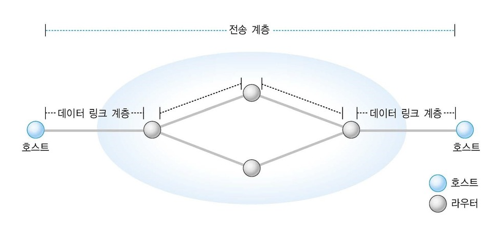
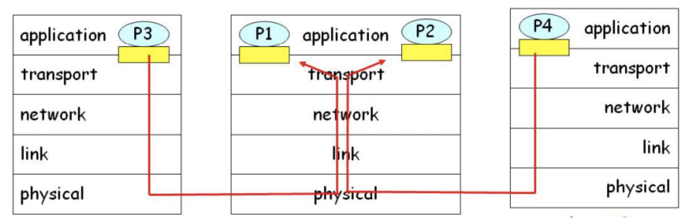

# 04. Transport 계층의 다중화와 역다중화

## 0. 들어가기 전

### 전송계층

OSI 7 계층 중, 전송  계층은 서로 다른 호스트에서 동작하는 어플리케이션 프로세스간의 논리적인 통신을 제공합니다.

-> 라우터가 아닌, 종단 간 연결

이러한 전송 계층은 여러 개의 소켓과 네트워크 계층 간의 다중화와 역다중화 동작을 지원하는데
이에 대해 자세히 알아봅시다.

### 포트

인터넷 프로토콜에서 포트는 운영체제 통신의 종단점입니다. 주로 네트워크 서비스나 특정 프로세스를 식별하는 논리 단위입니다. 이는 IP 주소와 함께 쓰여 해당하는 프로토콜에 의해 사용됩니다.

잘 알려진 포트 번호는 다음과 같습니다.

- 20 : FTP (data)
- 22 : SSH
- 80 : WWW HTTP
- 443 : TLS/SSL 방식의 HTTP 

등이 있습니다.

## 1. 다중화와 역다중화

소켓 : 네트워크에서 **프로세스**로 데이터를 전달하고 프로세스로부터 네트워크로 데이터를 전달하는 **출입구**

- 수신 호스트 **역다중화**
  - 수신된 세그먼트들을 올바른 소켓에 전달
    - 소켓은 자신만의 포트 번호를 할당 받음
- 송신호스트 **다중화**
  - 소켓들로부터 데이터를 모으고, 데이터의 헤더 정보를 캡슐화한 세그먼트들을 네트워크 계층에 전달

호스트는 IP 주소와 포트 번호를 사용하여 세그먼트를 해당하는 소켓에 전달하게 됩니다.

그러면 비연결형, 연결형으로 구분하여 다중화, 역다중화에 대해 구분해보겠습니다.

## 2. 비연결형 다중화와 역다중화

### 포트 할당

트랜스포트 계층은 포트번호를 소켓에게 자동으로 할당합니다.

### 다중화

호스트의 트랜스포트 계층은 어플리케이션 데이터, 출발지 포트 번호, 도착지 포트 번호, 그리고 기타 정보를 포함하여 세그먼트를 생성한 뒤 이를 네트워크 계층으로 전달하는 과정입니다.

### 역다중화

수신 호스트에 도착하면, 수신 호스트는 

- 출발지 포트번호는 확인하지 않음
- 목적지 포트 번호만 검사

목적지 포트 번호만 확인한뒤 이에 해당하는 소켓에 전달합니다.

따라서 동일한 목적지 IP 주소와 포트번호를 가지면 여러 개의 세그먼트라 하더라도 같은 목적지 소켓을 통해 동일한 프로세스에 접근할 것입니다.

*그러면 출발지 포트 번호는 전혀 쓰이지 않나요?*

아닙니다. 출발지 포트 번호는 수신 호스트가 응답을 해야 하기 때문에 이 때 사용이 됩니다.

### 정리

- 포트 번호를 갖는 소켓을 생성
- UDP 소켓을 두 요소로 구분(목적지 IP 주소, 목적지 포트번호)
- 호스트가 UDP 세그먼트 수신 시:
  - 세그먼트 내의 목적지 포트번호를 조사
  - 해당 포트번호를 갖는 소켓에 UDP 세그먼트를 전달
- IP 데이터그램은 출발지 IP 주소 혹은 출발지 포트번호가 다르더라도 
  모두 동일한 목적지 IP 주소와 목적지 포트 번호를 가지면 동일한 소켓에 전달.

## 3. 연결형 다중화와 역다중화

### TCP 소켓과 UDP 소켓의 차이

TCP 소켓은 4개 요소의 집합입니다. TCP 세그먼트는 역다중화를 위하여 4개의 값 모두를 사용하게 됩니다.

### 다중화

TCP 소켓에서 생성되는 세그먼트는 4가지 요소를 포함하게 됩니다. 

- 출발지 IP 주소, 출발지 포트번호
- 목적지 IP 주소, 목적지 포트번호

### 역다중화

수신호스트에 도착했을 때, 같은 사이트에 접속하려는 사람들의 경우
목적지 IP 주소와 포트 번호는 모두 동일합니다.

하지만 출발지의 IP주소와 포트 번호가 다르기에 접속하는 소켓이 달라집니다.
4가지 정보가 모두 같아야 같은 소켓으로 접속이 가능합니다.

### 정리

- TCP 는 4개 요소로 구분
  - 출발지 IP 주소, 출발지 포트번호
  - 목적지 IP 주소, 목적지 포트번호
- 수신측 호스트는 4개의 값을 사용하여 해당 소켓으로 세그먼트를 전달
- 서버 호스트는 동시에 많은 TCP 소켓을 지원
  - 웹서버는 연결되는 각 클라이언트마다 다른 소켓을 가지게 됨.

#### 많이 접속하면 많은 소켓이 생성되나요?

많이 접속 -> 세그먼트가 많아짐 -> 많은 소켓이 생성

소켓은 특정 프로세스에 접근하게 되기 때문에 새로운 프로세스를 많이 만들어야 할 것입니다. 
하지만 실제로는 프로세스가 아닌 스레드를 생성하는 형태로 이용하게 됩니다. 
이에 대해선 다른 곳에서 다루도록 하겠습니다.

## 레퍼런스

- https://donghoson.tistory.com/37
- 전공 교재

## 추가 공부할 키워드

- 소켓 통신, 웹소켓
- 프로세스와 스레드

