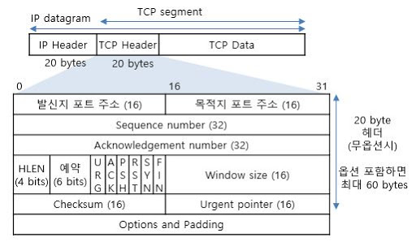

# 05. 3, 4 way handshake

## 0. 들어가기 전 

#### 연결 지향?

TCP 통신을 이용하여 데이터를 전송하기 위해 네트워크 연결을 설정을 해야합니다. 
신뢰성을 보장해야하는데, 이를 위해 TCP 는 handshake 라는 과정을 거쳐 신뢰성을 보장합니다.

## 1. 3-way handshake

2대의 장비, 혹은 호스트가 TCP 통신을 하기 위해서는 **연결** 과정이 선행되어야 하며, 
이 때 3-way handshake 가 일어나게 됩니다.

#### 과정

|      | 송신자 | 수신자 | 내용                                                         |
| ---- | ------ | ------ | ------------------------------------------------------------ |
| 1    | A      | B      | - A 에서 연결 요청 메시지 SYN 전송 - sequence number 는 임의의 값. syn 플래그 비트를 1로 설정하여 세그먼트 전송 - 포트 상태 - 포트 상태 A : CLOSED, B : LISTEN -> SYN_RCV |
| 2    | B      | A      | - 접속 요청을 받은 B 가 요청을 수락. - A 도 포트를 열어 달라는 메시지 전송 - SYN  + ACK 전달 (ACK = seq + 1) - 포트 상태 A : CLOSED -> ESTABLISHED, B : SYN_RCV |
| 3    | A      | B      | - A가 수락 확인을 보내 연결을 맺음 - 전송할 데이터가 있다면 이때부터 전송 가능 - 포트 상태 A : ESTABLISHED, B : ESTABLISHED |

#### 용어 정리

- SYN(Synchronize Sequence Number)
  - **연결 설정**
  - sequence number를 랜덤으로 설정하여 세션을 연결합니다.
  - 초기에 sequence number를 전송합니다.
    - sequence number - TCP 에서 데이터를 보낼 때 데이터에 **고유한 번호**를 부여해 전송.
    - 데이터 한 번 전송할 때마다 이 값은 1씩 증가.
    - 이 값을 사용하여 수신측에서 중복된 자료를 폐기하고, 순서가 바뀌어 수신되는 경우 순서대로 재구성할 수 있다.

- ACK(Acknowledgement)

  - **응답 확인**

  - 패킷을 받았음을 의미합니다.

  - Acknowledgement Number 필드가 유효한지를 나타냅니다.

    

## 2. 4-way handshake

4-way handshake는 연결을 해제하는 과정입니다. 

과정은 다음과 같습니다.

|      | 송신자 | 수신자 | 내용                                                         |
| ---- | ------ | ------ | ------------------------------------------------------------ |
| 1    | A      | B      | - A 가 연결을 종료하는 FIN 플래그 전송 - 더이상 A 는 패킷을 보낼 수 없음  |
| 2    | B      | A      | - A에서 연결 종료 신호(FIN)을 받고 그에 대해 응답(ACK) - A포트 : FIN_WAIT2 . - A는 B가 연결을 종료하기를 기다린다. |
| 3    | B      | A      | 서버측 어플리케이션이 종료된 이후,  - 클라이언트에게 종료 준비가 되었다는 FIN 을 보낸다. |
| 4    | A      | B      | - FIN 을 받고 ACK를 보낸다.                                  |

세부 세그먼트 구조

#### 왜 마지막에 FIN 에 대한 ACK 를 한 번 더 보낼까?

A : 클라이언트 ,  B: 서버

서버에서 FIN 을 보내기 전에 전송한 패킷이 FIN 보다 늦게 도착하는 경우가 발생한다면 close 가 된 경우 해당 패킷은 유실됩니다. 
그렇기에 FIN 을 수신하고 일정시간 이후 패킷을 기다리고 closed 하게 됩니다. 

## 레퍼런스

- http://www.deadfire.net/tcpip/tcpip20.html
- https://gmlwjd9405.github.io/2018/09/19/tcp-connection.html
- 

## 추가 공부할 키워드

